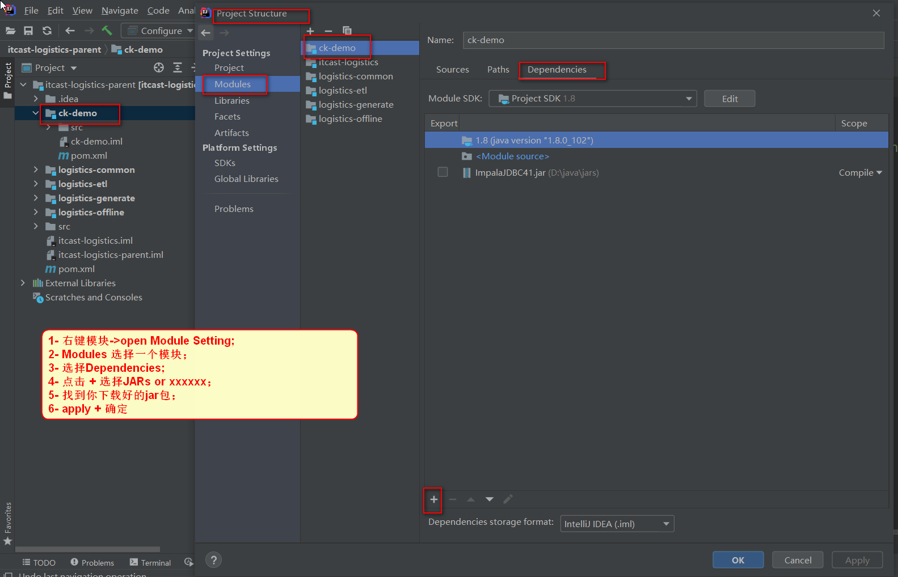

[TOC]


# 1- 编译jar包-并引用


## 1-1 编译JAR包

### 创建工程

​		01- 创建工程01


​		02- 创建工程02


​		03- 创建工程03


​		04- 生成的工程


​		05- 修改类名


​		06-编写新增接口代码


### 设置模块编译JAR包

file->

​	ProjectStructure->

​		ProjectSetting->

​			Artifacts->

​				"+"->

​					JAR->

​						from moudles with dependencxxx ->


### 编译

​	Build-> Build Artifacts...->Build


### 生成的jar包


## 1-2 使用jar包


### 创建使用jar包工程


### 配置工程保证可正常运行

Edit Configuratios->"+"->Application


### 添加jar包

file->

​	ProjectStructure->

​		ProjectSetting->

​			Libraries->

​				"+" ->

​					java ->

01- 配置新增jar包


02- 新增jar包后查看


03- 使用jar包中的接口方法


# 2- IDEA导入他人maven工程

1. 先删除他人工程下的 .idea文件；
2. 使用Idea打开工程;
3. 配置自己的maven；
4. 刷新maven; [如果自己仓库中没有jar包， 可能需要很久时间下载；]()
5. 每个模块add framework support 添加scala；
6. 每个模块下的scala目录需要 Make Directory As -> Source Root;
7. maven 依赖刷新完成后 rebuild一下；
8. 使用maven install ; 


# 3- IDEA 使用maven加载本地jar包

- 一般用于某个jar包不方便使用maven下载；

- systemPath

``` xml
<dependency>
    <groupId>com.oracle.jdbc</groupId>
    <artifactId>ojdbc8</artifactId>
    <version>${ojdbc.version}</version>
    <systemPath>D:/java/jars/ojdbc8-12.2.0.1.jar</systemPath>
    <scope>system</scope>
</dependency>
```

# 4- IDEA 使用modules加载本地jar包


