# 复习回顾

- 1.Flink概述

  Flink 是一个 大数据领域 流式数据有状态计算框架

- 2.Flink应用场景

  所有的流式计算

- 3.Flink安装部署

  - Local本地模式
  - Standalone独立集群模式
  - Standalone-HA高可用集群模式
  - OnYarn模式
    - 本质:把Flink程序的jar包运行在Yarn上(在Yarn上启动Flink集群)
    - 两种模式: 
      - Session会话模式(在Yarn上启动一个Flink集群供多个Client使用)
      - Per-Job任务分离模式(每个Client提交任务的时候都会在Yarn单独启动一个Flink集群)

- 4.Flink入门案例

  - DataSet-已经被软弃用了,未来会被删除

  - DataStream-支持流批一体

  - DataStream-Lambda-扩展

  - DataStream-OnYarn

    - 1.env
    - 2.source
    - 3.transformation
    - 4.sink
    - 5.execute

    ```java
    package cn.itcast.hello;
    
    import org.apache.flink.api.common.RuntimeExecutionMode;
    import org.apache.flink.api.common.functions.FlatMapFunction;
    import org.apache.flink.api.common.functions.MapFunction;
    import org.apache.flink.api.java.functions.KeySelector;
    import org.apache.flink.api.java.tuple.Tuple2;
    import org.apache.flink.api.java.utils.ParameterTool;
    import org.apache.flink.streaming.api.datastream.DataStream;
    import org.apache.flink.streaming.api.datastream.KeyedStream;
    import org.apache.flink.streaming.api.datastream.SingleOutputStreamOperator;
    import org.apache.flink.streaming.api.environment.StreamExecutionEnvironment;
    import org.apache.flink.util.Collector;
    
    /**
     * Author itcast
     * Desc 演示Flink-DataStream-流批一体API完成批处理WordCount,后面课程会演示流处理
     * 改造代码使适合Yarn
     */
    public class WordCount04 {
        public static void main(String[] args) throws Exception {
            //TODO 0.解析args参数中传入的数据(输入或)输出文件路径
            //String path = args[0];//这样写不好获取这样的格式 --output hdfs://......
            String path = "hdfs://node1:8020/wordcount/output48_";//--output hdfs://node1:8020/wordcount/output48_
            ParameterTool parameterTool = ParameterTool.fromArgs(args);
            if(parameterTool.has("output")){
                path = parameterTool.get("output");
            }
            path = path +  System.currentTimeMillis();
    
            //TODO 1.env-准备环境
            StreamExecutionEnvironment env = StreamExecutionEnvironment.getExecutionEnvironment();
            env.setRuntimeMode(RuntimeExecutionMode.BATCH);//指定计算模式为批
    
            //TODO 2.source-加载数据
            DataStream<String> dataStream = env.fromElements("itcast hadoop spark", "itcast hadoop spark", "itcast hadoop", "itcast");
    
            //TODO 3.transformation-数据转换处理
            //3.1对每一行数据进行分割并压扁
            DataStream<String> wordsDS = dataStream.flatMap(new FlatMapFunction<String, String>() {
                @Override
                public void flatMap(String value, Collector<String> out) throws Exception {
                    String[] words = value.split(" ");
                    for (String word : words) {
                        out.collect(word);
                    }
                }
            });
            //3.2每个单词记为<单词,1>
            DataStream<Tuple2<String, Integer>> wordAndOneDS = wordsDS.map(new MapFunction<String, Tuple2<String, Integer>>() {
                @Override
                public Tuple2<String, Integer> map(String value) throws Exception {
                    return Tuple2.of(value, 1);
                }
            });
            //3.3分组
            KeyedStream<Tuple2<String, Integer>, String> keyedDS = wordAndOneDS.keyBy(new KeySelector<Tuple2<String, Integer>, String>() {
                @Override
                public String getKey(Tuple2<String, Integer> value) throws Exception {
                    return value.f0;
                }
            });
    
            //3.4聚合
            SingleOutputStreamOperator<Tuple2<String, Integer>> result = keyedDS.sum(1);
    
            //TODO 4.sink-数据输出
            result.print();
            //设置操作hadoop的用户为root,防止权限不足,如果还报权限问题,执行: hadoop fs -chmod -R 777  /
            System.setProperty("HADOOP_USER_NAME", "root");
            result.writeAsText(path).setParallelism(1);//生成一个文件
    
            //TODO 5.execute-执行
            env.execute();
        }
    }
    
    ```

    


# Flink原理初探-理解-面试

上课听懂,课后花时间自己在图上标一下

## 角色分工

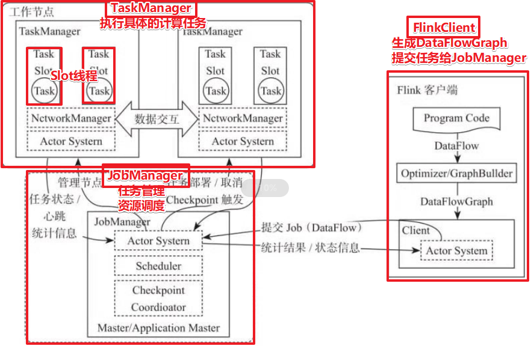


## 执行流程

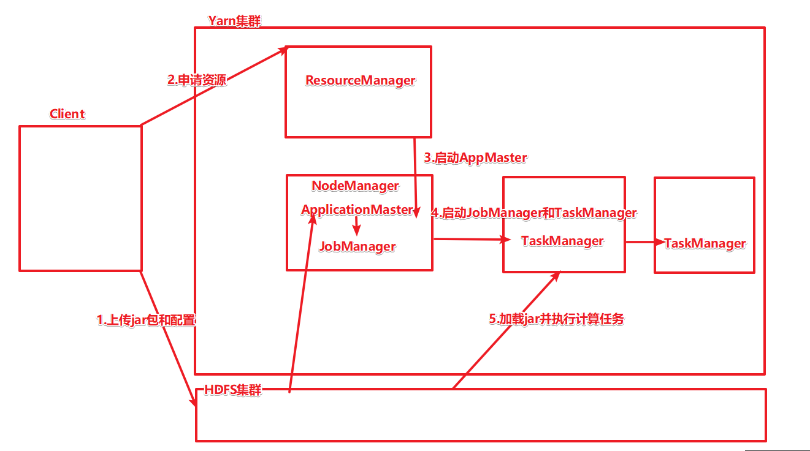


## StreamingDataFlow

类似于Spark中的DAG


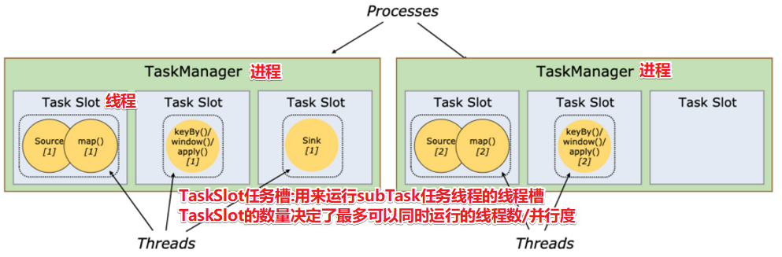


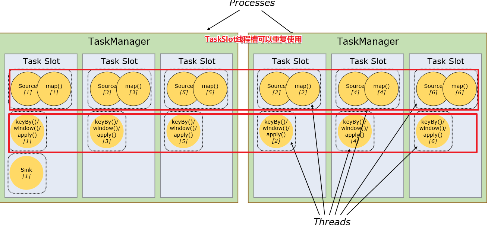


## 执行图生成流程


# 流处理相关概念-理解

- 批处理:对一批数据(历史数据/离线数据/有界数据流)进行处理分析,运行一次得到结果就可以停止,失败了,重新跑一次即可, 如对昨天/上周/上个月/前3个月/前6个月/前1年/...的数据进行历史数据分析,时效性差

- 流处理:对流式数据(实时数据/无界数据流)进行实时的处理计算分析,启动之后需要一直运行,不能停,如果中间运行失败需要支持自动恢复(容错), 如实时计算双十一交易大屏数据,实时道路/股票交易/工厂设备监控预警,时效性高! 难度大! 

- Spark中

  - 批处理:就是普通意义的批处理,可以SparkCore-RDD,或SparkSQL-DataFrame/DataSet
  - 流处理:SparkStreaming微批,把流划分成一个个的微批然后进行批处理,但微批间隔很小的时候就像是在做流处理, StructuredStreaming中支持试验性的连续处理,但默认还是微批----所以Spark中的流处理不是真正意义上的流处理,是假的,是微批

- Flink中

  - 流处理:就是真正意义上的流处理, 从Source接入数据,到Transformation处理数据,到Sink输出数据,整个流程中的各个环节会一直运行,等待上游将数据传递过来进行处理,类似于一直运行的流水线

  - 批处理:Flink中对于数据都看做是流! 实时数据是无界数据流, 离线数据是有界数据流, 对于无界数据流用真正意义上的流处理即可, 对于有界数据流当做特殊的流来处理,只不过不需要一直运行,到达数据边界的时候处理完就结束就ok

    ---

  - Flink是真正的流处理, 对于数据处理来说, 都统一的看做是流, 只不过对于无界数据流会一直运行Flink, 对于有界数据流, 计算完数据边界的数据就停止即可

  - Flink在底层原理/思想上已经实现了流批统一, 并且在Flink1.12的时候在API层面也实现了流批统一,使用DataStream就可以处理流或批,通过一句代码设置即可

    ```
    StreamExecutionEnvironment env = StreamExecutionEnvironment.getExecutionEnvironment();
    //env.setRuntimeMode(RuntimeExecutionMode.STREAMING);//指定计算模式为流
    //env.setRuntimeMode(RuntimeExecutionMode.BATCH);//指定计算模式为批
    env.setRuntimeMode(RuntimeExecutionMode.AUTOMATIC);//自动
    //不设置的话默认是流模式defaultValue(RuntimeExecutionMode.STREAMING)
    ```

    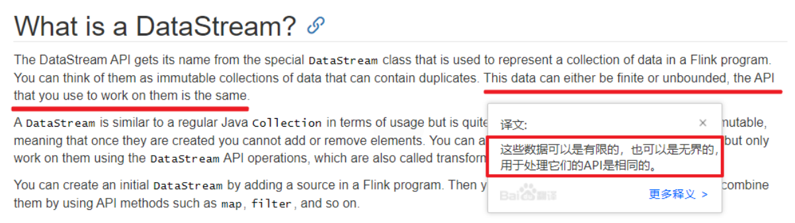


# Source-掌握

https://flink.apache.org/

https://ci.apache.org/projects/flink/flink-docs-release-1.12/

https://ci.apache.org/projects/flink/flink-docs-release-1.12/dev/datastream_api.html


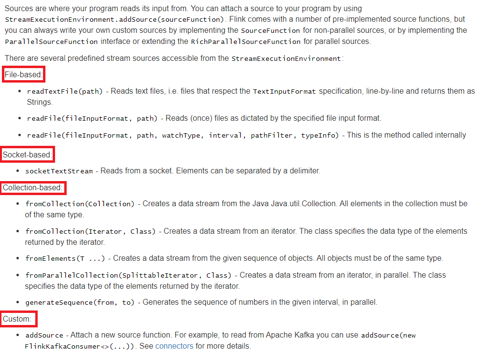


## 预定义

### Collection

```
一般用于学习测试时编造数据时使用
1.env.fromElements(可变参数);
2.env.fromColletion(各种集合);
3.env.generateSequence(开始,结束);
4.env.fromSequence(开始,结束);
```

```java
package cn.itcast.source;

import org.apache.flink.api.common.RuntimeExecutionMode;
import org.apache.flink.streaming.api.datastream.DataStream;
import org.apache.flink.streaming.api.environment.StreamExecutionEnvironment;

import java.util.Arrays;

/**
 * Author itcast
 * Desc 演示Flink-DataStream流批一体API-Source
 */
public class SourceDemo01_Collection {
    public static void main(String[] args) throws Exception {
        //TODO 1.env-准备环境
        StreamExecutionEnvironment env = StreamExecutionEnvironment.getExecutionEnvironment();
        env.setRuntimeMode(RuntimeExecutionMode.AUTOMATIC);
        //TODO 2.source-加载数据
        //1.env.fromElements(可变参数);
        //2.env.fromColletion(各种集合);
        //3.env.generateSequence(开始,结束);
        //4.env.fromSequence(开始,结束);
        DataStream<String> ds1 = env.fromElements("itcast hadoop spark", "itcast hadoop spark", "itcast hadoop", "itcast");
        DataStream<String> ds2 = env.fromCollection(Arrays.asList("itcast hadoop spark", "itcast hadoop spark", "itcast hadoop", "itcast"));
        DataStream<Long> ds3 = env.generateSequence(1, 10);
        DataStream<Long> ds4 = env.fromSequence(1, 10);

        //TODO 3.transformation-数据转换处理
        //TODO 4.sink-数据输出
        ds1.print("ds1");
        ds2.print("ds2");
        ds3.print("ds3");
        ds4.print("ds4");
        //TODO 5.execute-执行
        env.execute();
    }
}

```


### File

env.readTextFile(本地/HDFS文件/文件夹);//压缩文件也可以

```java
package cn.itcast.source;

import org.apache.flink.api.common.RuntimeExecutionMode;
import org.apache.flink.streaming.api.datastream.DataStream;
import org.apache.flink.streaming.api.environment.StreamExecutionEnvironment;

/**
 * Author itcast
 * Desc 演示Flink-DataStream流批一体API-Source
 */
public class SourceDemo02_File {
    public static void main(String[] args) throws Exception {
        //TODO 1.env-准备环境
        StreamExecutionEnvironment env = StreamExecutionEnvironment.getExecutionEnvironment();
        env.setRuntimeMode(RuntimeExecutionMode.AUTOMATIC);
        //TODO 2.source-加载数据
        //env.readTextFile(本地/HDFS文件/文件夹);//压缩文件也可以
        DataStream<String> ds1 = env.readTextFile("data/input/words.txt");
        DataStream<String> ds2 = env.readTextFile("data/input/dir");
        DataStream<String> ds3 = env.readTextFile("data/input/wordcount.txt.gz");

        //TODO 3.transformation-数据转换处理
        //TODO 4.sink-数据输出
        ds1.print("ds1");
        ds2.print("ds2");
        ds3.print("ds3");
        //TODO 5.execute-执行
        env.execute();
    }
}

```


### Socket

nc -lk 8888

```java
package cn.itcast.source;

import org.apache.flink.api.common.RuntimeExecutionMode;
import org.apache.flink.api.common.functions.FlatMapFunction;
import org.apache.flink.api.common.functions.MapFunction;
import org.apache.flink.api.java.functions.KeySelector;
import org.apache.flink.api.java.tuple.Tuple2;
import org.apache.flink.streaming.api.datastream.DataStream;
import org.apache.flink.streaming.api.datastream.KeyedStream;
import org.apache.flink.streaming.api.datastream.SingleOutputStreamOperator;
import org.apache.flink.streaming.api.environment.StreamExecutionEnvironment;
import org.apache.flink.util.Collector;

/**
 * Author itcast
 * Desc 演示Flink-DataStream流批一体API-Source
 */
public class SourceDemo03_Socket {
    public static void main(String[] args) throws Exception {
        //TODO 1.env-准备环境
        StreamExecutionEnvironment env = StreamExecutionEnvironment.getExecutionEnvironment();
        env.setRuntimeMode(RuntimeExecutionMode.AUTOMATIC);
        //TODO 2.source-加载数据
        DataStream<String> socketDS = env.socketTextStream("192.168.88.161", 8888);

        //TODO 3.transformation-数据转换处理
        //3.1对每一行数据进行分割并压扁
        DataStream<String> wordsDS = socketDS.flatMap(new FlatMapFunction<String, String>() {
            @Override
            public void flatMap(String value, Collector<String> out) throws Exception {
                String[] words = value.split(" ");
                for (String word : words) {
                    out.collect(word);
                }
            }
        });
        //3.2每个单词记为<单词,1>
        DataStream<Tuple2<String, Integer>> wordAndOneDS = wordsDS.map(new MapFunction<String, Tuple2<String, Integer>>() {
            @Override
            public Tuple2<String, Integer> map(String value) throws Exception {
                return Tuple2.of(value, 1);
            }
        });
        //3.3分组
        KeyedStream<Tuple2<String, Integer>, String> keyedDS = wordAndOneDS.keyBy(new KeySelector<Tuple2<String, Integer>, String>() {
            @Override
            public String getKey(Tuple2<String, Integer> value) throws Exception {
                return value.f0;
            }
        });

        //3.4聚合
        SingleOutputStreamOperator<Tuple2<String, Integer>> result = keyedDS.sum(1);

        //TODO 4.sink-数据输出
        result.print();

        //TODO 5.execute-执行
        env.execute();
    }
}

```


## 自定义

### 自定义Source随机生成数据

Flink自定义好的(Kafka后面单独学)

用户自定义的数据源需要实现下面的任一接口

```
SourceFunction:非并行数据源(并行度只能=1)
RichSourceFunction:多功能非并行数据源(并行度只能=1)
ParallelSourceFunction:并行数据源(并行度能够>=1)
RichParallelSourceFunction:多功能并行数据源(并行度能够>=1)--后续学习的Kafka数据源使用的
```

需求:

```
每隔1秒随机生成一条订单信息(订单ID、用户ID、订单金额、时间戳)
要求: 
- 随机生成订单ID(UUID)
- 随机生成用户ID(0-2)
- 随机生成订单金额(0-100)
- 时间戳为当前系统时间
```

代码实现

```java
package cn.itcast.source;

import lombok.AllArgsConstructor;
import lombok.Data;
import lombok.NoArgsConstructor;
import org.apache.flink.api.common.RuntimeExecutionMode;
import org.apache.flink.streaming.api.datastream.DataStream;
import org.apache.flink.streaming.api.environment.StreamExecutionEnvironment;
import org.apache.flink.streaming.api.functions.source.RichParallelSourceFunction;

import java.util.Random;
import java.util.UUID;

/**
 * Author itcast
 * Desc 演示Flink-DataStream流批一体API-自定义Source
 */
public class SourceDemo04_Customer {
    public static void main(String[] args) throws Exception {
        //TODO 1.env-准备环境
        StreamExecutionEnvironment env = StreamExecutionEnvironment.getExecutionEnvironment();
        env.setRuntimeMode(RuntimeExecutionMode.AUTOMATIC);
        //TODO 2.source-加载数据
        DataStream<Order> orderDS = env.addSource(new MyOrderSource()).setParallelism(1);

        //TODO 3.transformation-数据转换处理
        //TODO 4.sink-数据输出
        orderDS.print();

        //TODO 5.execute-执行
        env.execute();
    }

    //自定义source完成每隔1s生产一条订单信息
    public static class MyOrderSource extends RichParallelSourceFunction<Order>{
        private Boolean flag = true;
        //启动后需要一直运行的方法
        @Override
        public void run(SourceContext<Order> ctx) throws Exception {
            Random ran = new Random();
            while (flag){
                //每隔1s随机生成一条订单信息
                String id = UUID.randomUUID().toString();
                int uid = ran.nextInt(3);
                int money = ran.nextInt(101);
                long createTime = System.currentTimeMillis();
                ctx.collect(new Order(id,uid,money,createTime));
                Thread.sleep(1000);
            }
        }

        //接收到cancel命令时执行的方法(后面课程会演示cancel命令)
        @Override
        public void cancel() {
            flag = false;
        }
    }

    @Data
    @NoArgsConstructor
    @AllArgsConstructor
    public static class Order {
        private String id;
        private Integer userId;
        private Integer money;
        private Long createTime;

    }
}

```


注意:使用lombok需要导入依赖,导包,还需要安装插件

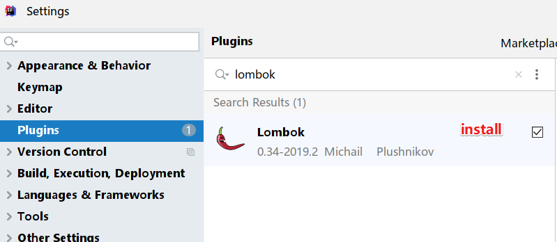


### 自定义Source加载MySQL数据

需求: 使用Flink自定义数据源,每隔2s加载一次MySQL表数据

```sql
CREATE TABLE `t_student` (
    `id` int(11) NOT NULL AUTO_INCREMENT,
    `name` varchar(255) DEFAULT NULL,
    `age` int(11) DEFAULT NULL,
    PRIMARY KEY (`id`)
) ENGINE=InnoDB AUTO_INCREMENT=7 DEFAULT CHARSET=utf8;

INSERT INTO `t_student` VALUES ('1', 'jack', '18');
INSERT INTO `t_student` VALUES ('2', 'tom', '19');
INSERT INTO `t_student` VALUES ('3', 'rose', '20');
INSERT INTO `t_student` VALUES ('4', 'tom', '19');
INSERT INTO `t_student` VALUES ('5', 'jack', '18');
INSERT INTO `t_student` VALUES ('6', 'rose', '20');
```


```java
package cn.itcast.source;

import lombok.AllArgsConstructor;
import lombok.Data;
import lombok.NoArgsConstructor;
import org.apache.flink.api.common.RuntimeExecutionMode;
import org.apache.flink.configuration.Configuration;
import org.apache.flink.streaming.api.datastream.DataStream;
import org.apache.flink.streaming.api.environment.StreamExecutionEnvironment;
import org.apache.flink.streaming.api.functions.source.RichParallelSourceFunction;

import java.sql.Connection;
import java.sql.DriverManager;
import java.sql.PreparedStatement;
import java.sql.ResultSet;

/**
 * Author itcast
 * Desc 演示Flink-DataStream流批一体API-自定义Source加载MySQL数据
 */
public class SourceDemo05_Customer_MySQL {
    public static void main(String[] args) throws Exception {
        //TODO 1.env-准备环境
        StreamExecutionEnvironment env = StreamExecutionEnvironment.getExecutionEnvironment();
        env.setRuntimeMode(RuntimeExecutionMode.AUTOMATIC);

        //TODO 2.source-加载数据
        DataStream<Student> studentDS = env.addSource(new MySQLSource()).setParallelism(1);

        //TODO 3.transformation-数据转换处理
        //TODO 4.sink-数据输出
        studentDS.print();

        //TODO 5.execute-执行
        env.execute();
    }

    //自定义source完成每隔2s查询MySQL
    public static class MySQLSource  extends RichParallelSourceFunction<Student>{
        Connection conn = null;
        PreparedStatement ps = null;
        //连接JDBC一次
        @Override
        public void open(Configuration parameters) throws Exception {
            //加载驱动在DriverManager源码已经有了不用写了
            conn = DriverManager.getConnection("jdbc:mysql://localhost:3306/bigdata", "root", "root");
            ps = conn.prepareStatement("select `id`, `name`, `age` from t_student");
        }

        private Boolean flag = true;
        @Override
        public void run(SourceContext<Student> ctx) throws Exception {
            while (flag){
                //每隔2s查询一次MySQL表
                ResultSet rs = ps.executeQuery();
                //处理结果集
                while (rs.next()){
                    int id = rs.getInt("id");
                    String name = rs.getString("name");
                    int age = rs.getInt("age");
                    ctx.collect(new Student(id,name,age));
                }
                Thread.sleep(2000);
            }
        }

        @Override
        public void cancel() {
            flag = false;
        }
        //关闭JDBC一次
        @Override
        public void close() throws Exception {
            if (conn != null) conn.close();
            if (ps != null) ps.close();
        }

    }


    @Data
    @NoArgsConstructor
    @AllArgsConstructor
    public static class Student {
        private Integer id;
        private String name;
        private Integer age;
    }
}

```


# Transformation-掌握

## 基础操作

map

flatMap

filter

sum

reduce

....

上面的算子/操作和Spark中类似

接下来使用一个案例演示一遍,

需求:

对流数据中的单词进行统计，排除敏感词TMD

```java
package cn.itcast.transformation;

import org.apache.flink.api.common.RuntimeExecutionMode;
import org.apache.flink.api.common.functions.FilterFunction;
import org.apache.flink.api.common.functions.FlatMapFunction;
import org.apache.flink.api.common.functions.MapFunction;
import org.apache.flink.api.common.functions.ReduceFunction;
import org.apache.flink.api.java.functions.KeySelector;
import org.apache.flink.api.java.tuple.Tuple2;
import org.apache.flink.streaming.api.datastream.DataStreamSource;
import org.apache.flink.streaming.api.datastream.SingleOutputStreamOperator;
import org.apache.flink.streaming.api.environment.StreamExecutionEnvironment;
import org.apache.flink.util.Collector;

/**
 * Author itcast
 * Desc 演示Flink-DataStream-Transformation-Basic基础算子/操作
 */
public class TransformationDemo01_Basic {
    public static void main(String[] args) throws Exception {
        //TODO 1.env-准备环境
        StreamExecutionEnvironment env = StreamExecutionEnvironment.getExecutionEnvironment();
        env.setRuntimeMode(RuntimeExecutionMode.AUTOMATIC);
        //TODO 2.source-加载数据
        DataStreamSource<String> socketDS = env.socketTextStream("192.168.88.161", 8888);
        //TODO 3.transformation-数据转换处理
        SingleOutputStreamOperator<Tuple2<String, Integer>> result = socketDS.flatMap(new FlatMapFunction<String, String>() {
            @Override
            public void flatMap(String value, Collector<String> out) throws Exception {
                String[] words = value.split(" ");
                for (String word : words) {
                    out.collect(word);
                }
            }
        }).filter(new FilterFunction<String>() {
            @Override
            public boolean filter(String value) throws Exception {
                /*if(value.equals("TMD")){
                    return false;
                }
               return true;*/
                return !value.equals("TMD");
            }
        }).map(new MapFunction<String, Tuple2<String, Integer>>() {
            @Override
            public Tuple2<String, Integer> map(String value) throws Exception {
                return Tuple2.of(value, 1);

            }
        })//.keyBy(t->t.f0);
                .keyBy(new KeySelector<Tuple2<String, Integer>, String>() {
                    @Override
                    public String getKey(Tuple2<String, Integer> value) throws Exception {
                        return value.f0;
                    }
                })//.sum(1);
                /*public interface ReduceFunction<T> extends Function, Serializable {
                    T reduce(T value1, T value2) throws Exception;
                }*/
                .reduce(new ReduceFunction<Tuple2<String, Integer>>() {
                    //t1和t2就是需要进行聚合的数据,如进来的t1为(hello,2),t2为(hello,1),聚合结果为(hello,3)
                    @Override
                    public Tuple2<String, Integer> reduce(Tuple2<String, Integer> t1, Tuple2<String, Integer> t2) throws Exception {
                        return Tuple2.of(t1.f0, t1.f1 + t2.f1);
                    }
                });

        //TODO 4.sink-数据输出
        result.print();

        //TODO 5.execute-执行
        env.execute();
    }
}

```


## 合并-拆分

### union和connect-合并和连接

union可以合并多个同类型的流

connect可以连接2个不同类型的流(最后需要处理后再输出)

```java
package cn.itcast.transformation;

import org.apache.flink.api.common.RuntimeExecutionMode;
import org.apache.flink.streaming.api.datastream.ConnectedStreams;
import org.apache.flink.streaming.api.datastream.DataStream;
import org.apache.flink.streaming.api.datastream.SingleOutputStreamOperator;
import org.apache.flink.streaming.api.environment.StreamExecutionEnvironment;
import org.apache.flink.streaming.api.functions.co.CoMapFunction;

/**
 * Author itcast
 * Desc 演示Flink-DataStream-Transformation
 */
public class TransformationDemo02_Union_Connect {
    public static void main(String[] args) throws Exception {
        //TODO 1.env-准备环境
        StreamExecutionEnvironment env = StreamExecutionEnvironment.getExecutionEnvironment();
        env.setRuntimeMode(RuntimeExecutionMode.AUTOMATIC);
        //TODO 2.source-加载数据
        DataStream<String> ds1 = env.fromElements("hadoop", "spark", "flink");
        DataStream<String> ds2 = env.fromElements("hadoop", "spark", "flink");
        DataStream<Long> ds3 = env.fromElements(1L, 2L, 3L);

        //TODO 3.transformation-数据转换处理
        DataStream<String> result1 = ds1.union(ds2);//两个流直接合并成一个流
        //ds1.union(ds3);//报错,union只能合并同类型的流
        //DataStream<String> result = result1.union(ds2);//union可以合并多个流


        ConnectedStreams<String, Long> result2 = ds1.connect(ds3);//connect可以连接不同类型的流
        //ConnectedStreams<String, String> result2 = ds1.connect(ds2);
        //result2.connect(ds2);//报错,connect只能连接2个流

        //TODO 4.sink-数据输出
        result1.print();//union之后的流可以直接输出
        //result2.print();//报错,connect连接的流不能支持输出
        /*public interface CoMapFunction<IN1, IN2, OUT> extends Function, Serializable {
        	OUT map1(IN1 value) throws Exception;
        	OUT map2(IN2 value) throws Exception;
        }*/
        SingleOutputStreamOperator<String> result3 = result2.map(new CoMapFunction<String, Long, String>() {
            @Override
            public String map1(String value) throws Exception {
                return "String:" + value;
            }

            @Override
            public String map2(Long value) throws Exception {
                return "Long:" + value;
            }
        });
        result3.print();

        //TODO 5.execute-执行
        env.execute();
    }
}

```


### split、select和Side Outputs-拆分/选择和侧道输出

```java
package cn.itcast.transformation;

import org.apache.flink.api.common.RuntimeExecutionMode;
import org.apache.flink.api.common.typeinfo.TypeInformation;
import org.apache.flink.streaming.api.datastream.DataStream;
import org.apache.flink.streaming.api.datastream.SingleOutputStreamOperator;
import org.apache.flink.streaming.api.environment.StreamExecutionEnvironment;
import org.apache.flink.streaming.api.functions.ProcessFunction;
import org.apache.flink.util.Collector;
import org.apache.flink.util.OutputTag;

/**
 * Author itcast
 * Desc 演示Flink-DataStream-Transformation
 */
public class TransformationDemo03_Split_Select_SideOutputs {
    public static void main(String[] args) throws Exception {
        //TODO 1.env-准备环境
        StreamExecutionEnvironment env = StreamExecutionEnvironment.getExecutionEnvironment();
        env.setRuntimeMode(RuntimeExecutionMode.AUTOMATIC);
        //TODO 2.source-加载数据
        DataStream<Integer> ds = env.fromElements(1, 2, 3, 4, 5, 6, 7, 8, 9, 10);
        //TODO 3.transformation-数据转换处理
        //将流中的数据根据奇偶性分层2个流
        //old-API-已经被移除了
        /*SplitStream<Integer> splitResult = ds.split(new OutputSelector<Integer>() {
            @Override
            public Iterable<String> select(Integer value) {
                //value是进来的数字
                if (value % 2 == 0) {
                    //偶数
                    ArrayList<String> list = new ArrayList<>();
                    list.add("偶数");
                    return list;
                } else {
                    //奇数
                    ArrayList<String> list = new ArrayList<>();
                    list.add("奇数");
                    return list;
                }
            }
        });
        DataStream<Integer> evenResult = splitResult.select("偶数");
        DataStream<Integer> oddResult = splitResult.select("奇数");*/

        //new-API-现在使用-项目中使用
        //创建2个侧道输出标签-用来存放奇数和偶数
        OutputTag<Integer> tag_even = new OutputTag<Integer>("偶数", TypeInformation.of(Integer.class));
        OutputTag<Integer> tag_odd = new OutputTag<Integer>("奇数",TypeInformation.of(Integer.class));
        //对流中的数据进行处理判断并贴上不同的标签中
        SingleOutputStreamOperator<Integer> processDS = ds.process(new ProcessFunction<Integer, Integer>() {
            @Override
            public void processElement(Integer value, Context ctx, Collector<Integer> out) throws Exception {
                if (value % 2 == 0) {//偶数
                    ctx.output(tag_even, value);
                } else {//奇数
                    ctx.output(tag_odd, value);
                }
            }
        });
        //取出贴上了偶数标签的数据
        DataStream<Integer> evenDS = processDS.getSideOutput(tag_even);
        //取出贴上了奇数标签的数据
        DataStream<Integer> oddDS = processDS.getSideOutput(tag_odd);


        //TODO 4.sink-数据输出
        evenDS.print("偶数:");
        oddDS.print("奇数:");

        //TODO 5.execute-执行
        env.execute();
    }
}

```


## 分区

### 重平衡分区-掌握

数据倾斜

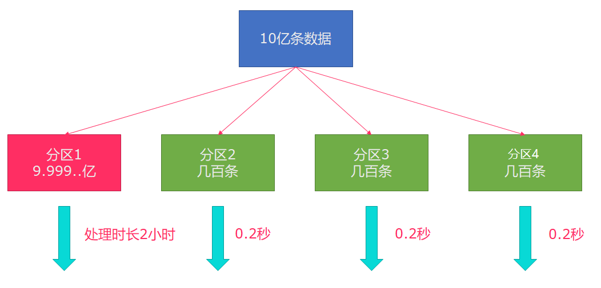

可以怎么处理? -- key加随机前后缀/reparation/coalsce/自定义分区.....

在Flink中很简单直接调用一个API:rebalance即可,会尽量的让数据重新平衡/均匀分布

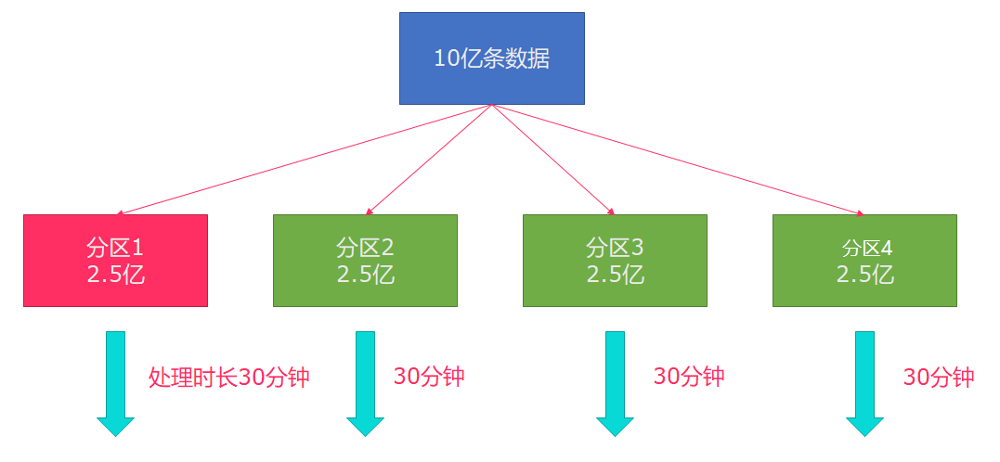

```java
package cn.itcast.transformation;

import org.apache.flink.api.common.RuntimeExecutionMode;
import org.apache.flink.api.common.functions.FilterFunction;
import org.apache.flink.api.common.functions.RichMapFunction;
import org.apache.flink.api.java.tuple.Tuple2;
import org.apache.flink.streaming.api.datastream.DataStream;
import org.apache.flink.streaming.api.environment.StreamExecutionEnvironment;

/**
 * Author itcast
 * Desc 演示Flink-DataStream-Transformation-重平衡分区
 */
public class TransformationDemo04_Rebalance {
    public static void main(String[] args) throws Exception {
        //TODO 1.env-准备环境
        StreamExecutionEnvironment env = StreamExecutionEnvironment.getExecutionEnvironment();
        env.setRuntimeMode(RuntimeExecutionMode.AUTOMATIC);
        //TODO 2.source-加载数据
        DataStream<Long> longDS = env.fromSequence(0, 100);
        //下面的操作相当于将数据随机分配给各个分区/线程执行,有可能出现数据倾斜
        DataStream<Long> filterDS = longDS.filter(new FilterFunction<Long>() {
            @Override
            public boolean filter(Long num) throws Exception {
                return num > 10;
            }
        });

        //TODO 3.transformation-数据转换处理
        //result1有可能出现数据倾斜
        DataStream<Tuple2<Integer, Integer>> result1 = filterDS.map(new RichMapFunction<Long, Tuple2<Integer, Integer>>() {
            @Override
            public Tuple2<Integer, Integer> map(Long value) throws Exception {
                //为了获取分区编号,需要使用Rich
                //return Tuple2.of(分区编号,1);
                int partitionId = getRuntimeContext().getIndexOfThisSubtask();
                return Tuple2.of(partitionId, 1);
            }
        }).keyBy(t -> t.f0).sum(1);//求的每个分区的数据量/数据条数

        //执行了rebalance之后再去求每个分区的数据量/数据条数,就会均匀的分布
        DataStream<Tuple2<Integer, Integer>> result2 = filterDS.rebalance()
                .map(new RichMapFunction<Long, Tuple2<Integer, Integer>>() {
                    @Override
                    public Tuple2<Integer, Integer> map(Long value) throws Exception {
                        //为了获取分区编号,需要使用Rich
                        //return Tuple2.of(分区编号,1);
                        int partitionId = getRuntimeContext().getIndexOfThisSubtask();
                        return Tuple2.of(partitionId, 1);
                    }
                }).keyBy(t -> t.f0).sum(1);//求的每个分区的数据量/数据条数


        //TODO 4.sink-数据输出
        //result1.print("result1");
        result2.print("result2");

        //TODO 5.execute-执行
        env.execute();
    }
}

```


### 其他分区-了解

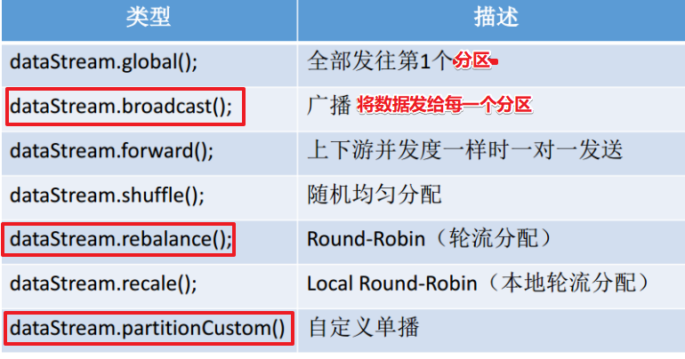

```java
package cn.itcast.transformation;

import org.apache.flink.api.common.RuntimeExecutionMode;
import org.apache.flink.api.common.functions.FlatMapFunction;
import org.apache.flink.api.common.functions.Partitioner;
import org.apache.flink.api.java.functions.KeySelector;
import org.apache.flink.api.java.tuple.Tuple2;
import org.apache.flink.streaming.api.datastream.DataStream;
import org.apache.flink.streaming.api.datastream.SingleOutputStreamOperator;
import org.apache.flink.streaming.api.environment.StreamExecutionEnvironment;
import org.apache.flink.util.Collector;

/**
 * Author itcast
 * Desc 演示Flink-DataStream-Transformation-其他各种分区
 */
public class TransformationDemo05_Other {
    public static void main(String[] args) throws Exception {
        //TODO 1.env-准备环境
        StreamExecutionEnvironment env = StreamExecutionEnvironment.getExecutionEnvironment();
        env.setRuntimeMode(RuntimeExecutionMode.AUTOMATIC);
        //TODO 2.source-加载数据
        DataStream<String> linesDS = env.readTextFile("data/input/words.txt");
        //TODO 3.transformation-数据转换处理
        SingleOutputStreamOperator<Tuple2<String, Integer>> wordAndOneDS = linesDS.flatMap(new FlatMapFunction<String, Tuple2<String, Integer>>() {
            @Override
            public void flatMap(String value, Collector<Tuple2<String, Integer>> out) throws Exception {
                String[] words = value.split(" ");
                for (String word : words) {
                    out.collect(Tuple2.of(word, 1));
                }
            }
        });

        //各种分区
        DataStream<Tuple2<String, Integer>> result1 = wordAndOneDS.global();
        DataStream<Tuple2<String, Integer>> result2 = wordAndOneDS.broadcast();
        DataStream<Tuple2<String, Integer>> result3 = wordAndOneDS.forward();
        DataStream<Tuple2<String, Integer>> result4 = wordAndOneDS.shuffle();
        DataStream<Tuple2<String, Integer>> result5 = wordAndOneDS.rebalance();
        DataStream<Tuple2<String, Integer>> result6 = wordAndOneDS.rescale();
        DataStream result7 = wordAndOneDS.partitionCustom(new MyPartitioner(), new KeySelector<Tuple2<String, Integer>, String>() {
            @Override
            public String getKey(Tuple2<String, Integer> value) throws Exception {
                return value.f0;
            }
        });

        //TODO 4.sink-数据输出
        result7.print();

        //TODO 5.execute-执行
        env.execute();
    }
    /*public interface Partitioner<K> extends java.io.Serializable, Function {
    	int partition(K key, int numPartitions);
    }*/
    public static class MyPartitioner<String> implements Partitioner<String> {
        @Override
        public int partition(String key, int numPartitions) {
            //int partitionNum = Math.abs(key.hashCode()) % numPartitions;//自定义的hash分区
            if(key.equals("hello")){ //city.equals("北京") || 河南 || 山东 {random.nextInt(10)} else{10}
                return 0;
            }else {
                return 1;
            }
            //或者你自己想怎么分就怎么分
        }
    }
}

```


# Sink-掌握

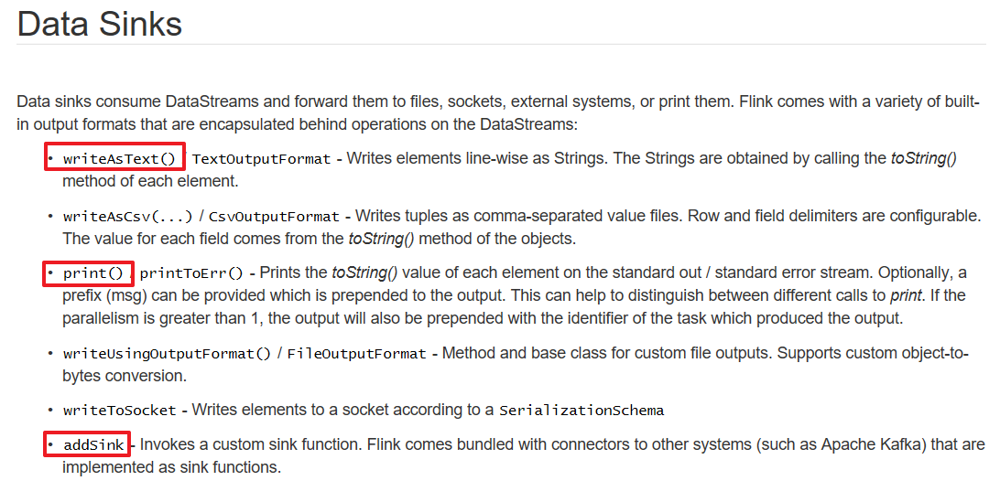

## 预定义

```java
package cn.itcast.sink;

import org.apache.flink.api.common.RuntimeExecutionMode;
import org.apache.flink.streaming.api.datastream.DataStream;
import org.apache.flink.streaming.api.environment.StreamExecutionEnvironment;

import java.util.List;

/**
 * Author itcast
 * Desc 演示Flink-DataStream-Sink-预定义
 */
public class SinkDemo01 {
    public static void main(String[] args) throws Exception {
        //TODO 1.env-准备环境
        StreamExecutionEnvironment env = StreamExecutionEnvironment.getExecutionEnvironment();
        env.setRuntimeMode(RuntimeExecutionMode.AUTOMATIC);
        //TODO 2.source-加载数据
        DataStream<String> ds = env.readTextFile("data/input/words.txt");
        //TODO 3.transformation-数据转换处理
        //TODO 4.sink-数据输出
        ds.print("提示符前缀");
        ds.printToErr("以红色输出");
        List<String> list = ds.executeAndCollect(10);
        System.out.println(list);
        ds.writeAsText("data/output/result").setParallelism(1);//输出到文件
        ds.writeAsText("data/output/result2").setParallelism(2);//输出到文件夹(2个文件)
        //TODO 5.execute-执行
        env.execute();
    }
}

```


## 自定义

使用自定义Sink将数据写入到MySQL

```java
package cn.itcast.sink;

import lombok.AllArgsConstructor;
import lombok.Data;
import lombok.NoArgsConstructor;
import org.apache.flink.api.common.RuntimeExecutionMode;
import org.apache.flink.configuration.Configuration;
import org.apache.flink.streaming.api.datastream.DataStream;
import org.apache.flink.streaming.api.environment.StreamExecutionEnvironment;
import org.apache.flink.streaming.api.functions.sink.RichSinkFunction;

import java.sql.Connection;
import java.sql.DriverManager;
import java.sql.PreparedStatement;

/**
 * Author itcast
 * Desc 演示Flink-DataStream-Sink-自定义Sink将数据写入到MySQL
 */
public class SinkDemo02 {
    public static void main(String[] args) throws Exception {
        //TODO 1.env-准备环境
        StreamExecutionEnvironment env = StreamExecutionEnvironment.getExecutionEnvironment();
        env.setRuntimeMode(RuntimeExecutionMode.AUTOMATIC);
        //TODO 2.source-加载数据
        DataStream<Student> studentDS = env.fromElements(new Student(null, "lily", 18));
        //TODO 3.transformation-数据转换处理
        //TODO 4.sink-数据输出
        studentDS.addSink(new MySQLSink());
        //TODO 5.execute-执行
        env.execute();
    }
    private static class MySQLSink extends RichSinkFunction<Student> {
        Connection conn = null;
        PreparedStatement ps = null;
        //连接JDBC一次
        @Override
        public void open(Configuration parameters) throws Exception {
            //加载驱动在DriverManager源码已经有了不用写了
            conn = DriverManager.getConnection("jdbc:mysql://localhost:3306/bigdata", "root", "root");
            ps = conn.prepareStatement("INSERT INTO `t_student` (`id`, `name`, `age`) VALUES (null, ?, ?)");
        }

        @Override
        public void invoke(Student value, Context context) throws Exception {
            //设置?占位符参数
            ps.setString(1,value.getName());
            ps.setInt(2,value.getAge());
            //执行SQL将数据插入到MySQL
            ps.executeUpdate();
        }

        //关闭JDBC一次
        @Override
        public void close() throws Exception {
            if (conn != null) conn.close();
            if (ps != null) ps.close();
        }
    }

    @Data
    @NoArgsConstructor
    @AllArgsConstructor
    public static class Student {
        private Integer id;
        private String name;
        private Integer age;
    }
}
```


# Connector

## JDBC-了解

https://ci.apache.org/projects/flink/flink-docs-release-1.12/dev/datastream_api.html

Flink官方提供了JdbcSink

```java
package cn.itcast.connectors;

import cn.itcast.sink.SinkDemo02;
import org.apache.flink.api.common.RuntimeExecutionMode;
import org.apache.flink.connector.jdbc.JdbcConnectionOptions;
import org.apache.flink.connector.jdbc.JdbcSink;
import org.apache.flink.streaming.api.datastream.DataStream;
import org.apache.flink.streaming.api.environment.StreamExecutionEnvironment;

/**
 * Author itcast
 * Desc 演示Flink-DataStream-Connectors-JDBCSink
 */
public class JDBCDemo {
    public static void main(String[] args) throws Exception {
        //TODO 1.env-准备环境
        StreamExecutionEnvironment env = StreamExecutionEnvironment.getExecutionEnvironment();
        env.setRuntimeMode(RuntimeExecutionMode.AUTOMATIC);
        //TODO 2.source-加载数据
        DataStream<SinkDemo02.Student> studentDS = env.fromElements(new SinkDemo02.Student(null, "lucy", 18));
        //TODO 3.transformation-数据转换处理
        //TODO 4.sink-数据输出
        studentDS.addSink(JdbcSink.sink(
                "INSERT INTO `t_student` (`id`, `name`, `age`) VALUES (null, ?, ?)",
                (ps, t) -> {
                    ps.setString(1,t.getName());
                    ps.setInt(2,t.getAge());
                },
                new JdbcConnectionOptions.JdbcConnectionOptionsBuilder()
                        .withUrl("jdbc:mysql://localhost:3306/bigdata")
                        .withDriverName("com.mysql.jdbc.Driver")
                        .withUsername("root")
                        .withPassword("root")
                        .build()));

        //TODO 5.execute-执行
        env.execute();
    }
}

```


## Kafka-掌握

https://ci.apache.org/projects/flink/flink-docs-release-1.12/dev/datastream_api.html

官网说明

- Source-KafkaConsumer

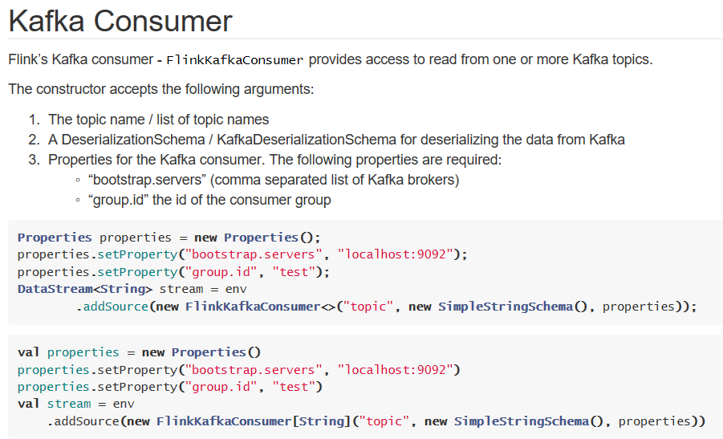

- 


- 需求

从Kafka的主题1中消费日志数据,并做实时ETL,将状态为success的数据写入到Kafka的主题2中

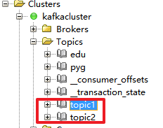

- 代码实现

```java
package cn.itcast.connectors;

import org.apache.flink.api.common.RuntimeExecutionMode;
import org.apache.flink.api.common.functions.FilterFunction;
import org.apache.flink.api.common.serialization.SimpleStringSchema;
import org.apache.flink.streaming.api.datastream.DataStreamSource;
import org.apache.flink.streaming.api.datastream.SingleOutputStreamOperator;
import org.apache.flink.streaming.api.environment.StreamExecutionEnvironment;
import org.apache.flink.streaming.connectors.kafka.FlinkKafkaConsumer;
import org.apache.flink.streaming.connectors.kafka.FlinkKafkaProducer;

import java.util.Properties;

/**
 * Author itcast
 * Desc 演示Flink-DataStream-Connectors-Kafka
 * 从Kafka的主题1中消费日志数据,并做实时ETL,将状态为success的数据写入到Kafka的主题2中
 */
public class KafkaDemo {
    public static void main(String[] args) throws Exception {
        //TODO 1.env-准备环境
        StreamExecutionEnvironment env = StreamExecutionEnvironment.getExecutionEnvironment();
        env.setRuntimeMode(RuntimeExecutionMode.AUTOMATIC);
        //TODO 2.source-加载数据
        //从kafka的topic1消费数据
        Properties properties = new Properties();
        properties.setProperty("bootstrap.servers", "192.168.88.161:9092");
        properties.setProperty("group.id", "flink");
        //下面可选
        properties.setProperty("auto.offset.reset","latest");//latest有offset记录从记录位置开始消费,没有记录从最新的/最后的消息开始消费 /earliest有offset记录从记录位置开始消费,没有记录从最早的/最开始的消息开始消费
        properties.setProperty("enable.auto.commit", "true");//自动提交(提交到默认主题,后续学习了Checkpoint后随着Checkpoint存储在Checkpoint和默认主题中)
        properties.setProperty("auto.commit.interval.ms", "2000");//自动提交的时间间隔
        properties.setProperty("flink.partition-discovery.interval-millis","5000");//会开启一个后台线程每隔5s检测一下Kafka的分区情况,实现动态分区检测
        //上面可选
        FlinkKafkaConsumer<String> kafkaSource = new FlinkKafkaConsumer<>("topic1", new SimpleStringSchema(), properties);
        DataStreamSource<String> kafkaDS = env.addSource(kafkaSource);

        //TODO 3.transformation-数据转换处理
        SingleOutputStreamOperator<String> result = kafkaDS.filter(new FilterFunction<String>() {
            @Override
            public boolean filter(String value) throws Exception {
                return value.contains("success");
            }
        });

        //TODO 4.sink-数据输出
        FlinkKafkaProducer<String> kafkaSink = new FlinkKafkaProducer<>("topic2", new SimpleStringSchema(), properties);
        result.addSink(kafkaSink);

        //TODO 5.execute-执行
        env.execute();
    }
}
//1.准备topic1和topic2
//2.启动kafka
//3.往topic1发送如下数据
///export/server/kafka/bin/kafka-console-producer.sh --broker-list node1:9092 --topic topic1
//log:2020-10-10 success xxx
//log:2020-10-10 success xxx
//log:2020-10-10 success xxx
//log:2020-10-10 fail xxx
//4.观察topic2的数据

```


## Redis-了解-第三方提供

https://bahir.apache.org/docs/flink/current/flink-streaming-redis/

需求:将实时统计的WordCount结果写入到Redis

```java
package cn.itcast.connectors;

import org.apache.flink.api.common.RuntimeExecutionMode;
import org.apache.flink.api.common.functions.FlatMapFunction;
import org.apache.flink.api.common.functions.MapFunction;
import org.apache.flink.api.java.functions.KeySelector;
import org.apache.flink.api.java.tuple.Tuple2;
import org.apache.flink.streaming.api.datastream.DataStream;
import org.apache.flink.streaming.api.datastream.KeyedStream;
import org.apache.flink.streaming.api.environment.StreamExecutionEnvironment;
import org.apache.flink.streaming.connectors.redis.RedisSink;
import org.apache.flink.streaming.connectors.redis.common.config.FlinkJedisPoolConfig;
import org.apache.flink.streaming.connectors.redis.common.mapper.RedisCommand;
import org.apache.flink.streaming.connectors.redis.common.mapper.RedisCommandDescription;
import org.apache.flink.streaming.connectors.redis.common.mapper.RedisMapper;
import org.apache.flink.util.Collector;

/**
 * Author itcast
 * Desc 演示Flink-DataStream流批一体API-Connectors-Redis
 * 需求:将WordCount结果存入Redis
 */
public class RedisDemo {
    public static void main(String[] args) throws Exception {
        //TODO 1.env-准备环境
        StreamExecutionEnvironment env = StreamExecutionEnvironment.getExecutionEnvironment();
        env.setRuntimeMode(RuntimeExecutionMode.AUTOMATIC);
        //TODO 2.source-加载数据
        DataStream<String> socketDS = env.socketTextStream("192.168.88.161", 8888);

        //TODO 3.transformation-数据转换处理
        //3.1对每一行数据进行分割并压扁
        DataStream<String> wordsDS = socketDS.flatMap(new FlatMapFunction<String, String>() {
            @Override
            public void flatMap(String value, Collector<String> out) throws Exception {
                String[] words = value.split(" ");
                for (String word : words) {
                    out.collect(word);
                }
            }
        });
        //3.2每个单词记为<单词,1>
        DataStream<Tuple2<String, Integer>> wordAndOneDS = wordsDS.map(new MapFunction<String, Tuple2<String, Integer>>() {
            @Override
            public Tuple2<String, Integer> map(String value) throws Exception {
                return Tuple2.of(value, 1);
            }
        });
        //3.3分组
        KeyedStream<Tuple2<String, Integer>, String> keyedDS = wordAndOneDS.keyBy(new KeySelector<Tuple2<String, Integer>, String>() {
            @Override
            public String getKey(Tuple2<String, Integer> value) throws Exception {
                return value.f0;
            }
        });

        //3.4聚合
        DataStream<Tuple2<String, Integer>> result = keyedDS.sum(1);

        //TODO 4.sink-数据输出
        result.print();
        //将结果输出到Redis
        FlinkJedisPoolConfig conf = new FlinkJedisPoolConfig.Builder().setHost("127.0.0.1").build();//指定Redis的地址
        RedisSink<Tuple2<String, Integer>> redisSink = new RedisSink<>(conf, new MyRedisMapper());
        result.addSink(redisSink);

        //TODO 5.execute-执行
        env.execute();
    }

    //自定义Mapper,指定要使用的Redis的命令和key:value
    public static class MyRedisMapper implements RedisMapper<Tuple2<String, Integer>>{
        //获取命令描述,也就是要使用什么命令将结果写入到Redis
        //可以使用下面的格式
        //key:单词,value:数量
        //key:wc_result,hash:k:单词,v:数量
        //复习:Redis的数据结构:
        //key:value
        //key是固定的String类型, value可以是String/Hash/List/Set/SortSet
        @Override
        public RedisCommandDescription getCommandDescription() {
            return new RedisCommandDescription(RedisCommand.HSET, "wc_result");
        }

        @Override
        public String getKeyFromData(Tuple2<String, Integer> t) {
            return t.f0;
        }

        @Override
        public String getValueFromData(Tuple2<String, Integer> t) {
            return t.f1.toString();
        }
    }
}

```


# 作业

1.课后在图上标出Flink核心名词

2.课后默写核心名词解释:

Client:

JobManager:

TaskManager:

Operator:

StreamingDataFlow:

Partition:

Parallelism:

SubTask:

Task:

TaskSlot:

StreamGraph:

JobGraph:

ExecutionGraph:

....

3.将Source-Transformation-Sink代码多敲几遍,最少1遍,不熟的敲多遍

4.复习Spark中窗口/事件时间/Watermaker--下次课要将Flink中的窗口/事件时间/Watermaker

5.复习其他框架

6.心态要调好!


独立自主学习的能力 需要从现在开始培养


