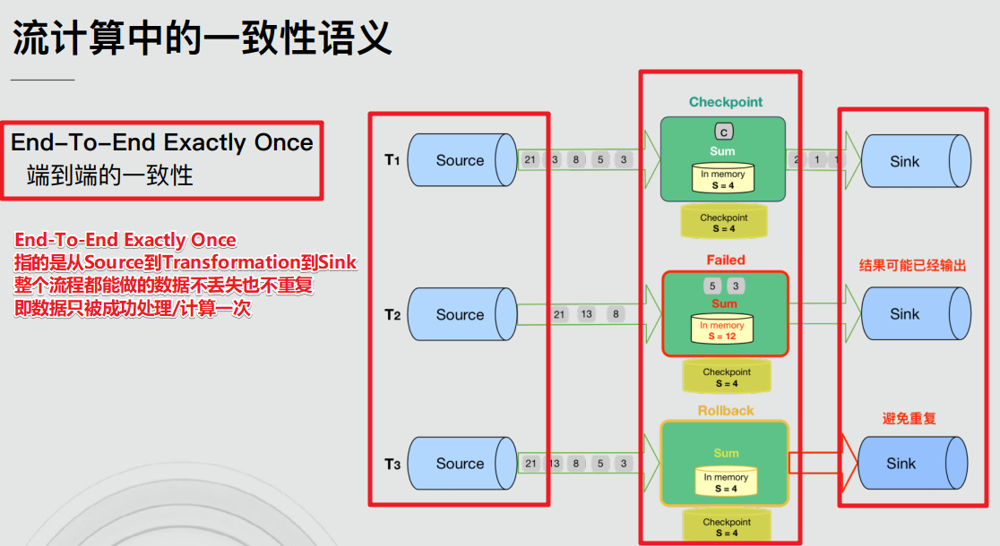

# 复习回顾

- 1.Window

  - 基于时间的滚动和滑动

    ```java
    //需求1:每5秒钟统计一次，最近5秒钟内，各个路口通过红绿灯汽车的数量--基于时间的滚动窗口
    keyedDS              .window(TumblingProcessingTimeWindows.of(Time.seconds(5)))
                    .sum("count");
    
    //需求2:每5秒钟统计一次，最近10秒钟内，各个路口通过红绿灯汽车的数量--基于时间的滑动窗口
            //size: The size of the generated windows.--窗口大小
            //slide: The slide interval of the generated windows.--滑动间隔
    keyedDS              .window(SlidingProcessingTimeWindows.of(Time.seconds(10), Time.seconds(5)))
                    .sum("count");
    ```

    

  - 基于数量的滚动和滑动

    ```java
    //需求1:统计在最近5条消息中,各自路口通过的汽车数量,相同的key每出现5次进行统计--基于数量的滚动窗口
    keyedDS.countWindow(5)
                    .sum("count");
    
    //需求2:统计在最近5条消息中,各自路口通过的汽车数量,相同的key每出现3次进行统计--基于数量的滑动窗口
    keyedDS.countWindow(5, 3)
                    .sum("count");
    ```

    

  - 会话窗口

    ```java
    //需求: 设置会话超时时间为10s,10s内没有数据到来,则触发上个窗口的计算
    //size The session timeout, i.e. the time gap between sessions
    keyedDS              .window(ProcessingTimeSessionWindows.withGap(Time.seconds(10)))
                    .sum("count");
    ```

    

- 2.EventTime+Watermark

  - EventTime:事件时间指的是数据/事件真真正正产生/发生的时间,能够代表事件/数据的本质
  - Watermark:本质上就是一个额外的时间戳, 能够在一定程度上解决数据延迟到达/数据乱序的问题
  - Watermark = 当前最大的事件时间 - 最大允许的延迟时间(最大乱序度)
  - Watermark可以延迟窗口的触发时机
  - Watermark >= 窗口结束时间 触发窗口计算
  - 对于延迟特别严重的数据可以使用侧道输出机制单独处理保证数据不丢失

  ```java
  //====下面的需要掌握======
          //https://ci.apache.org/projects/flink/flink-docs-release-1.12/dev/event_timestamps_watermarks.html
          //-1.告诉Flink使用EventTime来进行窗口计算
          env.setStreamTimeCharacteristic(TimeCharacteristic.EventTime);//过期API,新版本中不需要设置,默认就是
          //-2.告诉Flink最大允许的延迟时间/乱序时间为多少
          SingleOutputStreamOperator<Order> orderDSWithWatermark = orderDS
                  .assignTimestampsAndWatermarks(WatermarkStrategy.<Order>forBoundedOutOfOrderness(Duration.ofSeconds(3))
                  /*public interface TimestampAssigner<T> {
                  	long extractTimestamp(T element, long recordTimestamp);
                  }*/
                  //-3.告诉Flink哪一列是事件时间
                  .withTimestampAssigner((order, time) -> order.getCreateTime())
          );
  //====上面的需要掌握======
  
  //====下面的代码是使用侧道输出单独收集迟到严重的数据,避免数据丢失,后续想怎么处理就怎么处理!=========
          //-1.准备一个侧道输出标签
          OutputTag latenessTag = new OutputTag("latenessTag", TypeInformation.of(Order.class));
          //每隔5s计算每隔用户最近5s的订单总金额
          //orderDSWithWatermark.keyBy(order->order.getUserId())//传入的是函数
          KeyedStream<Order, Integer> keyedDS = orderDSWithWatermark.keyBy(Order::getUserId);//传入的方法,方法可以转为函数!
          SingleOutputStreamOperator resultDS = keyedDS.window(TumblingEventTimeWindows.of(Time.seconds(5)))
                  //-2.允许迟到并设置超过多久算迟到严重的数据
                  .allowedLateness(Time.seconds(3))
                  //-3.设置迟到严重的数据打什么标签/放在哪
                  .sideOutputLateData(latenessTag)
                  .sum("money");
          //-4.取出打上标签的数据
          DataStream latenessDS = resultDS.getSideOutput(latenessTag);
  //====上面的代码是使用侧道输出单独收集迟到严重的数据,避免数据丢失,后续想怎么处理就怎么处理!=========
  
          //TODO 4.sink-数据输出
          resultDS.print("正常的数据");
          latenessDS.print("迟到严重的数据");
  ```

  

- 3.State

  - 无状态计算:不需要考虑历史数据,如map/filter

  - 有状态计算:需要考虑历史数据,如sum/reduce/maxBy/minBy....

  - 有状态计算中的状态的分类

    - ManagedState和RawState
    - ManagedState又分为:KeyedState和OperatorState

  - 代码演示-KeyedState

    ```java
    package cn.itcast.state;
    
    import org.apache.flink.api.common.RuntimeExecutionMode;
    import org.apache.flink.api.common.functions.RichMapFunction;
    import org.apache.flink.api.common.state.ValueState;
    import org.apache.flink.api.common.state.ValueStateDescriptor;
    import org.apache.flink.api.java.tuple.Tuple2;
    import org.apache.flink.api.java.tuple.Tuple3;
    import org.apache.flink.configuration.Configuration;
    import org.apache.flink.streaming.api.datastream.DataStream;
    import org.apache.flink.streaming.api.environment.StreamExecutionEnvironment;
    
    /**
     * Author itcast
     * Desc 演示Flink-State-Managed State - KeyedState - ValueState
     * 使用KeyState中的ValueState获取数据中的最大值(实际中直接使用maxBy即可)
     * 也就是我们自己使用KeyState中的ValueState来模拟实训maxBy
     */
    public class StateDemo01 {
        public static void main(String[] args) throws Exception {
            //TODO 1.env-准备环境
            StreamExecutionEnvironment env = StreamExecutionEnvironment.getExecutionEnvironment();
            env.setRuntimeMode(RuntimeExecutionMode.AUTOMATIC);
            //TODO 2.source-加载数据
            DataStream<Tuple2<String, Long>> tupleDS = env.fromElements(
                    Tuple2.of("北京", 1L),
                    Tuple2.of("上海", 2L),
                    Tuple2.of("北京", 6L),
                    Tuple2.of("上海", 8L),
                    Tuple2.of("北京", 3L),
                    Tuple2.of("上海", 4L)
            );
    
            //TODO 3.transformation-数据转换处理
            //需求:求每个城市的最大值
            //方式1:使用Flink提供好的API:maxBy--开发中使用这个
            DataStream<Tuple2<String, Long>> result1 = tupleDS.keyBy(0).maxBy(1);
    
            //方式2:使用KeyState中的ValueState来自己处理/维护状态来实现maxBy的功能
            DataStream<Tuple3<String, Long, Long>> result2 = tupleDS.keyBy(t -> t.f0).map(new RichMapFunction<Tuple2<String, Long>, Tuple3<String, Long, Long>>() {
                //-1.定义一个状态用来存放最大值
                private ValueState<Long> maxValueState = null;
    
                //-2.初始化状态(一次)
                @Override
                public void open(Configuration parameters) throws Exception {
                    //创建状态描述器
                    ValueStateDescriptor<Long> stateDescriptor = new ValueStateDescriptor<>("maxValueState", Long.class);
                    //根据状态描述器获取状态
                    maxValueState = getRuntimeContext().getState(stateDescriptor);
                }
    
                //-3.使用状态
                @Override
                public Tuple3<String, Long, Long> map(Tuple2<String, Long> value) throws Exception {
                    Long currentValue = value.f1;//当前值
                    Long maxValue = maxValueState.value();//历史最大值
                    if (maxValue == null || currentValue > maxValue) {
                        maxValue = currentValue;//当前值作为最大值
                    }
                    //-4.更新状态
                    maxValueState.update(maxValue);
                    return Tuple3.of(value.f0, currentValue, maxValue);
                }
            });
    
            //TODO 4.sink-数据输出
            result1.print("maxBy");
            //(上海,8)
            //(北京,6)
            result2.print("KeyState中的ValueState来模拟的maxBy的功能");
            //(上海,2,2)
            //(上海,8,8)
            //(上海,4,8)
            //(北京,1,1)
            //(北京,6,6)
            //(北京,3,6)
    
            //TODO 5.execute-执行
            env.execute();
        }
    }
    
    ```

    


# Checkpoint

## State Vs Checkpoint-面试题

State:状态,是Flink中某一个Operator在某一个时刻的状态,如maxBy/sum,注意State存的是历史数据/状态,存在内存中

Checkpoint:检查点/存档点/快照点, 是Flink中所有有状态的Operator在某一个时刻的State快照信息/存档信息

一句话概括: ==Checkpoint就是State的快照==


## Checkpoint的流程-看懂


1.JobManager创建CheckpointCoordinator检查点协调器并根据用户设置的时间间隔,向Operator发送检查点信号Barrier栅栏

2.SourceOperator接收到检查点信号Barrier栅栏,就暂停手里的活,然后将当前Operator的State状态做一份快照(一般是存到HDFS上),ok之后向检查点协调器汇报成功, 并将Barrier栅栏发送给下一个Operator

3.下一个TransformationOperator接收到Barrier之后,同样的也暂停工作,将当前Operator的State做快照存储(一般是存到HDFS上),ok之后向检查点协调器汇报成功, 并将Barrier栅栏发送给下一个Operator

4.直到SinkOperator也完成上述快照操作, CheckpointCoordinator检查点协调器接收到所有的Operator汇报达到成功信息,则认为该次Checkpoint成功! 

注意: 数据存储到外部介质中(一般是HDFS)是使用的异步操作


## State存储介质/状态存储后端

### MemoryStateBackend-开发不用


### FSStateBackend-开发使用-一般情况下使用


### RocksStateBackend-开发使用-超大状态使用


### 注意

- Checkpoint的配置

  - 可以在配置文件中指定--针对所有程序

    ```
    修改flink-conf.yaml
    #这里可以配置
    #jobmanager(即MemoryStateBackend), 
    #filesystem(即FsStateBackend), 
    #rocksdb(即RocksDBStateBackend)
    state.backend: filesystem 
    state.checkpoints.dir: hdfs://namenode:8020/flink/checkpoints
    ```

    

  - 可以在代码中指定--针对每个程序,灵活

    ```
    //1.MemoryStateBackend--开发中不用
    env.setStateBackend(new MemoryStateBackend)
    //2.FsStateBackend--开发中可以使用--适合一般状态--秒级/分钟级窗口...
    env.setStateBackend(new FsStateBackend("hdfs路径或测试时的本地路径"))
    //3.RocksDBStateBackend--开发中可以使用--适合超大状态--天级窗口...
    env.setStateBackend(new RocksDBStateBackend(filebackend, true))
    ```

    注意:如果使用RocksDB需要单独引入依赖

    ```
    <dependency>
           <groupId>org.apache.flink</groupId>
           <artifactId>flink-statebackend-rocksdb_2.11</artifactId>
           <version>1.7.2</version>
    </dependency>
    ```

## 代码演示

都是一些通用/固定的配置

```java
package cn.itcast.checkpoint;

import org.apache.commons.lang3.SystemUtils;
import org.apache.flink.api.common.RuntimeExecutionMode;
import org.apache.flink.api.common.functions.FlatMapFunction;
import org.apache.flink.api.java.tuple.Tuple2;
import org.apache.flink.runtime.state.filesystem.FsStateBackend;
import org.apache.flink.streaming.api.CheckpointingMode;
import org.apache.flink.streaming.api.datastream.DataStream;
import org.apache.flink.streaming.api.datastream.SingleOutputStreamOperator;
import org.apache.flink.streaming.api.environment.CheckpointConfig;
import org.apache.flink.streaming.api.environment.StreamExecutionEnvironment;
import org.apache.flink.util.Collector;

/**
 * Author itcast
 * Desc 演示Flink-Checkpoint-代码配置
 */
public class CheckpointDemo01 {
    public static void main(String[] args) throws Exception {
        //TODO 1.env-准备环境
        StreamExecutionEnvironment env = StreamExecutionEnvironment.getExecutionEnvironment();
        env.setRuntimeMode(RuntimeExecutionMode.AUTOMATIC);
        //====配置Checkpoint:都是一些固定的通用的配置===
        //===========类型1:必须参数
        //设置Checkpoint的时间间隔为1000ms做一次Checkpoint/其实就是每隔1000ms发一次Barrier!
        env.enableCheckpointing(1000);
        //设置State状态存储介质
        /*if(args.length > 0){
            env.setStateBackend(new FsStateBackend(args[0]));
        }else {
            env.setStateBackend(new FsStateBackend("file:///D:\\data\\ckp"));
        }*/
        if (SystemUtils.IS_OS_WINDOWS) {
            env.setStateBackend(new FsStateBackend("file:///D:/ckp"));
        } else {
            env.setStateBackend(new FsStateBackend("hdfs://node1:8020/flink-checkpoint"));
        }
        //===========类型2:建议参数===========
        //设置两个Checkpoint 之间最少等待时间,如设置Checkpoint之间最少是要等 500ms(为了避免每隔1000ms做一次Checkpoint的时候,前一次太慢和后一次重叠到一起去了)
        //如:高速公路上,每隔1s关口放行一辆车,但是规定了两车之前的最小车距为500m
        env.getCheckpointConfig().setMinPauseBetweenCheckpoints(500);//默认是0
        //设置如果在做Checkpoint过程中出现错误，是否让整体任务失败：true是  false不是
        //env.getCheckpointConfig().setFailOnCheckpointingErrors(false);//默认是true
        env.getCheckpointConfig().setTolerableCheckpointFailureNumber(10);//默认值为0，表示不容忍任何检查点失败
        //设置是否清理检查点,表示 Cancel 时是否需要保留当前的 Checkpoint，默认 Checkpoint会在作业被Cancel时被删除
        //ExternalizedCheckpointCleanup.DELETE_ON_CANCELLATION：true,当作业被取消时，删除外部的checkpoint(默认值)
        //ExternalizedCheckpointCleanup.RETAIN_ON_CANCELLATION：false,当作业被取消时，保留外部的checkpoint
        env.getCheckpointConfig().enableExternalizedCheckpoints(CheckpointConfig.ExternalizedCheckpointCleanup.RETAIN_ON_CANCELLATION);

        //===========类型3:直接使用默认的即可===============
        //设置checkpoint的执行模式为EXACTLY_ONCE(默认)
        env.getCheckpointConfig().setCheckpointingMode(CheckpointingMode.EXACTLY_ONCE);
        //设置checkpoint的超时时间,如果 Checkpoint在 60s内尚未完成说明该次Checkpoint失败,则丢弃。
        env.getCheckpointConfig().setCheckpointTimeout(60000);//默认10分钟
        //设置同一时间有多少个checkpoint可以同时执行
        env.getCheckpointConfig().setMaxConcurrentCheckpoints(1);//默认为1


        //TODO 2.source-加载数据
        DataStream<String> socketDS = env.socketTextStream("192.168.88.161", 9999);

        //TODO 3.transformation-数据转换处理
        SingleOutputStreamOperator<Tuple2<String, Integer>> resultDS = socketDS.flatMap(new FlatMapFunction<String, Tuple2<String, Integer>>() {
            @Override
            public void flatMap(String value, Collector<Tuple2<String, Integer>> out) throws Exception {
                String[] words = value.split(" ");
                for (String word : words) {
                    out.collect(Tuple2.of(word, 1));
                }
            }
        }).keyBy(0).sum(1);

        //TODO 4.sink-数据输出
        resultDS.print();

        //TODO 5.execute-执行
        env.execute();
    }
}

```


## 状态快照恢复-全自动恢复-重启策略-掌握

自动Checkpoint + 自动恢复

### 引入

状态的作用是啥? --- 保存历史数据(内存),方便后续继续根据历史数据进行计算,如sum/maxBy

状态快照的作用是啥?---容错! 也就是程序出错的时候可以从快照(磁盘)中恢复! 

那么接下来就学习状态快照的自动恢复- 错误重启策略

就通过配置实现:当程序出错时,能够尝试从快照处进行自动重启恢复!


### 重启策略的分类

```
1.默认重启策略
 如果配置了Checkpoint,而没有配置重启策略,那么代码中出现了非致命错误时,程序会无限重启
2.无重启策略
 Job直接失败，不会尝试进行重启
 设置方式1:flink-conf.yaml
 restart-strategy: none
 ​
 设置方式2:
 无重启策略也可以在程序中设置
 val env = ExecutionEnvironment.getExecutionEnvironment()
 env.setRestartStrategy(RestartStrategies.noRestart())
 
3.固定延迟重启策略
 设置方式1:
 重启策略可以配置flink-conf.yaml的下面配置参数来启用，作为默认的重启策略:
 例子:
 restart-strategy: fixed-delay
 restart-strategy.fixed-delay.attempts: 3
 restart-strategy.fixed-delay.delay: 10 s
 ​
 设置方式2:
 也可以在程序中设置:
 val env = ExecutionEnvironment.getExecutionEnvironment()
 env.setRestartStrategy(RestartStrategies.fixedDelayRestart(
   3, // 最多重启3次数
   Time.of(10, TimeUnit.SECONDS) // 重启时间间隔
 ))
 上面的设置表示:如果job失败,重启3次, 每次间隔10
4.失败率重启策略
设置方式1:
 失败率重启策略可以在flink-conf.yaml中设置下面的配置参数来启用:
 例子:
 restart-strategy:failure-rate
 restart-strategy.failure-rate.max-failures-per-interval: 3
 restart-strategy.failure-rate.failure-rate-interval: 5 min
 restart-strategy.failure-rate.delay: 10 s
 ​
 设置方式2:
 失败率重启策略也可以在程序中设置:
 val env = ExecutionEnvironment.getExecutionEnvironment()
 env.setRestartStrategy(RestartStrategies.failureRateRestart(
   3, // 每个测量时间间隔最大失败次数
   Time.of(5, TimeUnit.MINUTES), //失败率测量的时间间隔
   Time.of(10, TimeUnit.SECONDS) // 两次连续重启的时间间隔
 ))
 上面的设置表示:如果5分钟内job失败不超过三次,自动重启, 每次间隔10s (如果5分钟内程序失败超过3次,则程序退出)
```


### 代码演示

```java
package cn.itcast.checkpoint;

import org.apache.commons.lang3.SystemUtils;
import org.apache.flink.api.common.RuntimeExecutionMode;
import org.apache.flink.api.common.functions.FlatMapFunction;
import org.apache.flink.api.common.restartstrategy.RestartStrategies;
import org.apache.flink.api.common.time.Time;
import org.apache.flink.api.java.tuple.Tuple2;
import org.apache.flink.runtime.state.filesystem.FsStateBackend;
import org.apache.flink.streaming.api.CheckpointingMode;
import org.apache.flink.streaming.api.datastream.DataStream;
import org.apache.flink.streaming.api.datastream.SingleOutputStreamOperator;
import org.apache.flink.streaming.api.environment.CheckpointConfig;
import org.apache.flink.streaming.api.environment.StreamExecutionEnvironment;
import org.apache.flink.util.Collector;

import java.util.concurrent.TimeUnit;

/**
 * Author itcast
 * Desc 演示Flink-Checkpoint-错误重启策略
 */
public class CheckpointDemo02 {
    public static void main(String[] args) throws Exception {
        //TODO 1.env-准备环境
        StreamExecutionEnvironment env = StreamExecutionEnvironment.getExecutionEnvironment();
        env.setRuntimeMode(RuntimeExecutionMode.AUTOMATIC);
        //====配置Checkpoint:都是一些固定的通用的配置===
        //===========类型1:必须参数
        //设置Checkpoint的时间间隔为1000ms做一次Checkpoint/其实就是每隔1000ms发一次Barrier!
        env.enableCheckpointing(1000);
        //设置State状态存储介质
        /*if(args.length > 0){
            env.setStateBackend(new FsStateBackend(args[0]));
        }else {
            env.setStateBackend(new FsStateBackend("file:///D:\\data\\ckp"));
        }*/
        if (SystemUtils.IS_OS_WINDOWS) {
            env.setStateBackend(new FsStateBackend("file:///D:/ckp"));
        } else {
            env.setStateBackend(new FsStateBackend("hdfs://node1:8020/flink-checkpoint"));
        }
        //===========类型2:建议参数===========
        //设置两个Checkpoint 之间最少等待时间,如设置Checkpoint之间最少是要等 500ms(为了避免每隔1000ms做一次Checkpoint的时候,前一次太慢和后一次重叠到一起去了)
        //如:高速公路上,每隔1s关口放行一辆车,但是规定了两车之前的最小车距为500m
        env.getCheckpointConfig().setMinPauseBetweenCheckpoints(500);//默认是0
        //设置如果在做Checkpoint过程中出现错误，是否让整体任务失败：true是  false不是
        //env.getCheckpointConfig().setFailOnCheckpointingErrors(false);//默认是true
        env.getCheckpointConfig().setTolerableCheckpointFailureNumber(10);//默认值为0，表示不容忍任何检查点失败
        //设置是否清理检查点,表示 Cancel 时是否需要保留当前的 Checkpoint，默认 Checkpoint会在作业被Cancel时被删除
        //ExternalizedCheckpointCleanup.DELETE_ON_CANCELLATION：true,当作业被取消时，删除外部的checkpoint(默认值)
        //ExternalizedCheckpointCleanup.RETAIN_ON_CANCELLATION：false,当作业被取消时，保留外部的checkpoint
        env.getCheckpointConfig().enableExternalizedCheckpoints(CheckpointConfig.ExternalizedCheckpointCleanup.RETAIN_ON_CANCELLATION);

        //===========类型3:直接使用默认的即可===============
        //设置checkpoint的执行模式为EXACTLY_ONCE(默认)
        env.getCheckpointConfig().setCheckpointingMode(CheckpointingMode.EXACTLY_ONCE);
        //设置checkpoint的超时时间,如果 Checkpoint在 60s内尚未完成说明该次Checkpoint失败,则丢弃。
        env.getCheckpointConfig().setCheckpointTimeout(60000);//默认10分钟
        //设置同一时间有多少个checkpoint可以同时执行
        env.getCheckpointConfig().setMaxConcurrentCheckpoints(1);//默认为1


        //===配置错误重启策略=====
        //1.默认重启策略:如果配置了Checkpoint,而没有配置重启策略,那么代码中出现了非致命错误时,程序会无限重启
        //2.无重启策略:也就是关闭无限重启,只要出现异常就报错,程序停掉
        //env.setRestartStrategy(RestartStrategies.noRestart());
        //3.固定延迟重启策略
        //尝试重启3次,每次间隔5s,超过3次,程序停掉
        env.setRestartStrategy(RestartStrategies.fixedDelayRestart(3, Time.of(5, TimeUnit.SECONDS)));
        //4.失败率重启策略
        //如果5分钟内job失败不达到三次,自动重启, 每次间隔10s (如果5分钟内程序失败达到3次,则程序退出)
        //env.setRestartStrategy(RestartStrategies.failureRateRestart(3, Time.of(5, TimeUnit.MINUTES),Time.of(10, TimeUnit.SECONDS)));

        //TODO 2.source-加载数据
        DataStream<String> socketDS = env.socketTextStream("192.168.88.161", 9999);

        //TODO 3.transformation-数据转换处理
        SingleOutputStreamOperator<Tuple2<String, Integer>> resultDS = socketDS.flatMap(new FlatMapFunction<String, Tuple2<String, Integer>>() {
            @Override
            public void flatMap(String value, Collector<Tuple2<String, Integer>> out) throws Exception {
                String[] words = value.split(" ");
                for (String word : words) {
                    if(word.equals("bug")){
                        System.out.println("出bug了....");
                        throw new RuntimeException("出bug了....");
                    }
                    out.collect(Tuple2.of(word, 1));
                }
            }
        }).keyBy(0).sum(1);

        //TODO 4.sink-数据输出
        resultDS.print();

        //TODO 5.execute-执行
        env.execute();
    }
}

```


## 状态快照恢复-半自动-手动恢复-了解

自动Checkpoint + 手动恢复

1.打包/改名并上传


可以将打包好的程序用FlinkOnYarn运行也可以使用Flink的WebUI界面提交

2.启动Flink集群(HDFS....)

/export/server/flink/bin/start-cluster.sh


3.访问WebUI

http://node1:8081/#/overview

http://node2:8081/#/overview


4.提交任务执行


先执行nc -lk 9999


发送数据


5.取消任务


6.重新提交任务并从指定的Checkpoint目录进行恢复

hdfs://node1:8020/flink-checkpoint/adbe4a57dcbe12b539424d988c7d98b2/chk-222


发送数据并观察结果


7.停止任务和集群

/export/server/flink/bin/stop-cluster.sh


## 状态快照恢复-全手动-SavePoint-了解

手动Checkpoint+ 手动恢复


1.打包/改名/上传


2.使用FlinkOnYarn-Session会话模式来演示

启动Hadoop

在Yarn上启动Flink集群

/export/server/flink/bin/yarn-session.sh -n 2 -tm 800 -s 1 -d


3.去Yarn上查询集群状态

http://node1:8088/cluster


4.提交任务

先执行

nc -lk 9999

再提交

/export/server/flink/bin/flink run --class cn.itcast.checkpoint.CheckpointDemo02 /root/ckp.jar

发送数据


5.执行一次SavePoint,也就是执行一次手动的Checkpoint

/export/server/flink/bin/flink savepoint  14606c094e273e12c124d8a0a36df259 hdfs://node1:8020/flink-savepoint/


6.取消任务

/export/server/flink/bin/flink cancel 14606c094e273e12c124d8a0a36df259


7.重新运行程序并从指定的SavePoint进行恢复

/export/server/flink/bin/flink run -s hdfs://node1:8020/flink-savepoint/savepoint-14606c-3d8d42cebb93 --class cn.itcast.checkpoint.CheckpointDemo02 /root/ckp.jar 


8.继续发送数据


9.停止任务和集群

/export/server/flink/bin/flink cancel 261f07456a8c2e60db13670f913e430a

yarn application -kill application_1614825325070_0005


# End-to-End Exactly-Once-面试

## 流处理语义

如果让我们自己去实现流处理数据语义:  

At-most-once-最多一次,有可能丢失,实现起来最简单(不需要做任何处理)

At-least-once-至少一次,不会丢,但是可能会重复(先消费再提交)

Exactly-Once-恰好一次/精准一次/精确一次,数据不能丢失且不能被重复处理(先消费再提交 + 去重)

## Flink中的流处理语义

注意: Flink在1.4.0 版本中开始支持Exactly-Once的语义的实现,且支持End-to-End的Exactly-Once

- Exactly-Once和End-to-End-Exactly-Once





## Flink如何实现的End-to-End Exactly-Once

- Source:通过offset即可保证数据不丢失, 再结合后续的Checkpoint保证数据只会被成功处理/计算一次即可

- Transformation:通过Flink的Checkpoint就可以完全可以保证

- Sink:去重(维护麻烦)或幂等性写入(Redis/HBase支持,MySQL和Kafka不支持)都可以, Flink中使用的是两阶段事务提交+Checkpoint来实现的


## 两阶段事务提交

### API

1.beginTransaction:开启事务

2.preCommit:预提交

3.commit:提交

4.abort:终止

### 流程


1.Flink程序启动运行,JobManager启动CheckpointCoordinator按照设置的参数定期执行Checkpoint

2.有数据进来参与计算, 各个Operator(Source/Transformation/Sink)都会执行Checkpoint

3.将数据写入到外部存储的时候beginTransaction开启事务

4.中间各个Operator执行Checkpoint成功则各自执行preCommit预提交

5.所有的Operator执行完预提交之后则执行commit最终提交

6.如果中间有任何preCommit失败则进行abort终止

==总结:== 

Flink通过Checkpoint + 两阶段事务提交来实现End-to-End Exactly-Once

也就是要保证数据从Source到Transformation到Sink都能实现数据不会丢也不会重复,也就是数据只会被成功计算/处理/保存一次

- Source:Offset + Checkpoint 

- Transformation:Checkpoint 

- Sink:两阶段事务提交+ Checkpoint 

可以简单理解:Checkpoint保证数据不丢失 , 两阶段事务提交保证数据不重复!


注意: Flink已经帮我们实现好了上述的复杂流程! 我们直接使用即可! 如果要自己实现太麻烦了!


## Flink+Kafka中的两阶段事务提交实现源码欣赏


## 代码演示-开发时直接使用-掌握

总结:

Flink+Kafka实现End-to-End Exactly-Once已经由Flink帮我们做好了

- Source:FlinkKafkaConsumer extends FlinkKafkaConsumerBase implements CheckpointedFunction 里面维护offset到Checkpoint中, 我们只需要开启Checkpoint即可
- Transformation: 开启Checkpoint之后,Flink自动维护Operator的State到Checkpoint中
- Sink:  FlinkKafkaProducer  extends TwoPhaseCommitSinkFunction implements CheckpointedFunction,通过两阶段事务提交+Checkpoint实现, 我们只需要开启Checkpoint并设置流数据处理语义为FlinkKafkaProducer.Semantic.EXACTLY_ONCE即可

```java
package cn.itcast.extend;

import org.apache.commons.lang3.SystemUtils;
import org.apache.flink.api.common.RuntimeExecutionMode;
import org.apache.flink.api.common.functions.FlatMapFunction;
import org.apache.flink.api.common.functions.MapFunction;
import org.apache.flink.api.common.restartstrategy.RestartStrategies;
import org.apache.flink.api.common.serialization.SimpleStringSchema;
import org.apache.flink.api.common.time.Time;
import org.apache.flink.api.java.tuple.Tuple2;
import org.apache.flink.runtime.state.filesystem.FsStateBackend;
import org.apache.flink.streaming.api.CheckpointingMode;
import org.apache.flink.streaming.api.datastream.DataStream;
import org.apache.flink.streaming.api.datastream.SingleOutputStreamOperator;
import org.apache.flink.streaming.api.environment.CheckpointConfig;
import org.apache.flink.streaming.api.environment.StreamExecutionEnvironment;
import org.apache.flink.streaming.connectors.kafka.FlinkKafkaConsumer;
import org.apache.flink.streaming.connectors.kafka.FlinkKafkaProducer;
import org.apache.flink.streaming.connectors.kafka.internals.KeyedSerializationSchemaWrapper;
import org.apache.flink.util.Collector;

import java.util.Properties;
import java.util.Random;
import java.util.concurrent.TimeUnit;

/**
 * Author itcast
 * Desc 演示Flink-Connectors-Kafka-End-to-End Exactly-Once
 * 从Kafka的主题1中消费数据,并做实时WordCount,将结果写入到Kafka的主题2中
 */
public class KafkaDemo {
    public static void main(String[] args) throws Exception {
        //TODO 1.env-准备环境
        StreamExecutionEnvironment env = StreamExecutionEnvironment.getExecutionEnvironment();
        env.setRuntimeMode(RuntimeExecutionMode.AUTOMATIC);

        //===========类型1:必须参数
        //设置Checkpoint的时间间隔为1000ms做一次Checkpoint/其实就是每隔1000ms发一次Barrier!
        env.enableCheckpointing(1000);
        //设置State状态存储介质
        if (SystemUtils.IS_OS_WINDOWS) {
            env.setStateBackend(new FsStateBackend("file:///D:/ckp"));
        } else {
            env.setStateBackend(new FsStateBackend("hdfs://node1:8020/flink-checkpoint"));
        }
        //===========类型2:建议参数===========
        //设置两个Checkpoint 之间最少等待时间,如设置Checkpoint之间最少是要等 500ms(为了避免每隔1000ms做一次Checkpoint的时候,前一次太慢和后一次重叠到一起去了)
        //如:高速公路上,每隔1s关口放行一辆车,但是规定了两车之前的最小车距为500m
        env.getCheckpointConfig().setMinPauseBetweenCheckpoints(500);//默认是0
        //设置如果在做Checkpoint过程中出现错误，是否让整体任务失败：true是  false不是
        //env.getCheckpointConfig().setFailOnCheckpointingErrors(false);//默认是true
        env.getCheckpointConfig().setTolerableCheckpointFailureNumber(10);//默认值为0，表示不容忍任何检查点失败
        //设置是否清理检查点,表示 Cancel 时是否需要保留当前的 Checkpoint，默认 Checkpoint会在作业被Cancel时被删除
        //ExternalizedCheckpointCleanup.DELETE_ON_CANCELLATION：true,当作业被取消时，删除外部的checkpoint(默认值)
        //ExternalizedCheckpointCleanup.RETAIN_ON_CANCELLATION：false,当作业被取消时，保留外部的checkpoint
        env.getCheckpointConfig().enableExternalizedCheckpoints(CheckpointConfig.ExternalizedCheckpointCleanup.RETAIN_ON_CANCELLATION);

        //===========类型3:直接使用默认的即可===============
        //设置checkpoint的执行模式为EXACTLY_ONCE(默认)
        env.getCheckpointConfig().setCheckpointingMode(CheckpointingMode.EXACTLY_ONCE);
        //设置checkpoint的超时时间,如果 Checkpoint在 60s内尚未完成说明该次Checkpoint失败,则丢弃。
        env.getCheckpointConfig().setCheckpointTimeout(60000);//默认10分钟
        //设置同一时间有多少个checkpoint可以同时执行
        env.getCheckpointConfig().setMaxConcurrentCheckpoints(1);//默认为1

        //===配置错误重启策略=====
        //1.默认重启策略:如果配置了Checkpoint,而没有配置重启策略,那么代码中出现了非致命错误时,程序会无限重启
        //2.无重启策略:也就是关闭无限重启,只要出现异常就报错,程序停掉
        //env.setRestartStrategy(RestartStrategies.noRestart());
        //3.固定延迟重启策略
        //尝试重启3次,每次间隔5s,超过3次,程序停掉
        env.setRestartStrategy(RestartStrategies.fixedDelayRestart(3, Time.of(5, TimeUnit.SECONDS)));
        //4.失败率重启策略
        //如果5分钟内job失败不达到三次,自动重启, 每次间隔10s (如果5分钟内程序失败达到3次,则程序退出)
        //env.setRestartStrategy(RestartStrategies.failureRateRestart(3, Time.of(5, TimeUnit.MINUTES),Time.of(10, TimeUnit.SECONDS)));


        //TODO 2.source-加载数据-ok
        //从kafka的topic1消费数据
        Properties properties = new Properties();
        properties.setProperty("bootstrap.servers", "192.168.88.161:9092");
        properties.setProperty("transaction.timeout.ms", 1000 * 5 + "");
        properties.setProperty("group.id", "flink");
        properties.setProperty("auto.offset.reset","latest");//latest有offset记录从记录位置开始消费,没有记录从最新的/最后的消息开始消费 /earliest有offset记录从记录位置开始消费,没有记录从最早的/最开始的消息开始消费
        //properties.setProperty("enable.auto.commit", "true");//自动提交(提交到默认主题,后续学习了Checkpoint后随着Checkpoint存储在Checkpoint和默认主题中)
        //properties.setProperty("auto.commit.interval.ms", "2000");//自动提交的时间间隔
        properties.setProperty("flink.partition-discovery.interval-millis","5000");//会开启一个后台线程每隔5s检测一下Kafka的分区情况,实现动态分区检测
        FlinkKafkaConsumer<String> kafkaSource = new FlinkKafkaConsumer<>("topic1", new SimpleStringSchema(), properties);
        kafkaSource.setCommitOffsetsOnCheckpoints(true);//默认就是true,表示在执行Checkpoint的时候提交Offset(也就是提交Offset到Checkpoint中并提交到默认主题__consumer_offsets中)
        DataStream<String> kafkaDS = env.addSource(kafkaSource);


        //TODO 3.transformation-数据转换处理
        DataStream<Tuple2<String, Integer>> wordAndCountDS = kafkaDS.flatMap(new FlatMapFunction<String, Tuple2<String, Integer>>() {
            @Override
            public void flatMap(String value, Collector<Tuple2<String, Integer>> out) throws Exception {
                String[] words = value.split(" ");
                for (String word : words) {
                    /*if(word.equals("bug")){
                        System.out.println("出bug了....");
                        throw new RuntimeException("出bug了....");
                    }*/
                    Random ran = new Random();
                    int i = ran.nextInt(10);
                    if(i % 3 ==0){
                        System.out.println("出bug了....");
                        throw new RuntimeException("出bug了....");
                    }
                    out.collect(Tuple2.of(word, 1));
                }
            }
        }).keyBy(0).sum(1);

        SingleOutputStreamOperator<String> resultDS = wordAndCountDS.map(new MapFunction<Tuple2<String, Integer>, String>() {
            @Override
            public String map(Tuple2<String, Integer> value) throws Exception {
                return value.f0 + ":::" + value.f1;
            }
        });

        //TODO 4.sink-数据输出
        FlinkKafkaProducer<String> kafkaSink = new FlinkKafkaProducer<>(
                "topic2",
                //new SimpleStringSchema(),
                new KeyedSerializationSchemaWrapper<String>(new SimpleStringSchema()),
                properties,
                FlinkKafkaProducer.Semantic.EXACTLY_ONCE
        );
        resultDS.addSink(kafkaSink);

        //TODO 5.execute-执行
        env.execute();
    }
}
//1.准备topic1和topic2
//2.启动kafka
//3.往topic1发送如下数据
///export/server/kafka/bin/kafka-console-producer.sh --broker-list node1:9092 --topic topic1
//4.观察topic2的数据

```


# 双流Join-面试

## join分类

双流Join是Flink面试的高频问题。一般情况下说明以下几点就可以hold了：

 Join大体分类只有两种：Window Join和Interval Join。

- Window Join又可以根据Window的类型细分出3种：

  Tumbling Window Join、Sliding Window Join、Session Widnow Join。

  Windows类型的join都是利用window的机制，先将数据缓存在Window State中，当窗口触发计算时，执行join操作；

- interval join也是利用state存储数据再处理，区别在于state中的数据有失效机制，依靠数据触发数据清理；


https://ci.apache.org/projects/flink/flink-docs-release-1.12/dev/stream/operators/joining.html


### Window Join


### Interval Join


## 代码演示-Window Join

需求

使用两个指定Source模拟数据，

一个Source是订单明细，

一个Source是商品数据。

我们通过window join，将数据关联到一起。


代码实现

```java
package cn.itcast.extend;

import com.alibaba.fastjson.JSON;
import lombok.Data;
import org.apache.flink.api.common.RuntimeExecutionMode;
import org.apache.flink.api.common.eventtime.*;
import org.apache.flink.api.common.functions.JoinFunction;
import org.apache.flink.configuration.Configuration;
import org.apache.flink.streaming.api.datastream.DataStream;
import org.apache.flink.streaming.api.environment.StreamExecutionEnvironment;
import org.apache.flink.streaming.api.functions.source.RichSourceFunction;
import org.apache.flink.streaming.api.windowing.assigners.TumblingEventTimeWindows;
import org.apache.flink.streaming.api.windowing.time.Time;

import java.math.BigDecimal;
import java.util.ArrayList;
import java.util.List;
import java.util.Random;
import java.util.UUID;
import java.util.concurrent.TimeUnit;

/**
 * Author itcast
 * Desc 演示Flink-双流Join-Window-Join
 */
public class JoinDemo01 {
    public static void main(String[] args) throws Exception {
        //TODO 1.env-准备环境
        StreamExecutionEnvironment env = StreamExecutionEnvironment.getExecutionEnvironment();
        env.setRuntimeMode(RuntimeExecutionMode.AUTOMATIC);

        //TODO 2.source-加载数据
        //构建商品数据流
        DataStream<Goods> goodsDS = env.addSource(new GoodsSource())
                .assignTimestampsAndWatermarks(new GoodsWatermark());
        //构建订单明细数据流
        DataStream<OrderItem> orderItemDS = env.addSource(new OrderItemSource())
                .assignTimestampsAndWatermarks(new OrderItemWatermark());

        //TODO 3.transformation-数据转换处理
        //将商品流和订单流使用Window-Join-使用Tumbling Window Join 每隔5s计算一次
        DataStream<FactOrderItem> joinResult = goodsDS.join(orderItemDS)
                //.where(goods->goods.getGoodsId())
                /*.where(new KeySelector<Goods, String>() {
                    @Override
                    public String getKey(Goods value) throws Exception {
                        return value.getGoodsId();
                    }
                })*/
                .where(Goods::getGoodsId)
                .equalTo(OrderItem::getGoodsId)
                .window(TumblingEventTimeWindows.of(Time.seconds(5)))
                //.window(SlidingEventTimeWindows.of(Time.seconds(2) /* size */, Time.seconds(1) /* slide */))
                //.window(EventTimeSessionWindows.withGap(Time.seconds(10)))
                //使用apply可以实现自定义的计算逻辑
                /*public interface JoinFunction<IN1, IN2, OUT> extends Function, Serializable {
                	OUT join(IN1 first, IN2 second) throws Exception;
                }*/
                .apply(new JoinFunction<Goods, OrderItem, FactOrderItem>() {
                    @Override
                    public FactOrderItem join(Goods goods, OrderItem order) throws Exception {
                        FactOrderItem result = new FactOrderItem();
                        result.setGoodsId(goods.getGoodsId());
                        result.setGoodsName(goods.getGoodsName());
                        result.setCount(new BigDecimal(order.getCount()));
                        result.setTotalMoney(new BigDecimal(order.getCount()).multiply(goods.getGoodsPrice()));
                        return result;
                    }
                });
        //TODO 4.sink-数据输出
        joinResult.print();
        //TODO 5.execute-执行
        env.execute();
    }
    //商品类
    @Data
    public static class Goods {
        private String goodsId;//商品id
        private String goodsName;//商品名称
        private BigDecimal goodsPrice;//商品价格
        public static List<Goods> GOODS_LIST;//商品集合
        public static Random r;

        static  {
            r = new Random();
            GOODS_LIST = new ArrayList<>();
            GOODS_LIST.add(new Goods("1", "小米12", new BigDecimal(4890)));
            GOODS_LIST.add(new Goods("2", "iphone12", new BigDecimal(12000)));
            GOODS_LIST.add(new Goods("3", "MacBookPro", new BigDecimal(15000)));
            GOODS_LIST.add(new Goods("4", "Thinkpad X1", new BigDecimal(9800)));
            GOODS_LIST.add(new Goods("5", "MeiZu One", new BigDecimal(3200)));
            GOODS_LIST.add(new Goods("6", "Mate 40", new BigDecimal(6500)));
        }
        public static Goods randomGoods() {
            int rIndex = r.nextInt(GOODS_LIST.size());
            return GOODS_LIST.get(rIndex);
        }
        public Goods() {
        }
        public Goods(String goodsId, String goodsName, BigDecimal goodsPrice) {
            this.goodsId = goodsId;
            this.goodsName = goodsName;
            this.goodsPrice = goodsPrice;
        }
        @Override
        public String toString() {
            return JSON.toJSONString(this);
        }
    }

    //订单明细类
    @Data
    public static class OrderItem {
        private String itemId;//订单id
        private String goodsId;//商品id
        private Integer count;//数量
        @Override
        public String toString() {
            return JSON.toJSONString(this);
        }
    }

    //关联结果
    @Data
    public static class FactOrderItem {
        private String goodsId;//商品id
        private String goodsName;//商品名称
        private BigDecimal count;//数量
        private BigDecimal totalMoney;//总金额
        @Override
        public String toString() {
            return JSON.toJSONString(this);
        }
    }

    //构建一个商品Stream源（这个好比就是维表）
    public static class GoodsSource extends RichSourceFunction<Goods> {
        private Boolean flag =true;
        @Override
        public void run(SourceContext sourceContext) throws Exception {
            while(flag) {
                Goods.GOODS_LIST.stream().forEach(goods -> sourceContext.collect(goods));
                TimeUnit.SECONDS.sleep(1);
                //Thread.sleep(1000);
            }
        }
        @Override
        public void cancel() {
            flag = false;
        }
    }
    //构建订单明细Stream源
    public static class OrderItemSource extends RichSourceFunction<OrderItem> {
        private Boolean isCancel;
        private Random r;
        @Override
        public void open(Configuration parameters) throws Exception {
            isCancel = false;
            r = new Random();
        }
        @Override
        public void run(SourceContext sourceContext) throws Exception {
            while(!isCancel) {
                Goods goods = Goods.randomGoods();
                OrderItem orderItem = new OrderItem();
                orderItem.setGoodsId(goods.getGoodsId());
                orderItem.setCount(r.nextInt(10) + 1);
                orderItem.setItemId(UUID.randomUUID().toString());
                sourceContext.collect(orderItem);
                orderItem.setGoodsId("111");
                sourceContext.collect(orderItem);
                TimeUnit.SECONDS.sleep(1);
            }
        }

        @Override
        public void cancel() {
            isCancel = true;
        }
    }
    //构建水印分配器，学习测试直接使用系统时间了
    public static class GoodsWatermark implements WatermarkStrategy<Goods> {
        @Override
        public TimestampAssigner<Goods> createTimestampAssigner(TimestampAssignerSupplier.Context context) {
            return (element, recordTimestamp) -> System.currentTimeMillis();
        }
        @Override
        public WatermarkGenerator<Goods> createWatermarkGenerator(WatermarkGeneratorSupplier.Context context) {
            return new WatermarkGenerator<Goods>() {
                @Override
                public void onEvent(Goods event, long eventTimestamp, WatermarkOutput output) {
                    output.emitWatermark(new Watermark(System.currentTimeMillis()));
                }

                @Override
                public void onPeriodicEmit(WatermarkOutput output) {
                    output.emitWatermark(new Watermark(System.currentTimeMillis()));
                }
            };
        }
    }
    //构建水印分配器，学习测试直接使用系统时间了
    public static class OrderItemWatermark implements WatermarkStrategy<OrderItem> {
        @Override
        public TimestampAssigner<OrderItem> createTimestampAssigner(TimestampAssignerSupplier.Context context) {
            return (element, recordTimestamp) -> System.currentTimeMillis();
        }
        @Override
        public WatermarkGenerator<OrderItem> createWatermarkGenerator(WatermarkGeneratorSupplier.Context context) {
            return new WatermarkGenerator<OrderItem>() {
                @Override
                public void onEvent(OrderItem event, long eventTimestamp, WatermarkOutput output) {
                    output.emitWatermark(new Watermark(System.currentTimeMillis()));
                }
                @Override
                public void onPeriodicEmit(WatermarkOutput output) {
                    output.emitWatermark(new Watermark(System.currentTimeMillis()));
                }
            };
        }
    }
}

```


## 代码演示-Interval Join

需求

将订单流和商品流进行join,条件是

goodsId得相等,前时间范围内满足: 商品.事件时间 -1<=  订单.事件时间  <=  商品.事件时间+1

代码实现

```java
package cn.itcast.extend;

import com.alibaba.fastjson.JSON;
import lombok.Data;
import org.apache.flink.api.common.RuntimeExecutionMode;
import org.apache.flink.api.common.eventtime.*;
import org.apache.flink.configuration.Configuration;
import org.apache.flink.streaming.api.datastream.DataStream;
import org.apache.flink.streaming.api.environment.StreamExecutionEnvironment;
import org.apache.flink.streaming.api.functions.co.ProcessJoinFunction;
import org.apache.flink.streaming.api.functions.source.RichSourceFunction;
import org.apache.flink.streaming.api.windowing.time.Time;
import org.apache.flink.util.Collector;

import java.math.BigDecimal;
import java.util.ArrayList;
import java.util.List;
import java.util.Random;
import java.util.UUID;
import java.util.concurrent.TimeUnit;

/**
 * Author itcast
 * Desc 演示Flink-双流Join-Interval-Join
 * 将订单流和商品流进行join,条件是
 * goodsId得相等,前时间范围内满足: 商品.事件时间 -1  <=  订单.事件时间  <=  商品.事件时间+1
 */
public class JoinDemo02 {
    public static void main(String[] args) throws Exception {
        //TODO 1.env-准备环境
        StreamExecutionEnvironment env = StreamExecutionEnvironment.getExecutionEnvironment();
        env.setRuntimeMode(RuntimeExecutionMode.AUTOMATIC);

        //TODO 2.source-加载数据
        //构建商品数据流
        DataStream<Goods> goodsDS = env.addSource(new GoodsSource())
                .assignTimestampsAndWatermarks(new GoodsWatermark());
        //构建订单明细数据流
        DataStream<OrderItem> orderItemDS = env.addSource(new OrderItemSource())
                .assignTimestampsAndWatermarks(new OrderItemWatermark());

        //TODO 3.transformation-数据转换处理
        //将订单流和商品流进行join,条件是
        //goodsId得相等,前时间范围内满足: 商品.事件时间 -5  <=  订单.事件时间  <=  商品.事件时间 +5
        //上面的条件其实就是说允许订单比商品早1s或晚1s
        DataStream<FactOrderItem> joinResult = orderItemDS.keyBy(OrderItem::getGoodsId)
                .intervalJoin(goodsDS.keyBy(Goods::getGoodsId))
                .between(Time.seconds(-5), Time.seconds(+5))
                //自定义的处理逻辑
                .process(new ProcessJoinFunction<OrderItem, Goods, FactOrderItem>() {
                    @Override
                    public void processElement(OrderItem order, Goods goods, Context ctx, Collector<FactOrderItem> out) throws Exception {
                        FactOrderItem result = new FactOrderItem();
                        result.setGoodsId(goods.getGoodsId());
                        result.setGoodsName(goods.getGoodsName());
                        result.setCount(new BigDecimal(order.getCount()));
                        result.setTotalMoney(new BigDecimal(order.getCount()).multiply(goods.getGoodsPrice()));
                        out.collect(result);
                    }
                });

        //TODO 4.sink-数据输出
        joinResult.print();
        //TODO 5.execute-执行
        env.execute();
    }
    //商品类
    @Data
    public static class Goods {
        private String goodsId;//商品id
        private String goodsName;//商品名称
        private BigDecimal goodsPrice;//商品价格
        public static List<Goods> GOODS_LIST;//商品集合
        public static Random r;

        static  {
            r = new Random();
            GOODS_LIST = new ArrayList<>();
            GOODS_LIST.add(new Goods("1", "小米12", new BigDecimal(4890)));
            GOODS_LIST.add(new Goods("2", "iphone12", new BigDecimal(12000)));
            GOODS_LIST.add(new Goods("3", "MacBookPro", new BigDecimal(15000)));
            GOODS_LIST.add(new Goods("4", "Thinkpad X1", new BigDecimal(9800)));
            GOODS_LIST.add(new Goods("5", "MeiZu One", new BigDecimal(3200)));
            GOODS_LIST.add(new Goods("6", "Mate 40", new BigDecimal(6500)));
        }
        public static Goods randomGoods() {
            int rIndex = r.nextInt(GOODS_LIST.size());
            return GOODS_LIST.get(rIndex);
        }
        public Goods() {
        }
        public Goods(String goodsId, String goodsName, BigDecimal goodsPrice) {
            this.goodsId = goodsId;
            this.goodsName = goodsName;
            this.goodsPrice = goodsPrice;
        }
        @Override
        public String toString() {
            return JSON.toJSONString(this);
        }
    }

    //订单明细类
    @Data
    public static class OrderItem {
        private String itemId;//订单id
        private String goodsId;//商品id
        private Integer count;//数量
        @Override
        public String toString() {
            return JSON.toJSONString(this);
        }
    }

    //关联结果
    @Data
    public static class FactOrderItem {
        private String goodsId;//商品id
        private String goodsName;//商品名称
        private BigDecimal count;//数量
        private BigDecimal totalMoney;//总金额
        @Override
        public String toString() {
            return JSON.toJSONString(this);
        }
    }

    //构建一个商品Stream源（这个好比就是维表）
    public static class GoodsSource extends RichSourceFunction<Goods> {
        private Boolean flag =true;
        @Override
        public void run(SourceContext sourceContext) throws Exception {
            while(flag) {
                Goods.GOODS_LIST.stream().forEach(goods -> sourceContext.collect(goods));
                TimeUnit.SECONDS.sleep(1);
                //Thread.sleep(1000);
            }
        }
        @Override
        public void cancel() {
            flag = false;
        }
    }
    //构建订单明细Stream源
    public static class OrderItemSource extends RichSourceFunction<OrderItem> {
        private Boolean isCancel;
        private Random r;
        @Override
        public void open(Configuration parameters) throws Exception {
            isCancel = false;
            r = new Random();
        }
        @Override
        public void run(SourceContext sourceContext) throws Exception {
            while(!isCancel) {
                Goods goods = Goods.randomGoods();
                OrderItem orderItem = new OrderItem();
                orderItem.setGoodsId(goods.getGoodsId());
                orderItem.setCount(r.nextInt(10) + 1);
                orderItem.setItemId(UUID.randomUUID().toString());
                sourceContext.collect(orderItem);
                orderItem.setGoodsId("111");
                sourceContext.collect(orderItem);
                TimeUnit.SECONDS.sleep(1);
            }
        }

        @Override
        public void cancel() {
            isCancel = true;
        }
    }
    //构建水印分配器，学习测试直接使用系统时间了
    public static class GoodsWatermark implements WatermarkStrategy<Goods> {
        @Override
        public TimestampAssigner<Goods> createTimestampAssigner(TimestampAssignerSupplier.Context context) {
            return (element, recordTimestamp) -> System.currentTimeMillis();
        }
        @Override
        public WatermarkGenerator<Goods> createWatermarkGenerator(WatermarkGeneratorSupplier.Context context) {
            return new WatermarkGenerator<Goods>() {
                @Override
                public void onEvent(Goods event, long eventTimestamp, WatermarkOutput output) {
                    output.emitWatermark(new Watermark(System.currentTimeMillis()));
                }

                @Override
                public void onPeriodicEmit(WatermarkOutput output) {
                    output.emitWatermark(new Watermark(System.currentTimeMillis()));
                }
            };
        }
    }
    //构建水印分配器，学习测试直接使用系统时间了
    public static class OrderItemWatermark implements WatermarkStrategy<OrderItem> {
        @Override
        public TimestampAssigner<OrderItem> createTimestampAssigner(TimestampAssignerSupplier.Context context) {
            return (element, recordTimestamp) -> System.currentTimeMillis();
        }
        @Override
        public WatermarkGenerator<OrderItem> createWatermarkGenerator(WatermarkGeneratorSupplier.Context context) {
            return new WatermarkGenerator<OrderItem>() {
                @Override
                public void onEvent(OrderItem event, long eventTimestamp, WatermarkOutput output) {
                    output.emitWatermark(new Watermark(System.currentTimeMillis()));
                }
                @Override
                public void onPeriodicEmit(WatermarkOutput output) {
                    output.emitWatermark(new Watermark(System.currentTimeMillis()));
                }
            };
        }
    }
}

```


