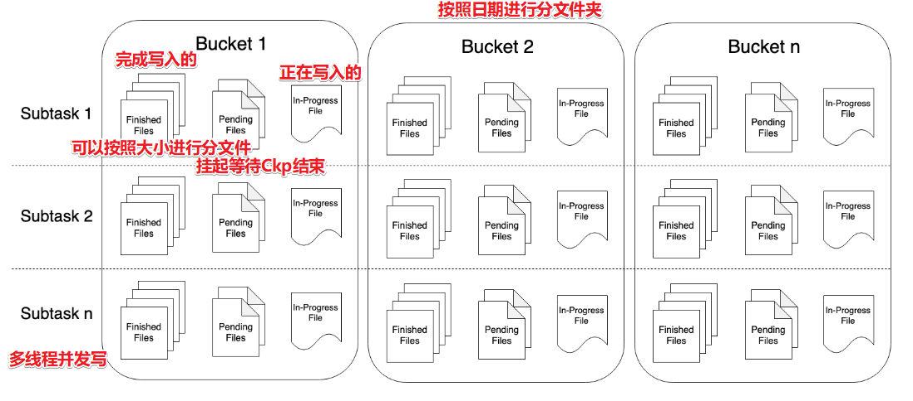
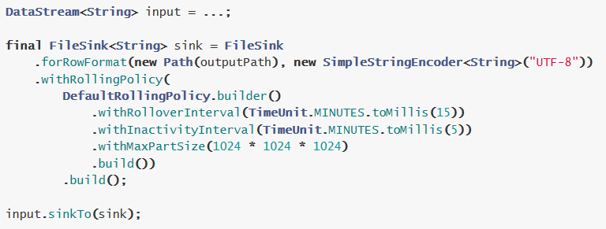

复习回顾

- 1.Checkpoint

  - State和Checkpoint的关系: 
    - State:某个Operator在某个时刻的历史结果数据/状态,内存
    - Checkpoint:某个时刻,所有的Operator当前状态的快照信息,磁盘
  - Checkpoint的流程

  

  -  Checkpoint存储位置/State状态后端
     -  MemoryStateBackend:State存TaskManager内存,Checkpoint存JobManager内存
     -  FsStateBackend:State存TaskManager内存,Checkpoint存外部文件系统(本地/HDFS)
     -  RocksDBStateBackend:State存TaskManager内存+磁盘, Checkpoint存外部文件系统(本地/HDFS)
  -  Checkpoint的配置

  ```java
  //====配置Checkpoint:都是一些固定的通用的配置===
          //===========类型1:必须参数
          //设置Checkpoint的时间间隔为1000ms做一次Checkpoint/其实就是每隔1000ms发一次Barrier!
          env.enableCheckpointing(1000);
          //设置State状态存储介质
          /*if(args.length > 0){
              env.setStateBackend(new FsStateBackend(args[0]));
          }else {
              env.setStateBackend(new FsStateBackend("file:///D:\\data\\ckp"));
          }*/
          if (SystemUtils.IS_OS_WINDOWS) {
              env.setStateBackend(new FsStateBackend("file:///D:/ckp"));
          } else {
              env.setStateBackend(new FsStateBackend("hdfs://node1:8020/flink-checkpoint"));
          }
          //===========类型2:建议参数===========
          //设置两个Checkpoint 之间最少等待时间,如设置Checkpoint之间最少是要等 500ms(为了避免每隔1000ms做一次Checkpoint的时候,前一次太慢和后一次重叠到一起去了)
          //如:高速公路上,每隔1s关口放行一辆车,但是规定了两车之前的最小车距为500m
          env.getCheckpointConfig().setMinPauseBetweenCheckpoints(500);//默认是0
          //设置如果在做Checkpoint过程中出现错误，是否让整体任务失败：true是  false不是
          //env.getCheckpointConfig().setFailOnCheckpointingErrors(false);//默认是true
          env.getCheckpointConfig().setTolerableCheckpointFailureNumber(10);//默认值为0，表示不容忍任何检查点失败
          //设置是否清理检查点,表示 Cancel 时是否需要保留当前的 Checkpoint，默认 Checkpoint会在作业被Cancel时被删除
          //ExternalizedCheckpointCleanup.DELETE_ON_CANCELLATION：true,当作业被取消时，删除外部的checkpoint(默认值)
          //ExternalizedCheckpointCleanup.RETAIN_ON_CANCELLATION：false,当作业被取消时，保留外部的checkpoint
          env.getCheckpointConfig().enableExternalizedCheckpoints(CheckpointConfig.ExternalizedCheckpointCleanup.RETAIN_ON_CANCELLATION);
  
          //===========类型3:直接使用默认的即可===============
          //设置checkpoint的执行模式为EXACTLY_ONCE(默认)
          env.getCheckpointConfig().setCheckpointingMode(CheckpointingMode.EXACTLY_ONCE);
          //设置checkpoint的超时时间,如果 Checkpoint在 60s内尚未完成说明该次Checkpoint失败,则丢弃。
          env.getCheckpointConfig().setCheckpointTimeout(60000);//默认10分钟
          //设置同一时间有多少个checkpoint可以同时执行
          env.getCheckpointConfig().setMaxConcurrentCheckpoints(1);//默认为1
  ```

- Checkpoint恢复-全自动

  - 自动Checkpoint+自动恢复

  ```java
  //1.默认重启策略:如果配置了Checkpoint,而没有配置重启策略,那么代码中出现了非致命错误时,程序会无限重启
  //2.无重启策略:也就是关闭无限重启,只要出现异常就报错,程序停掉
  //env.setRestartStrategy(RestartStrategies.noRestart());
  //3.固定延迟重启策略
  //尝试重启3次,每次间隔5s,超过3次,程序停掉
  env.setRestartStrategy(RestartStrategies.fixedDelayRestart(3, Time.of(5, TimeUnit.SECONDS)));
  //4.失败率重启策略
  //如果5分钟内job失败不达到三次,自动重启, 每次间隔10s (如果5分钟内程序失败达到3次,则程序退出)
  //env.setRestartStrategy(RestartStrategies.failureRateRestart(3, Time.of(5, TimeUnit.MINUTES),Time.of(10, TimeUnit.SECONDS)));
  
  ```

- Checkpoint恢复-半自动-了解

  - 自动Checkpoint+手动恢复

- Checkpoint恢复-全手动-SavePoint-了解

  -  手动的Checkpoint(SavePoint) + 手动恢复


- 2.End-To-End-Exactly-Once

  - At Most Once :最多一次
  - At Least Once: 至少一次
  - Exactly-Once:精准一次/精确一次/恰好一次/仅成功处理一次

  

  代码

  ```java
  package cn.itcast.extend;
  
  import org.apache.commons.lang3.SystemUtils;
  import org.apache.flink.api.common.RuntimeExecutionMode;
  import org.apache.flink.api.common.functions.FlatMapFunction;
  import org.apache.flink.api.common.functions.MapFunction;
  import org.apache.flink.api.common.restartstrategy.RestartStrategies;
  import org.apache.flink.api.common.serialization.SimpleStringSchema;
  import org.apache.flink.api.common.time.Time;
  import org.apache.flink.api.java.tuple.Tuple2;
  import org.apache.flink.runtime.state.filesystem.FsStateBackend;
  import org.apache.flink.streaming.api.CheckpointingMode;
  import org.apache.flink.streaming.api.datastream.DataStream;
  import org.apache.flink.streaming.api.datastream.SingleOutputStreamOperator;
  import org.apache.flink.streaming.api.environment.CheckpointConfig;
  import org.apache.flink.streaming.api.environment.StreamExecutionEnvironment;
  import org.apache.flink.streaming.connectors.kafka.FlinkKafkaConsumer;
  import org.apache.flink.streaming.connectors.kafka.FlinkKafkaProducer;
  import org.apache.flink.streaming.connectors.kafka.internals.KeyedSerializationSchemaWrapper;
  import org.apache.flink.util.Collector;
  
  import java.util.Properties;
  import java.util.Random;
  import java.util.concurrent.TimeUnit;
  
  /**
   * Author itcast
   * Desc 演示Flink-Connectors-Kafka-End-to-End Exactly-Once
   * 从Kafka的主题1中消费数据,并做实时WordCount,将结果写入到Kafka的主题2中
   */
  public class KafkaDemo {
      public static void main(String[] args) throws Exception {
          //TODO 1.env-准备环境
          StreamExecutionEnvironment env = StreamExecutionEnvironment.getExecutionEnvironment();
          env.setRuntimeMode(RuntimeExecutionMode.AUTOMATIC);
  
          //===========类型1:必须参数
          //设置Checkpoint的时间间隔为1000ms做一次Checkpoint/其实就是每隔1000ms发一次Barrier!
          env.enableCheckpointing(1000);
          //设置State状态存储介质
          if (SystemUtils.IS_OS_WINDOWS) {
              env.setStateBackend(new FsStateBackend("file:///D:/ckp"));
          } else {
              env.setStateBackend(new FsStateBackend("hdfs://node1:8020/flink-checkpoint"));
          }
          //===========类型2:建议参数===========
          //设置两个Checkpoint 之间最少等待时间,如设置Checkpoint之间最少是要等 500ms(为了避免每隔1000ms做一次Checkpoint的时候,前一次太慢和后一次重叠到一起去了)
          //如:高速公路上,每隔1s关口放行一辆车,但是规定了两车之前的最小车距为500m
          env.getCheckpointConfig().setMinPauseBetweenCheckpoints(500);//默认是0
          //设置如果在做Checkpoint过程中出现错误，是否让整体任务失败：true是  false不是
          //env.getCheckpointConfig().setFailOnCheckpointingErrors(false);//默认是true
          env.getCheckpointConfig().setTolerableCheckpointFailureNumber(10);//默认值为0，表示不容忍任何检查点失败
          //设置是否清理检查点,表示 Cancel 时是否需要保留当前的 Checkpoint，默认 Checkpoint会在作业被Cancel时被删除
          //ExternalizedCheckpointCleanup.DELETE_ON_CANCELLATION：true,当作业被取消时，删除外部的checkpoint(默认值)
          //ExternalizedCheckpointCleanup.RETAIN_ON_CANCELLATION：false,当作业被取消时，保留外部的checkpoint
          env.getCheckpointConfig().enableExternalizedCheckpoints(CheckpointConfig.ExternalizedCheckpointCleanup.RETAIN_ON_CANCELLATION);
  
          //===========类型3:直接使用默认的即可===============
          //设置checkpoint的执行模式为EXACTLY_ONCE(默认)
          env.getCheckpointConfig().setCheckpointingMode(CheckpointingMode.EXACTLY_ONCE);
          //设置checkpoint的超时时间,如果 Checkpoint在 60s内尚未完成说明该次Checkpoint失败,则丢弃。
          env.getCheckpointConfig().setCheckpointTimeout(60000);//默认10分钟
          //设置同一时间有多少个checkpoint可以同时执行
          env.getCheckpointConfig().setMaxConcurrentCheckpoints(1);//默认为1
  
          //===配置错误重启策略=====
          //1.默认重启策略:如果配置了Checkpoint,而没有配置重启策略,那么代码中出现了非致命错误时,程序会无限重启
          //2.无重启策略:也就是关闭无限重启,只要出现异常就报错,程序停掉
          //env.setRestartStrategy(RestartStrategies.noRestart());
          //3.固定延迟重启策略
          //尝试重启3次,每次间隔5s,超过3次,程序停掉
          env.setRestartStrategy(RestartStrategies.fixedDelayRestart(3, Time.of(5, TimeUnit.SECONDS)));
          //4.失败率重启策略
          //如果5分钟内job失败不达到三次,自动重启, 每次间隔10s (如果5分钟内程序失败达到3次,则程序退出)
          //env.setRestartStrategy(RestartStrategies.failureRateRestart(3, Time.of(5, TimeUnit.MINUTES),Time.of(10, TimeUnit.SECONDS)));
  
  
          //TODO 2.source-加载数据-ok
          //从kafka的topic1消费数据
          Properties properties = new Properties();
          properties.setProperty("bootstrap.servers", "192.168.88.161:9092");
          properties.setProperty("transaction.timeout.ms", 1000 * 5 + "");
          properties.setProperty("group.id", "flink");
          properties.setProperty("auto.offset.reset","latest");//latest有offset记录从记录位置开始消费,没有记录从最新的/最后的消息开始消费 /earliest有offset记录从记录位置开始消费,没有记录从最早的/最开始的消息开始消费
          //properties.setProperty("enable.auto.commit", "true");//自动提交(提交到默认主题,后续学习了Checkpoint后随着Checkpoint存储在Checkpoint和默认主题中)
          //properties.setProperty("auto.commit.interval.ms", "2000");//自动提交的时间间隔
          properties.setProperty("flink.partition-discovery.interval-millis","5000");//会开启一个后台线程每隔5s检测一下Kafka的分区情况,实现动态分区检测
          FlinkKafkaConsumer<String> kafkaSource = new FlinkKafkaConsumer<>("topic1", new SimpleStringSchema(), properties);
          kafkaSource.setCommitOffsetsOnCheckpoints(true);//默认就是true,表示在执行Checkpoint的时候提交Offset(也就是提交Offset到Checkpoint中并提交到默认主题__consumer_offsets中)
          DataStream<String> kafkaDS = env.addSource(kafkaSource);
  
  
          //TODO 3.transformation-数据转换处理
          DataStream<Tuple2<String, Integer>> wordAndCountDS = kafkaDS.flatMap(new FlatMapFunction<String, Tuple2<String, Integer>>() {
              @Override
              public void flatMap(String value, Collector<Tuple2<String, Integer>> out) throws Exception {
                  String[] words = value.split(" ");
                  for (String word : words) {
                      /*if(word.equals("bug")){
                          System.out.println("出bug了....");
                          throw new RuntimeException("出bug了....");
                      }*/
                      Random ran = new Random();
                      int i = ran.nextInt(10);
                      if(i % 3 ==0){
                          System.out.println("出bug了....");
                          throw new RuntimeException("出bug了....");
                      }
                      out.collect(Tuple2.of(word, 1));
                  }
              }
          }).keyBy(0).sum(1);
  
          SingleOutputStreamOperator<String> resultDS = wordAndCountDS.map(new MapFunction<Tuple2<String, Integer>, String>() {
              @Override
              public String map(Tuple2<String, Integer> value) throws Exception {
                  return value.f0 + ":::" + value.f1;
              }
          });
  
          //TODO 4.sink-数据输出
          FlinkKafkaProducer<String> kafkaSink = new FlinkKafkaProducer<>(
                  "topic2",
                  //new SimpleStringSchema(),
                  new KeyedSerializationSchemaWrapper<String>(new SimpleStringSchema()),
                  properties,
                  FlinkKafkaProducer.Semantic.EXACTLY_ONCE
          );
          resultDS.addSink(kafkaSink);
  
          //TODO 5.execute-执行
          env.execute();
      }
  }
  //1.准备topic1和topic2
  //2.启动kafka
  //3.往topic1发送如下数据
  ///export/server/kafka/bin/kafka-console-producer.sh --broker-list node1:9092 --topic topic1
  //4.观察topic2的数据
  
  ```

  

- 3.双流Join

  - Window-join

  - ```java 
    DataStream<FactOrderItem> joinResult = goodsDS.join(orderItemDS)
                    //.where(goods->goods.getGoodsId())
                  /*.where(new KeySelector<Goods, String>() {
                        @Override
                      public String getKey(Goods value) throws Exception {
                            return value.getGoodsId();
                      }
                    })*/
                  .where(Goods::getGoodsId)
                    .equalTo(OrderItem::getGoodsId)
                  .window(TumblingEventTimeWindows.of(Time.seconds(5)))
                    //.window(SlidingEventTimeWindows.of(Time.seconds(2) /* size */, Time.seconds(1) /* slide */))
                  //.window(EventTimeSessionWindows.withGap(Time.seconds(10)))
                    //使用apply可以实现自定义的计算逻辑
                    /*public interface JoinFunction<IN1, IN2, OUT> extends Function, Serializable {
                    	OUT join(IN1 first, IN2 second) throws Exception;
                    }*/
                    .apply(new JoinFunction<Goods, OrderItem, FactOrderItem>() {
                        @Override
                        public FactOrderItem join(Goods goods, OrderItem order) throws Exception {
                            FactOrderItem result = new FactOrderItem();
                            result.setGoodsId(goods.getGoodsId());
                            result.setGoodsName(goods.getGoodsName());
                            result.setCount(new BigDecimal(order.getCount()));
                            result.setTotalMoney(new BigDecimal(order.getCount()).multiply(goods.getGoodsPrice()));
                            return result;
                        }
                    });
    ```

  - Interval-join

  - ```java
    //TODO 3.transformation-数据转换处理
            //将订单流和商品流进行join,条件是
            //goodsId得相等,前时间范围内满足: 商品.事件时间 -5  <=  订单.事件时间  <=  商品.事件时间 +5
            //上面的条件其实就是说允许订单比商品早5s或晚5s
            DataStream<FactOrderItem> joinResult = orderItemDS.keyBy(OrderItem::getGoodsId)
                    .intervalJoin(goodsDS.keyBy(Goods::getGoodsId))
                    .between(Time.seconds(-5), Time.seconds(+5))
                    //自定义的处理逻辑
                    .process(new ProcessJoinFunction<OrderItem, Goods, FactOrderItem>() {
                        @Override
                        public void processElement(OrderItem order, Goods goods, Context ctx, Collector<FactOrderItem> out) throws Exception {
                            FactOrderItem result = new FactOrderItem();
                            result.setGoodsId(goods.getGoodsId());
                            result.setGoodsName(goods.getGoodsName());
                            result.setCount(new BigDecimal(order.getCount()));
                            result.setTotalMoney(new BigDecimal(order.getCount()).multiply(goods.getGoodsPrice()));
                            out.collect(result);
                        }
                    });
    ```

    

  

  

# 异步IO-面试

## 注意

面试被问到项目优化的时候可以说使用异步IO进行改造了

但是需要注意: 使用异步IO

1.API比较复杂

2.对数据源API有要求 

3.很多数据源支持高并发读,用异步IO性能提升也不是那么明显

所以异步IO有点鸡肋

## 为什么使用异步IO


  

## 如何使用异步IO

1.对于数据源来说: 需要提供异步客户端,如果没有提供需要使用第三方的,如Vertx(Java提供的一个异步客户端工具,可以将MySQL的jdbc连接包装成异步的) 或者使用连接池自己实现

  

2.对于Flink代码来说,需要实现异步IO的接口


  

  

#   Streaming File Sink和File Sink

## 注意

- 在Flink1.7

  离线文件输出使用ds.writeAsText

  实时文件输出Streaming File Sink

- 在Flink1.12中

  离线和实时文件输出都使用File Sink

所以接下来直接演示File Sink


## 原理和API

https://ci.apache.org/projects/flink/flink-docs-release-1.12/dev/connectors/file_sink.html






## 代码演示

```java
package cn.itcast.extend;

import org.apache.flink.api.common.RuntimeExecutionMode;
import org.apache.flink.api.common.functions.FlatMapFunction;
import org.apache.flink.api.common.functions.MapFunction;
import org.apache.flink.api.common.serialization.SimpleStringEncoder;
import org.apache.flink.api.java.tuple.Tuple2;
import org.apache.flink.connector.file.sink.FileSink;
import org.apache.flink.core.fs.Path;
import org.apache.flink.runtime.state.filesystem.FsStateBackend;
import org.apache.flink.streaming.api.datastream.DataStream;
import org.apache.flink.streaming.api.environment.CheckpointConfig;
import org.apache.flink.streaming.api.environment.StreamExecutionEnvironment;
import org.apache.flink.streaming.api.functions.sink.filesystem.bucketassigners.DateTimeBucketAssigner;
import org.apache.flink.streaming.api.functions.sink.filesystem.rollingpolicies.DefaultRollingPolicy;
import org.apache.flink.util.Collector;

import java.util.concurrent.TimeUnit;

/**
 * Author itcast
 * Desc 演示Flink1.12新特性-FlieSink将数据实时写入到HDFS
 */
public class FileSinkDemo {
    public static void main(String[] args) throws Exception {
        //TODO 1.env-准备环境
        StreamExecutionEnvironment env = StreamExecutionEnvironment.getExecutionEnvironment();
        env.setRuntimeMode(RuntimeExecutionMode.AUTOMATIC);
        //====配置Checkpoint:都是一些固定的通用的配置===
        env.enableCheckpointing(1000);
        env.setStateBackend(new FsStateBackend("file:///D:/ckp"));
        env.getCheckpointConfig().setMinPauseBetweenCheckpoints(500);//默认是0
        env.getCheckpointConfig().setTolerableCheckpointFailureNumber(10);//默认值为0，表示不容忍任何检查点失败
        env.getCheckpointConfig().enableExternalizedCheckpoints(CheckpointConfig.ExternalizedCheckpointCleanup.RETAIN_ON_CANCELLATION);

        //TODO 2.source-加载数据
        DataStream<String> socketDS = env.socketTextStream("192.168.88.161", 9999);

        //TODO 3.transformation-数据转换处理
        DataStream<String> resultDS = socketDS.flatMap(new FlatMapFunction<String, Tuple2<String, Integer>>() {
            @Override
            public void flatMap(String value, Collector<Tuple2<String, Integer>> out) throws Exception {
                String[] words = value.split(" ");
                for (String word : words) {
                    out.collect(Tuple2.of(word, 1));
                }
            }
        }).keyBy(0).sum(1).map(new MapFunction<Tuple2<String, Integer>, String>() {
            @Override
            public String map(Tuple2<String, Integer> value) throws Exception {
                return value.f0 + ":::" + value.f1;
            }
        });


        //TODO 4.sink-数据输出
        resultDS.print();
        //准备FlinkSink的配置
        //指定路径和编码
        FileSink<String> fileSink = FileSink.forRowFormat(new Path("hdfs://node1:8020/FlinkFileSink/48"), new SimpleStringEncoder<String>("UTF-8"))
                //指定分桶策略/分文件夹的策略
                .withBucketAssigner(new DateTimeBucketAssigner<>())
                //指定滚动策略
                .withRollingPolicy(DefaultRollingPolicy.builder()
                        .withMaxPartSize(1024 * 1024 * 1024)//单个文件最大大小
                        .withRolloverInterval(TimeUnit.MINUTES.toMillis(15))//文件最多写入的时长
                        .withInactivityInterval(TimeUnit.MINUTES.toMillis(5))//文件最大空闲时间
                        .build())
                .build();

        resultDS.sinkTo(fileSink);

        //TODO 5.execute-执行
        env.execute();
    }
}

```


  

# 关于并行度-面试

## 注意: 

你设置的并行度并不代表真正的有那么多线程同时执行, 得有足够的CPU资源才可以!!!

## 设置方式

- 在operator上进行设置: ds.operator.setParallelism

- 在env上进行设置

- 在flink ru命令后加参数:    -p,--parallelism

- 在flink-conf.yaml中:    parallelism.default: 1

  从上到下依次会进行覆盖

## 设置多少?

没有固定答案,但有规律

```
SourceOperator的并行度:一般和Kafka的分区数保持一致(一般百级,互联网公司有万级)
TransformationOperator的并行度:一般不做随意更改,因为改了之后可能会导致shuffle重分区,什么时候改? 数据变多之后-调大并相度,数据变少如filter之后,可以调下并行度
Sink的并行度:一般也不用边,如果往HDFS输出,要避免小文件,如往HBase输出避免过多的连接,可以调小并行度
```


# Flink Table & SQL

## 注意

- 直到Flink1.11,官网上都直接很老实的承认FlinkTable & SQL的功能还不完善,还在积极开发中
- 在Flink1.12的时候官网上没有这句话了,但是和SparkSQL相比, FlinkTable & SQL还是不完善,很多API和前面不兼容,未来API稳定性未知! 
- 所以后续的项目中只有一点点业务使用FlinkSQL, 但是未来随着Flink的发展,FlinkTable & SQL可能会越来越好
- 但目前还是比不过SparkSQL
- ==注意:不管是HiveSQL 还是 SparkSQL 还是FlinkSQL, 重点是SQL==
- 注意:SQL可以很方便快捷的完成一些简单业务逻辑,太复杂的搞不定


## 为什么很多计算框架都要支持SQL


## FlinkSQL的发展史


## 开发准备

### FlinkSQL依赖

https://ci.apache.org/projects/flink/flink-docs-release-1.12/dev/table/

注意: 查询计划器使用blink

```xml
		<dependency>
            <groupId>org.apache.flink</groupId>
            <artifactId>flink-table-api-scala-bridge_2.12</artifactId>
            <version>${flink.version}</version>
		</dependency>
        <dependency>
            <groupId>org.apache.flink</groupId>
            <artifactId>flink-table-api-java-bridge_2.12</artifactId>
            <version>${flink.version}</version>
        </dependency>

        <!-- blink执行计划,1.11+默认的-->
        <dependency>
            <groupId>org.apache.flink</groupId>
            <artifactId>flink-table-planner-blink_2.12</artifactId>
            <version>${flink.version}</version>
        </dependency>

        <dependency>
            <groupId>org.apache.flink</groupId>
            <artifactId>flink-table-common</artifactId>
            <version>${flink.version}</version>
        </dependency>
```


### FlinkSQL开发步骤


### 创建环境


### DataStream->表


### 表->DataStream


### 查询

Table风格/DSL风格


SQL风格


### FlinkSQL核心思想

- 动态表和连续查询

注意: FlinkSQL和Spark-StructuredStreaming的原理类似, 都支持使用SQL来处理批数据和流数据

但是注意: StructuredStreaming是把流当做批来处理, 而Flink是把批当做流来处理, 但是不管怎么,都有一个核心的模型,叫做动态表! 


# FlinkSQL-案例1-掌握

## 需求

将DataStream注册为Table和View并进行SQL统计


## 代码实现

掌握:

1.env

2.DataStream->table/view

3.table->DataStream

```java
package cn.itcast.sql;

import lombok.AllArgsConstructor;
import lombok.Data;
import lombok.NoArgsConstructor;
import org.apache.flink.api.java.tuple.Tuple2;
import org.apache.flink.streaming.api.datastream.DataStream;
import org.apache.flink.streaming.api.environment.StreamExecutionEnvironment;
import org.apache.flink.table.api.Table;
import org.apache.flink.table.api.bridge.java.StreamTableEnvironment;

import java.util.Arrays;

import static org.apache.flink.table.api.Expressions.$;

/**
 * Author itcast
 * Desc 将DataStream注册为Table和View并进行SQL统计
 */
public class FlinkSQLDemo01 {
    public static void main(String[] args) throws Exception {
        //TODO 1.env
        StreamExecutionEnvironment env = StreamExecutionEnvironment.getExecutionEnvironment();
        //EnvironmentSettings settings = EnvironmentSettings.newInstance().useBlinkPlanner().inStreamingMode().build();
        //StreamTableEnvironment tenv = StreamTableEnvironment.create(env, settings);
        StreamTableEnvironment tenv = StreamTableEnvironment.create(env);

        //TODO 2.source/准备表View/Table
        DataStream<Order> orderA = env.fromCollection(Arrays.asList(
                new Order(1L, "beer", 1),
                new Order(1L, "diaper", 4),
                new Order(3L, "rubber", 2)));

        DataStream<Order> orderB = env.fromCollection(Arrays.asList(
                new Order(2L, "pen", 3),
                new Order(2L, "rubber", 3),
                new Order(1L, "beer", 1)));

        //将DataStream转为View/Table
        //注意tableA是表名
        tenv.createTemporaryView("tableA",orderA,$("user"), $("product"), $("amount"));
        //注意tableB是变量名
        Table tableB = tenv.fromDataStream(orderB, $("user"), $("product"), $("amount"));
        tableB.printSchema();
        //root
        // |-- user: BIGINT
        // |-- product: STRING
        // |-- amount: INT
        System.out.println(tableB);//toString之后才是表名
        //UnnamedTable$0

        //TODO 3.transformation/查询
        //将订单数据进行合并-使用标准SQL语法中的union(会去重) 或 union all(不去重)
/*
select * from tableA
union all
select * from tableB
 */
        Table resultTable = tenv.sqlQuery("select * from tableA\n" +
                //"union all\n" +
                "union \n" +
                "select * from " + tableB);

        //TODO 4.sink
        //将Table转为DataStream再输出
        //toAppendStream:只支持追加
        //DataStream<Order> resultDS = tenv.toAppendStream(resultTable, Order.class);
        //resultDS.print("resultDS");

        //toRetractStream:支持所有
        DataStream<Tuple2<Boolean, Order>> resultDS2 = tenv.toRetractStream(resultTable, Order.class);

        resultDS2.print("resultDS2");

        //TODO 5.execute
        env.execute();
    }

    @Data
    @NoArgsConstructor
    @AllArgsConstructor
    public static class Order {
        public Long user;
        public String product;
        public int amount;
    }
}

```


# FlinkSQL-案例2-掌握

## 需求

使用SQL和Table(DSL)两种方式对DataStream中的单词进行统计


## 代码实现

掌握

1.sql风格写法:tenv.sqlQuery("SQL语句")

2.dsl风格写法:table.groupBy()...select().filter.....

```java
package cn.itcast.sql;

import lombok.AllArgsConstructor;
import lombok.Data;
import lombok.NoArgsConstructor;
import org.apache.flink.api.java.tuple.Tuple2;
import org.apache.flink.streaming.api.datastream.DataStream;
import org.apache.flink.streaming.api.environment.StreamExecutionEnvironment;
import org.apache.flink.table.api.Table;
import org.apache.flink.table.api.bridge.java.StreamTableEnvironment;
import org.apache.flink.types.Row;

import static org.apache.flink.table.api.Expressions.$;

/**
 * Author itcast
 * Desc 使用SQL和Table(DSL)两种方式对DataStream中的单词进行统计
 */
public class FlinkSQLDemo02 {
    public static void main(String[] args) throws Exception {
        //TODO 1.env
        StreamExecutionEnvironment env = StreamExecutionEnvironment.getExecutionEnvironment();
        StreamTableEnvironment tenv = StreamTableEnvironment.create(env);

        //TODO 2.source/准备表View/Table
        DataStream<WC> dataStream = env.fromElements(
                new WC("Hello", 1),
                new WC("World", 1),
                new WC("Hello", 1)
        );
        //dataStream->View和Table
        tenv.createTemporaryView("table1",dataStream, $("word"), $("frequency"));
        Table table2 = tenv.fromDataStream(dataStream, $("word"), $("frequency"));

        //TODO 3.transformation/查询
        //方式1:SQL方式查询
        //select word,sum(frequency) from table1 group by word
        Table resultTable1 = tenv.sqlQuery("select word,sum(frequency) as frequency from table1 group by word");
        DataStream<Tuple2<Boolean, WC>> resultDS1 = tenv.toRetractStream(resultTable1, WC.class);

        //方式2:Table(DSL)方式查询
        Table resultTable2 = table2.groupBy($("word"))
                .select($("word"), $("frequency").sum().as("frequency"))
                .filter($("frequency").isEqual(2));  //无 fuck 说
      
        
        resultTable2.printSchema();
        DataStream<Tuple2<Boolean, Row>> resultDS2 = tenv.toRetractStream(resultTable2, Row.class);
        DataStream<Tuple2<Boolean, WC>> resultDS3 = tenv.toRetractStream(resultTable2, WC.class);


        //TODO 4.sink
        resultDS1.print("resultDS1");
        resultDS2.print("resultDS2");
        resultDS3.print("resultDS3");

        //TODO 5.execute
        env.execute();
    }
    @Data
    @NoArgsConstructor
    @AllArgsConstructor
    public static class WC {
        public String word;
        public long frequency;
    }
}

```


# FlinkSQL-案例3-掌握一部分

## 需求

使用Flink SQL来统计5秒内 每个用户的 订单总数、订单的最大金额、订单的最小金额

也就是每隔5秒统计最近5秒的每个用户的订单总数、订单的最大金额、订单的最小金额

上面的需求使用DataStream的Window的基于事件时间的滚动窗口就可以搞定!

就是要求使用FlinkTable&SQL-API来实现基于事件时间的窗口


## 代码实现

```java
package cn.itcast.sql;

import lombok.AllArgsConstructor;
import lombok.Data;
import lombok.NoArgsConstructor;
import org.apache.flink.api.common.eventtime.WatermarkStrategy;
import org.apache.flink.api.java.tuple.Tuple2;
import org.apache.flink.api.java.tuple.Tuple4;
import org.apache.flink.streaming.api.TimeCharacteristic;
import org.apache.flink.streaming.api.datastream.DataStream;
import org.apache.flink.streaming.api.environment.StreamExecutionEnvironment;
import org.apache.flink.streaming.api.functions.source.SourceFunction;
import org.apache.flink.streaming.api.functions.windowing.WindowFunction;
import org.apache.flink.streaming.api.windowing.assigners.TumblingEventTimeWindows;
import org.apache.flink.streaming.api.windowing.time.Time;
import org.apache.flink.streaming.api.windowing.windows.TimeWindow;
import org.apache.flink.table.api.Table;
import org.apache.flink.table.api.Tumble;
import org.apache.flink.table.api.bridge.java.StreamTableEnvironment;
import org.apache.flink.types.Row;
import org.apache.flink.util.Collector;

import java.time.Duration;
import java.util.Random;
import java.util.UUID;

import static org.apache.flink.table.api.Expressions.$;
import static org.apache.flink.table.api.Expressions.lit;

/**
 * Author itcast
 * Desc 使用Flink SQL来统计5秒内 每个用户的 订单总数、订单的最大金额、订单的最小金额
 * 也就是每隔5秒统计最近5秒的每个用户的订单总数、订单的最大金额、订单的最小金额
 * 上面的需求使用DataStream的Window的基于事件时间的滚动窗口就可以搞定!
 * 就是要求使用FlinkTable&SQL-API来实现基于事件时间的窗口
 */
public class FlinkSQLDemo03 {
    public static void main(String[] args) throws Exception {
        //TODO 1.env
        StreamExecutionEnvironment env = StreamExecutionEnvironment.getExecutionEnvironment();
        StreamTableEnvironment tenv = StreamTableEnvironment.create(env);

        //TODO 2.source/准备表View/Table
        DataStream<Order> orderDS = env.addSource(new SourceFunction<Order>() {
            private Boolean flag = true;

            @Override
            public void run(SourceContext<Order> ctx) throws Exception {
                Random random = new Random();
                while (flag) {
                    ctx.collect(new Order(UUID.randomUUID().toString(),
                            random.nextInt(3),
                            random.nextInt(101),
                            System.currentTimeMillis()));
                    Thread.sleep(1000);
                }
            }

            @Override
            public void cancel() {
                flag = false;
            }
        });

        //指定使用事件时间/最大允许的乱序时间/哪一列是事件时间列
        env.setStreamTimeCharacteristic(TimeCharacteristic.EventTime);
        DataStream<Order> orderDSWithWatermark = orderDS.assignTimestampsAndWatermarks(
                WatermarkStrategy.<Order>forBoundedOutOfOrderness(Duration.ofSeconds(3))
                        .withTimestampAssigner((order, time) -> order.getCreateTime())
        );
        //TODO 3.transformation/查询
        DataStream<Object> resultDS = orderDSWithWatermark
                .keyBy(Order::getUserId)
                .window(TumblingEventTimeWindows.of(Time.seconds(5)))
                //WindowFunction<IN, OUT, KEY, W extends Window>
                .apply(new WindowFunction<Order, Object, Integer, TimeWindow>() {
                    @Override
                    public void apply(Integer key, TimeWindow window, Iterable<Order> orders, Collector<Object> out) throws Exception {
                        int size = 0;
                        Integer max = 0;
                        Integer min = Integer.MAX_VALUE;
                        for (Order order : orders) {
                            size++;
                            if (order.getMoney() > max) {
                                max = order.getMoney();
                            }
                            if (order.getMoney() < min) {
                                min = order.getMoney();
                            }
                        }
                        out.collect(Tuple4.of(key, size, max, min));
                        
                        /*ArrayList<Order> list = new ArrayList();
                        for (Order order : orders) {
                            list.add(order);
                        }
                        int count = list.size();
                        Integer max2 = list.stream().max((o1, o2) -> o1.getMoney().compareTo(o2.getMoney())).get().getMoney();
                        Integer min2 = list.stream().min((o1, o2) -> o1.getMoney().compareTo(o2.getMoney())).get().getMoney();*/
                    }
                });

        //上面的是按照DataStream的API完成的! 接下来使用Table & SQL 来搞定

        //方式1 SQL
        //注意需要使用 $("createTime").rowtime()告诉FlinkSQL哪一列是时间列
        //将DataStream转为view
        tenv.createTemporaryView("t_order1",orderDSWithWatermark,$("orderId"), $("userId"), $("money"), $("createTime").rowtime());
        //每隔5s统计5秒内 每个用户的 订单总数、订单的最大金额、订单的最小金额
/*
select userId,count(userId) as orderCounts,max(money) as maxMoney,min(money) as minMoney
from t_order1 group by  TUMBLE(createTime, INTERVAL '5' SECOND),  userId
*/

        Table tableResult1 = tenv.sqlQuery("select userId,count(userId) as orderCounts,max(money) as maxMoney,min(money) as minMoney\n" +
                "from t_order1 group by TUMBLE(createTime, INTERVAL '5' SECOND),  userId");
        DataStream<Tuple2<Boolean, Row>> resultDS1 = tenv.toRetractStream(tableResult1, Row.class);

        //方式2 Table
        //将DataStream转为table
        //Table table = tenv.fromDataStream(orderDSWithWatermark, $("orderId"), $("userId"), $("money"), $("createTime").rowtime());
        //将view转为Table
        Table table = tenv.from("t_order1");
        //.window(Tumble.over(lit(10).minutes()).on($("rowtime")).as("w"));
        Table tableResult2 = table.window(Tumble.over(lit(5).seconds()).on($("createTime")).as("myWindow"))
                .groupBy($("userId"), $("myWindow"))
                .select($("userId"),
                        $("userId").count().as("totalCount"),
                        $("money").max().as("maxMoney"),
                        $("money").min().as("minMoney"));
        DataStream<Tuple2<Boolean, Row>> resultDS2 = tenv.toRetractStream(tableResult2, Row.class);


        //TODO 4.sink
        resultDS.print("resultDS");
        resultDS1.print("resultDS1");
        resultDS2.print("resultDS2");

        //TODO 5.execute
        env.execute();
    }
    @Data
    @AllArgsConstructor
    @NoArgsConstructor
    public static class Order {
        private String orderId;
        private Integer userId;
        private Integer money;
        private Long createTime;
    }
}

```


# FlinkSQL-案例4

## 需求

从Kafka的topic1中消费数据并过滤出状态为success的数据再写入到Kafka的topic2

```
{"user_id": "1", "page_id":"1", "status": "success"}
{"user_id": "1", "page_id":"1", "status": "success"}
{"user_id": "1", "page_id":"1", "status": "success"}
{"user_id": "1", "page_id":"1", "status": "success"}
{"user_id": "1", "page_id":"1", "status": "fail"}
```


## 代码实现

https://ci.apache.org/projects/flink/flink-docs-release-1.12/dev/table/connectors/kafka.html


```java
package cn.itcast.sql;

import org.apache.flink.api.java.tuple.Tuple2;
import org.apache.flink.streaming.api.datastream.DataStream;
import org.apache.flink.streaming.api.environment.StreamExecutionEnvironment;
import org.apache.flink.table.api.Table;
import org.apache.flink.table.api.TableResult;
import org.apache.flink.table.api.bridge.java.StreamTableEnvironment;
import org.apache.flink.types.Row;

/**
 * Author itcast
 * Desc 从Kafka的topic1中消费数据并过滤出状态为success的数据再写入到Kafka的topic2
 * {"user_id": "1", "page_id":"1", "status": "success"}
 * {"user_id": "1", "page_id":"1", "status": "success"}
 * {"user_id": "1", "page_id":"1", "status": "success"}
 * {"user_id": "1", "page_id":"1", "status": "success"}
 * {"user_id": "1", "page_id":"1", "status": "fail"}
 */
public class FlinkSQLDemo04 {
    public static void main(String[] args) throws Exception {
        //TODO 1.env
        StreamExecutionEnvironment env = StreamExecutionEnvironment.getExecutionEnvironment();
        StreamTableEnvironment tenv = StreamTableEnvironment.create(env);

        //TODO 2.source/准备表View/Table
        //可以使用DataStream的从Kafka消费消息/读消息,也可以直接使用Flink-Table&SQL提供的API直接连接Kafka消费数据
        //可以使用DataStream的往Kafka生产消息/写数据,也可以直接使用Flink-Table&SQL提供的API直接连接Kafka写入数据
        //接下来创建2个表,一个表用来从Kafka读数据,一个表用来往Kafka写数据
        //tenv.sqlQuery()//执行查询
        //tenv.executeSql()//可以执行sql,如建表
        //从Kafka读数据
        TableResult table1 = tenv.executeSql(
                "CREATE TABLE table1 (\n" +
                        "  `user_id` BIGINT,\n" +
                        "  `page_id` BIGINT,\n" +
                        "  `status` STRING\n" +
                        ") WITH (\n" +
                        "  'connector' = 'kafka',\n" +
                        "  'topic' = 'topic1',\n" +
                        "  'properties.bootstrap.servers' = '192.168.88.161:9092',\n" +
                        "  'properties.group.id' = 'testGroup',\n" +
                        "  'scan.startup.mode' = 'latest-offset',\n" +
                        "  'format' = 'json'\n" +
                        ")"
        );

        //向Kafka写数据
        TableResult table2 = tenv.executeSql(
                "CREATE TABLE table2 (\n" +
                        "  `user_id` BIGINT,\n" +
                        "  `page_id` BIGINT,\n" +
                        "  `status` STRING\n" +
                        ") WITH (\n" +
                        "  'connector' = 'kafka',\n" +
                        "  'topic' = 'topic2',\n" +
                        "  'properties.bootstrap.servers' = '192.168.88.161:9092',\n" +
                        "  'format' = 'json',\n" +
                        "  'sink.partitioner' = 'round-robin'\n" +
                        ")"
        );

        //TODO 3.transformation/查询
        Table result = tenv.sqlQuery("select user_id,page_id,status from table1 where status='success'");

        //TODO 4.sink
        //输出到控制台
        DataStream<Tuple2<Boolean, Row>> resultDS = tenv.toRetractStream(result, Row.class);
        resultDS.print();
        //输出到Kafka
        tenv.executeSql("insert into table2 select * from " + result);

        //TODO 5.execute
        env.execute();
    }
}
//1.准备主题
//2.启动程序
//3.发送数据都topic1
///export/server/kafka/bin/kafka-console-producer.sh --broker-list node1:9092 --topic topic1
//4.观察topic2
```


# FlinkSQL-案例5

## 需求

整合Hive

https://ci.apache.org/projects/flink/flink-docs-release-1.12/dev/table/connectors/hive/


## 准备操作

1.在/etc/profile配置,并分发,并source

```java
export HADOOP_CLASSPATH=`hadoop classpath`
```


2.下载jar包并上传到flink/lib目录

cd /export/server/flink/lib/ 

三台都上传


3.修改配置文件

vim /export/server/hive/conf/hive-site.xml

```java
<property>
        <name>hive.metastore.uris</name>
        <value>thrift://node3:9083</value>
</property>
```


4.在node3上启动hive元数据服务

nohup /export/server/hive/bin/hive --service metastore &


## 使用Flink-Cli连接Hive

1.修改flink的配置

vim /export/server/flink/conf/sql-client-defaults.yaml 

```java
catalogs:
   - name: myhive
     type: hive
     hive-conf-dir: /export/server/hive/conf
     default-database: default
```


2.在node1启动flink集群

/export/server/flink/bin/start-cluster.sh

http://192.168.88.161:8081/#/job/running

http://192.168.88.162:8081/#/job/running


3.在node3启动flink-sql客户端

/export/server/flink/bin/sql-client.sh embedded


4.执行hive sql用Flink去执行

```
show catalogs;
use catalog myhive;
show tables;
select * from person;
```


## 使用Flink-代码连接Hive

```java
package cn.itcast.sql;

import org.apache.flink.table.api.EnvironmentSettings;
import org.apache.flink.table.api.TableEnvironment;
import org.apache.flink.table.api.TableResult;
import org.apache.flink.table.catalog.hive.HiveCatalog;

/**
 * Author itcast
 * Desc 演示FlinkSQL-连接Hive执行HiveSQL(底层使用Flink作为执行引擎)
 */
public class FlinkSQLDemo05 {
    public static void main(String[] args) throws Exception {
        //TODO 1.env
        EnvironmentSettings settings = EnvironmentSettings.newInstance().useBlinkPlanner().build();
        TableEnvironment tenv = TableEnvironment.create(settings);

        //TODO 2.source/准备表View/Table
        //准备常量
        String name            = "myhive";
        String defaultDatabase = "default";
        String hiveConfDir     = "./conf";
        //注册并使用HiveCatalog
        HiveCatalog hive = new HiveCatalog(name, defaultDatabase, hiveConfDir);
        tenv.registerCatalog("myhive", hive);
        tenv.useCatalog("myhive");

        //TODO 3.transformation/查询
        String insertSQL = "insert into person select * from person";
        TableResult result = tenv.executeSql(insertSQL);//执行sql并获取结果

        while (true){
            System.out.println(result.getJobClient().get().getJobStatus());//获取结果中的执行状态
            Thread.sleep(1000);
        }
        //TODO 4.sink

        //TODO 5.execute
    }
}
```


# 作业

==复习!!!==

中午有空把Spark复习下


