[TOC]


# 1- End-to-End Exactly-Once-面试

## 1-1 流处理语义

如果让我们自己去实现流处理数据语义:  

At-most-once-最多一次,有可能**丢失**,实现起来最简单(不需要做任何处理)

At-least-once-至少一次,不会丢,但是可能会**重复**(先消费再提交)

Exactly-Once-恰好一次/精准一次/精确一次,数据**不能丢失且不能被重复**处理(先消费再提交 + 去重)


## 1-2 Flink中的流处理语义

注意: Flink在1.4.0 版本中开始支持Exactly-Once的语义的实现,且支持End-to-End的Exactly-Once

- Exactly-Once

``` properties
Exactly-Once --精准一次,  也就是说数据只会被处理一次,不会丢也不会重复,注意: 更准确的理解应该是只会被正确处理一次而不是仅一次
```


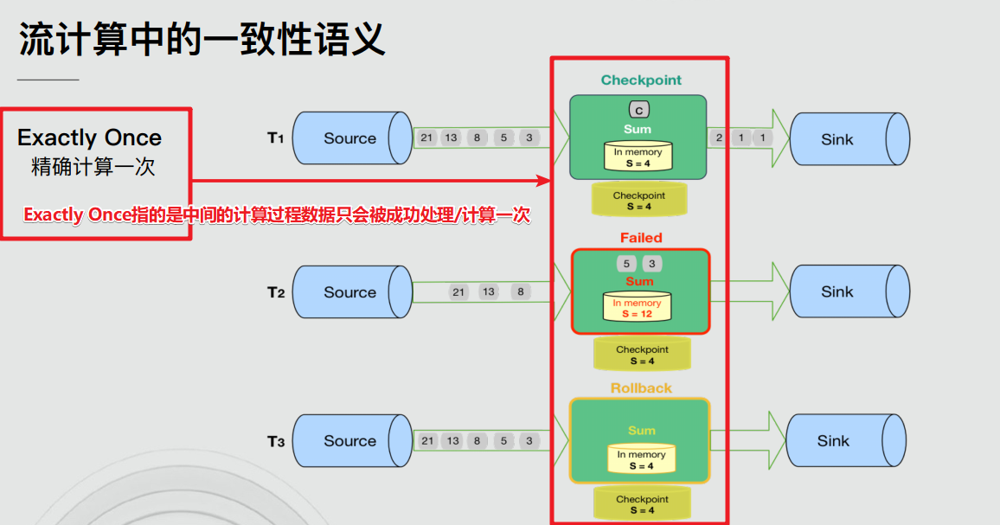


- End-to-End Exactly-Once

``` properties
End-to-End Exactly-Once : 端到端的Exactly-Once, 也就是说, Flink不光光内部处理数据的时候支持Exactly-Once, 在从Source消费, 到Transformation处理, 再到Sink,整个流数据处理,从一端到另一端 整个流程都支持Exactly-Once ! 
```


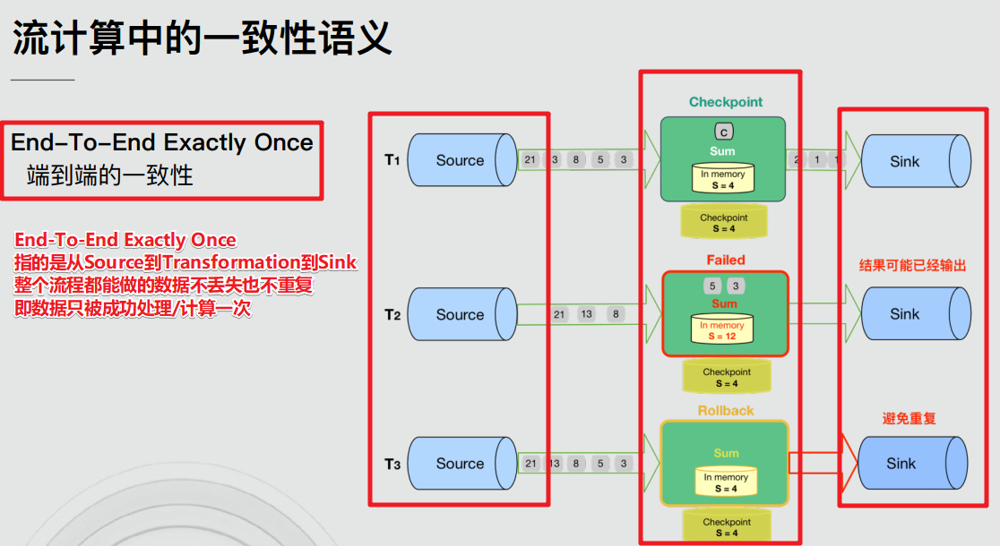


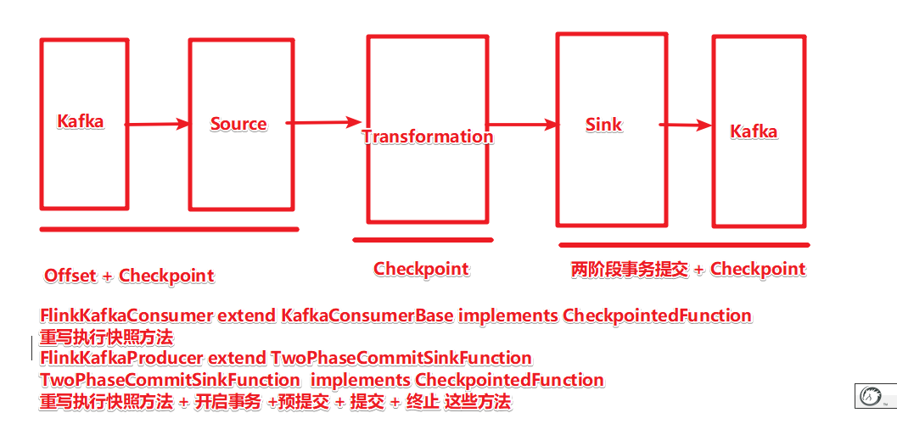

## 1-3 Flink如何实现的End-to-End Exactly-Once

- Source:通过**offset**即可保证数据不丢失, 再结合后续的**Checkpoint**保证数据只会被成功处理/计算一次即可

``` java
FlinkKafkaConsumer<T> extends FlinkKafkaConsumerBase
FlinkKafkaConsumerBase<T>  implements CheckpointedFunction
源码中就记录了主题分区和offset信息
ListState<Tuple2<KafkaTopicPartition, Long>> unionOffsetStates
initializeState方法和snapshotState方法
```


- Transformation:通过Flink的**Checkpoint**就可以完全可以保证

``` properties
Flink官方介绍说的就是支持数据流上的有状态计算! Flink中的有状态的Transformation-API都是自动维护状态到的(到Checkpoint中),如sum/reduce/maxBy.....
```


- Sink:去重(维护麻烦)或幂等性写入(Redis/HBase支持,MySQL和Kafka不支持)都可以, Flink中使用的是**两阶段事务提交**+**Checkpoint**来实现的

``` properties
Flink+Kafka, Kafka是支持事务的,所以可以使用两阶段事务提交来实现
FlinkKafkaProducer<IN> extends TwoPhaseCommitSinkFunction  	//两阶段事务提交
beginTransaction 	// 开启事务
preCommit  			// 预提交事务
commit				// 提交事务
abort				// 回滚事务
```


## 1-4 两阶段事务提交

### 1-4-1 API

- 1.beginTransaction:开启事务

- 2.preCommit:预提交

- 3.commit:提交

- 4.abort:终止


### 1-4-2 流程

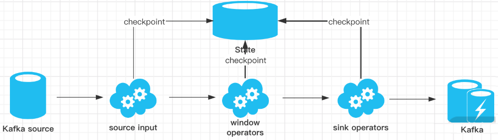

- 1.Flink程序启动运行,JobManager启动CheckpointCoordinator按照设置的参数**定期执行Checkpoint**

- 2.有数据进来参与计算, **各个Operator(Source/Transformation/Sink)都会执行Checkpoint**

- 3.将数据写入到外部存储的时候**beginTransaction开启事务**

- 4.中间各个Operator执行Checkpoint成功则各自执行**preCommit预提交**

- 5.所有的Operator执行完预提交之后则执行**commit最终提交**

- 6.如果中间有任何preCommit失败则进行**abort终止**


总结: 

Flink通过 **Offet + Checkpoint + 两阶段事务提交** 来实现End-to-End Exactly-Once

也就是要保证数据从Source到Transformation到Sink都能实现数据不会丢也不会重复,也就是数据只会被成功计算/处理/保存一次

- Source: **Offset + Checkpoint** 

- Transformation: **Checkpoint** 

- Sink: **两阶段事务提交+ Checkpoint** 


可以简单理解:**Checkpoint保证数据不丢失** , **两阶段事务提交保证数据不重复**!


注意: Flink已经帮我们实现好了上述的复杂流程! 我们直接使用即可! 如果要自己实现太麻烦了!


## 1-5 Flink+Kafka中的两阶段事务提交实现源码欣赏

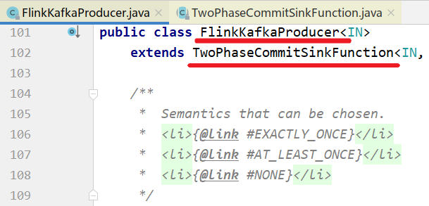

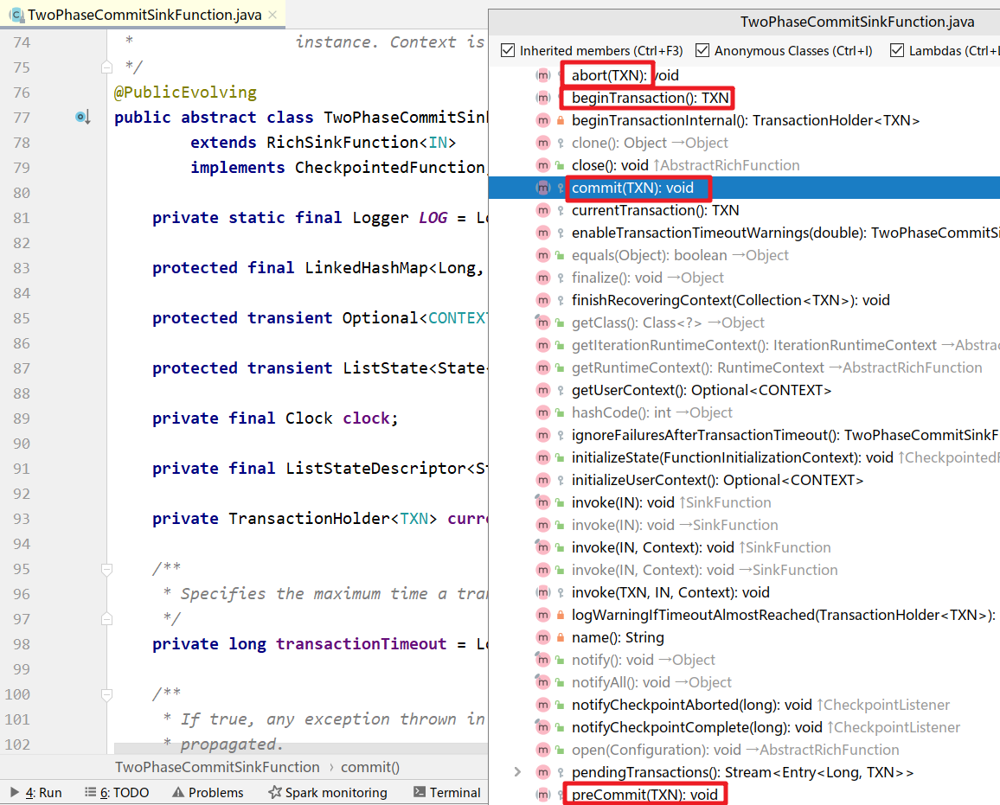


## 1-6 代码演示-开发时直接使用-掌握

### 1-6-1 总结:

Kafka+Flink+Kafka实现End-to-End Exactly-Once已经由Flink帮我们做好了

- Source:FlinkKafkaConsumer extends FlinkKafkaConsumerBase implements CheckpointedFunction 里面维护offset到Checkpoint中, 我们只需要开启Checkpoint即可
- Transformation: 开启Checkpoint之后,Flink自动维护Operator的State到Checkpoint中
- Sink:  FlinkKafkaProducer  extends TwoPhaseCommitSinkFunction implements CheckpointedFunction,通过两阶段事务提交+Checkpoint实现, 我们只需要开启Checkpoint并设置流数据处理语义为FlinkKafkaProducer.Semantic.EXACTLY_ONCE即可


### 1-6-2 技术点

- kafka配置

``` java
//TODO 2.source-加载数据-ok
//从kafka的topic1消费数据
Properties properties = new Properties();
properties.setProperty("bootstrap.servers", "192.168.88.161:9092");
properties.setProperty("transaction.timeout.ms", 1000 * 5 + "");
properties.setProperty("group.id", "flink");

properties.setProperty("auto.offset.reset","latest");//latest有offset记录从记录位置开始消费,没有记录从最新的/最后的消息开始消费 /earliest有offset记录从记录位置开始消费,没有记录从最早的/最开始的消息开始消费

properties.setProperty("enable.auto.commit", "true");//自动提交(提交到默认主题,后续学习了Checkpoint后随着Checkpoint存储在Checkpoint和默认主题中)

properties.setProperty("auto.commit.interval.ms", "2000");//自动提交的时间间隔

properties.setProperty("flink.partition-discovery.interval-millis","5000");//会开启一个后台线程每隔5s检测一下Kafka的分区情况,实现动态分区检测
```

- 创建kafka消费者

``` java
FlinkKafkaConsumer<String> kafkaSource = new FlinkKafkaConsumer<>("topic1", new 				SimpleStringSchema(), properties);

kafkaSource.setCommitOffsetsOnCheckpoints(true);//默认就是true,表示在执行Checkpoint的时候提交Offset(也就是提交Offset到Checkpoint中并提交到默认主题__consumer_offsets中)

```


- 创建kafka 生成者

``` java
FlinkKafkaProducer<String> kafkaSink = new FlinkKafkaProducer<>(
    "topic2",
    //new SimpleStringSchema(),
    new KeyedSerializationSchemaWrapper<String>(new SimpleStringSchema()),//序列化约束，现在使用String.
    properties,
    FlinkKafkaProducer.Semantic.EXACTLY_ONCE
);
```


### 1-6-3 测试步骤

- 准备topic1和topic2
- 启动kafka
- 启动程序；
- 往topic1发送如下数据

``` properties
export/server/kafka/bin/kafka-console-producer.sh --broker-list node1:9092 --topic topic1
```

- 观察topic2的数据


### 1-6-4 程序代码

```java
package cn.itcast.extend;

import org.apache.commons.lang3.SystemUtils;
import org.apache.flink.api.common.RuntimeExecutionMode;
import org.apache.flink.api.common.functions.FlatMapFunction;
import org.apache.flink.api.common.functions.MapFunction;
import org.apache.flink.api.common.restartstrategy.RestartStrategies;
import org.apache.flink.api.common.serialization.SimpleStringSchema;
import org.apache.flink.api.common.time.Time;
import org.apache.flink.api.java.tuple.Tuple2;
import org.apache.flink.runtime.state.filesystem.FsStateBackend;
import org.apache.flink.streaming.api.CheckpointingMode;
import org.apache.flink.streaming.api.datastream.DataStream;
import org.apache.flink.streaming.api.datastream.SingleOutputStreamOperator;
import org.apache.flink.streaming.api.environment.CheckpointConfig;
import org.apache.flink.streaming.api.environment.StreamExecutionEnvironment;
import org.apache.flink.streaming.connectors.kafka.FlinkKafkaConsumer;
import org.apache.flink.streaming.connectors.kafka.FlinkKafkaProducer;
import org.apache.flink.streaming.connectors.kafka.internals.KeyedSerializationSchemaWrapper;
import org.apache.flink.util.Collector;

import java.util.Properties;
import java.util.Random;
import java.util.concurrent.TimeUnit;

/**
 * Author itcast
 * Desc 演示Flink-Connectors-Kafka-End-to-End Exactly-Once
 * 从Kafka的主题1中消费数据,并做实时WordCount,将结果写入到Kafka的主题2中
 */
public class KafkaDemo {
    public static void main(String[] args) throws Exception {
        //TODO 1.env-准备环境
        StreamExecutionEnvironment env = StreamExecutionEnvironment.getExecutionEnvironment();
        env.setRuntimeMode(RuntimeExecutionMode.AUTOMATIC);

        //===========类型1:必须参数
        //设置Checkpoint的时间间隔为1000ms做一次Checkpoint/其实就是每隔1000ms发一次Barrier!
        env.enableCheckpointing(1000);
        //设置State状态存储介质
        if (SystemUtils.IS_OS_WINDOWS) {
            env.setStateBackend(new FsStateBackend("file:///D:/ckp"));
        } else {
            env.setStateBackend(new FsStateBackend("hdfs://node1:8020/flink-checkpoint"));
        }
        //===========类型2:建议参数===========
        //设置两个Checkpoint 之间最少等待时间,如设置Checkpoint之间最少是要等 500ms(为了避免每隔1000ms做一次Checkpoint的时候,前一次太慢和后一次重叠到一起去了)
        //如:高速公路上,每隔1s关口放行一辆车,但是规定了两车之前的最小车距为500m
        env.getCheckpointConfig().setMinPauseBetweenCheckpoints(500);//默认是0
        //设置如果在做Checkpoint过程中出现错误，是否让整体任务失败：true是  false不是
        //env.getCheckpointConfig().setFailOnCheckpointingErrors(false);//默认是true
        env.getCheckpointConfig().setTolerableCheckpointFailureNumber(10);//默认值为0，表示不容忍任何检查点失败
        //设置是否清理检查点,表示 Cancel 时是否需要保留当前的 Checkpoint，默认 Checkpoint会在作业被Cancel时被删除
        //ExternalizedCheckpointCleanup.DELETE_ON_CANCELLATION：true,当作业被取消时，删除外部的checkpoint(默认值)
        //ExternalizedCheckpointCleanup.RETAIN_ON_CANCELLATION：false,当作业被取消时，保留外部的checkpoint
        env.getCheckpointConfig().enableExternalizedCheckpoints(CheckpointConfig.ExternalizedCheckpointCleanup.RETAIN_ON_CANCELLATION);

        //===========类型3:直接使用默认的即可===============
        //设置checkpoint的执行模式为EXACTLY_ONCE(默认)
        env.getCheckpointConfig().setCheckpointingMode(CheckpointingMode.EXACTLY_ONCE);
        
       //设置checkpoint的超时时间,如果 Checkpoint在 60s内尚未完成说明该次Checkpoint失败,则丢弃。
        env.getCheckpointConfig().setCheckpointTimeout(60000);//默认10分钟
        
        //设置同一时间有多少个checkpoint可以同时执行
        env.getCheckpointConfig().setMaxConcurrentCheckpoints(1);//默认为1

        //===配置错误重启策略=====
        //1.默认重启策略:如果配置了Checkpoint,而没有配置重启策略,那么代码中出现了非致命错误时,程序会无限重启
        //2.无重启策略:也就是关闭无限重启,只要出现异常就报错,程序停掉
        //env.setRestartStrategy(RestartStrategies.noRestart());
        //3.固定延迟重启策略
        //尝试重启3次,每次间隔5s,超过3次,程序停掉
        env.setRestartStrategy(RestartStrategies.fixedDelayRestart(3, Time.of(5, TimeUnit.SECONDS)));
        //4.失败率重启策略
        //如果5分钟内job失败不达到三次,自动重启, 每次间隔10s (如果5分钟内程序失败达到3次,则程序退出)
        //env.setRestartStrategy(RestartStrategies.failureRateRestart(3, Time.of(5, TimeUnit.MINUTES),Time.of(10, TimeUnit.SECONDS)));


        //TODO 2.source-加载数据-ok
        //从kafka的topic1消费数据
        Properties properties = new Properties();
        properties.setProperty("bootstrap.servers", "192.168.88.161:9092");
        properties.setProperty("transaction.timeout.ms", 1000 * 5 + "");
        properties.setProperty("group.id", "flink");
        properties.setProperty("auto.offset.reset","latest");//latest有offset记录从记录位置开始消费,没有记录从最新的/最后的消息开始消费 /earliest有offset记录从记录位置开始消费,没有记录从最早的/最开始的消息开始消费
        //properties.setProperty("enable.auto.commit", "true");//自动提交(提交到默认主题,后续学习了Checkpoint后随着Checkpoint存储在Checkpoint和默认主题中)
        //properties.setProperty("auto.commit.interval.ms", "2000");//自动提交的时间间隔
        properties.setProperty("flink.partition-discovery.interval-millis","5000");//会开启一个后台线程每隔5s检测一下Kafka的分区情况,实现动态分区检测
        
        FlinkKafkaConsumer<String> kafkaSource = new FlinkKafkaConsumer<>("topic1", new SimpleStringSchema(), properties);
        kafkaSource.setCommitOffsetsOnCheckpoints(true);//默认就是true,表示在执行Checkpoint的时候提交Offset(也就是提交Offset到Checkpoint中并提交到默认主题__consumer_offsets中)
        DataStream<String> kafkaDS = env.addSource(kafkaSource);


        //TODO 3.transformation-数据转换处理
        DataStream<Tuple2<String, Integer>> wordAndCountDS = kafkaDS.flatMap(new FlatMapFunction<String, Tuple2<String, Integer>>() {
            @Override
            public void flatMap(String value, Collector<Tuple2<String, Integer>> out) throws Exception {
                String[] words = value.split(" ");
                for (String word : words) {
                    /*if(word.equals("bug")){
                        System.out.println("出bug了....");
                        throw new RuntimeException("出bug了....");
                    }*/
                    Random ran = new Random();
                    int i = ran.nextInt(10);
                    if(i % 3 ==0){
                        System.out.println("出bug了....");
                        throw new RuntimeException("出bug了....");
                    }
                    out.collect(Tuple2.of(word, 1));
                }
            }
        }).keyBy(0).sum(1);

        SingleOutputStreamOperator<String> resultDS = wordAndCountDS.map(new MapFunction<Tuple2<String, Integer>, String>() {
            @Override
            public String map(Tuple2<String, Integer> value) throws Exception {
                return value.f0 + ":::" + value.f1;
            }
        });

        //TODO 4.sink-数据输出
        FlinkKafkaProducer<String> kafkaSink = new FlinkKafkaProducer<>(
                "topic2",
                //new SimpleStringSchema(),
                new KeyedSerializationSchemaWrapper<String>(new SimpleStringSchema()),
                properties,
                FlinkKafkaProducer.Semantic.EXACTLY_ONCE
        );
        resultDS.addSink(kafkaSink);

        //TODO 5.execute-执行
        env.execute();
    }
}
//1.准备topic1和topic2
//2.启动kafka
//3.往topic1发送如下数据
///export/server/kafka/bin/kafka-console-producer.sh --broker-list node1:9092 --topic topic1
//4.观察topic2的数据

```

- 

  


# 2- 双流Join-面试

## 2-1 join分类

双流Join是Flink面试的高频问题。一般情况下说明以下几点就可以hold了：

 Join大体分类只有两种：**Window Join** 和 **Interval Join**。

- Window Join又可以根据Window的类型细分出3种：

  **Tumbling** Window Join、**Sliding** Window Join、**Session** Widnow Join。

  Windows类型的join都是利用 **window的机制**，先将数据 **缓存在Window State** 中，当窗口触发计算时，执行join操作；

- interval join也是利用 **state存储** 数据再处理，区别在于state中的数据有失效机制，依靠数据触发数据清理；

- 官方文档


``` http
https://ci.apache.org/projects/flink/flink-docs-release-1.12/dev/stream/operators/joining.html
```


### 2-1-1 Window Join

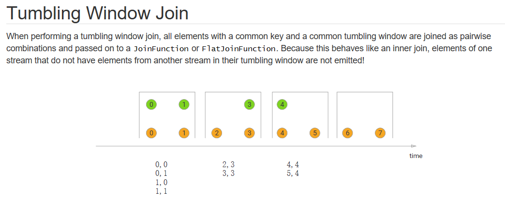

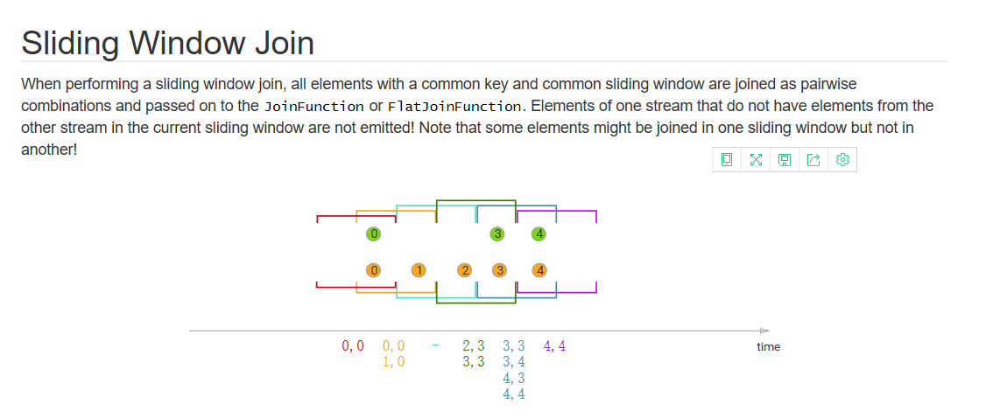

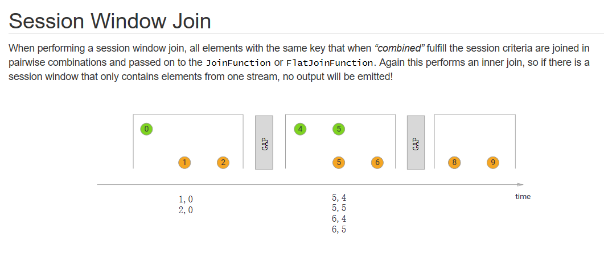

### 2-1-2 Interval Join

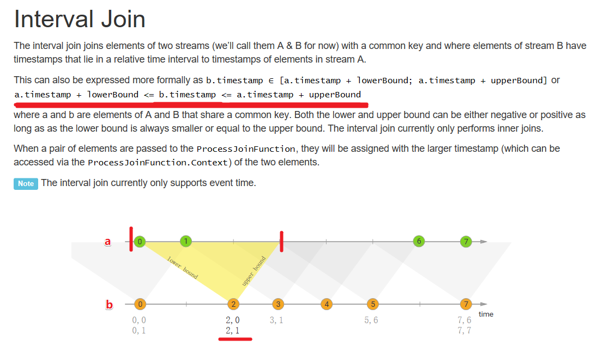


## 2-2 代码演示-Window Join

- 需求


``` properties
使用两个指定Source模拟数据，

一个Source是订单明细，

一个Source是商品数据。

我们通过window join，将数据关联到一起。
```


代码实现

```java
package cn.itcast.extend;

import com.alibaba.fastjson.JSON;
import lombok.Data;
import org.apache.flink.api.common.RuntimeExecutionMode;
import org.apache.flink.api.common.eventtime.*;
import org.apache.flink.api.common.functions.JoinFunction;
import org.apache.flink.configuration.Configuration;
import org.apache.flink.streaming.api.datastream.DataStream;
import org.apache.flink.streaming.api.environment.StreamExecutionEnvironment;
import org.apache.flink.streaming.api.functions.source.RichSourceFunction;
import org.apache.flink.streaming.api.windowing.assigners.TumblingEventTimeWindows;
import org.apache.flink.streaming.api.windowing.time.Time;

import java.math.BigDecimal;
import java.util.ArrayList;
import java.util.List;
import java.util.Random;
import java.util.UUID;
import java.util.concurrent.TimeUnit;

/**
 * Author itcast
 * Desc 演示Flink-双流Join-Window-Join
 */
public class JoinDemo01 {
    public static void main(String[] args) throws Exception {
        //TODO 1.env-准备环境
        StreamExecutionEnvironment env = StreamExecutionEnvironment.getExecutionEnvironment();
        env.setRuntimeMode(RuntimeExecutionMode.AUTOMATIC);

        //TODO 2.source-加载数据
        //构建商品数据流
        DataStream<Goods> goodsDS = env.addSource(new GoodsSource())
                .assignTimestampsAndWatermarks(new GoodsWatermark());
        //构建订单明细数据流
        DataStream<OrderItem> orderItemDS = env.addSource(new OrderItemSource())
                .assignTimestampsAndWatermarks(new OrderItemWatermark());

        //TODO 3.transformation-数据转换处理
        //将商品流和订单流使用Window-Join-使用Tumbling Window Join 每隔5s计算一次
        DataStream<FactOrderItem> joinResult = goodsDS.join(orderItemDS)
                //.where(goods->goods.getGoodsId())
                /*.where(new KeySelector<Goods, String>() {
                    @Override
                    public String getKey(Goods value) throws Exception {
                        return value.getGoodsId();
                    }
                })*/
                .where(Goods::getGoodsId)
                .equalTo(OrderItem::getGoodsId)
                .window(TumblingEventTimeWindows.of(Time.seconds(5)))
                //.window(SlidingEventTimeWindows.of(Time.seconds(2) /* size */, Time.seconds(1) /* slide */))
                //.window(EventTimeSessionWindows.withGap(Time.seconds(10)))
                //使用apply可以实现自定义的计算逻辑
                /*public interface JoinFunction<IN1, IN2, OUT> extends Function, Serializable {
                	OUT join(IN1 first, IN2 second) throws Exception;
                }*/
                .apply(new JoinFunction<Goods, OrderItem, FactOrderItem>() {
                    @Override
                    public FactOrderItem join(Goods goods, OrderItem order) throws Exception {
                        FactOrderItem result = new FactOrderItem();
                        result.setGoodsId(goods.getGoodsId());
                        result.setGoodsName(goods.getGoodsName());
                        result.setCount(new BigDecimal(order.getCount()));
                        result.setTotalMoney(new BigDecimal(order.getCount()).multiply(goods.getGoodsPrice()));
                        return result;
                    }
                });
        //TODO 4.sink-数据输出
        joinResult.print();
        //TODO 5.execute-执行
        env.execute();
    }
    //商品类
    @Data
    public static class Goods {
        private String goodsId;//商品id
        private String goodsName;//商品名称
        private BigDecimal goodsPrice;//商品价格
        public static List<Goods> GOODS_LIST;//商品集合
        public static Random r;

        static  {
            r = new Random();
            GOODS_LIST = new ArrayList<>();
            GOODS_LIST.add(new Goods("1", "小米12", new BigDecimal(4890)));
            GOODS_LIST.add(new Goods("2", "iphone12", new BigDecimal(12000)));
            GOODS_LIST.add(new Goods("3", "MacBookPro", new BigDecimal(15000)));
            GOODS_LIST.add(new Goods("4", "Thinkpad X1", new BigDecimal(9800)));
            GOODS_LIST.add(new Goods("5", "MeiZu One", new BigDecimal(3200)));
            GOODS_LIST.add(new Goods("6", "Mate 40", new BigDecimal(6500)));
        }
        public static Goods randomGoods() {
            int rIndex = r.nextInt(GOODS_LIST.size());
            return GOODS_LIST.get(rIndex);
        }
        public Goods() {
        }
        public Goods(String goodsId, String goodsName, BigDecimal goodsPrice) {
            this.goodsId = goodsId;
            this.goodsName = goodsName;
            this.goodsPrice = goodsPrice;
        }
        @Override
        public String toString() {
            return JSON.toJSONString(this);
        }
    }

    //订单明细类
    @Data
    public static class OrderItem {
        private String itemId;//订单id
        private String goodsId;//商品id
        private Integer count;//数量
        @Override
        public String toString() {
            return JSON.toJSONString(this);
        }
    }

    //关联结果
    @Data
    public static class FactOrderItem {
        private String goodsId;//商品id
        private String goodsName;//商品名称
        private BigDecimal count;//数量
        private BigDecimal totalMoney;//总金额
        @Override
        public String toString() {
            return JSON.toJSONString(this);
        }
    }

    //构建一个商品Stream源（这个好比就是维表）
    public static class GoodsSource extends RichSourceFunction<Goods> {
        private Boolean flag =true;
        @Override
        public void run(SourceContext sourceContext) throws Exception {
            while(flag) {
                Goods.GOODS_LIST.stream().forEach(goods -> sourceContext.collect(goods));
                TimeUnit.SECONDS.sleep(1);
                //Thread.sleep(1000);
            }
        }
        @Override
        public void cancel() {
            flag = false;
        }
    }
    //构建订单明细Stream源
    public static class OrderItemSource extends RichSourceFunction<OrderItem> {
        private Boolean isCancel;
        private Random r;
        @Override
        public void open(Configuration parameters) throws Exception {
            isCancel = false;
            r = new Random();
        }
        @Override
        public void run(SourceContext sourceContext) throws Exception {
            while(!isCancel) {
                Goods goods = Goods.randomGoods();
                OrderItem orderItem = new OrderItem();
                orderItem.setGoodsId(goods.getGoodsId());
                orderItem.setCount(r.nextInt(10) + 1);
                orderItem.setItemId(UUID.randomUUID().toString());
                sourceContext.collect(orderItem);
                orderItem.setGoodsId("111");
                sourceContext.collect(orderItem);
                TimeUnit.SECONDS.sleep(1);
            }
        }

        @Override
        public void cancel() {
            isCancel = true;
        }
    }
    
    //构建水印分配器，学习测试直接使用系统时间了
    public static class GoodsWatermark implements WatermarkStrategy<Goods> {
        @Override
        public TimestampAssigner<Goods> createTimestampAssigner(TimestampAssignerSupplier.Context context) {
            return (element, recordTimestamp) -> System.currentTimeMillis();
        }
        @Override
        public WatermarkGenerator<Goods> createWatermarkGenerator(WatermarkGeneratorSupplier.Context context) {
            return new WatermarkGenerator<Goods>() {
                @Override
                public void onEvent(Goods event, long eventTimestamp, WatermarkOutput output) {
                    output.emitWatermark(new Watermark(System.currentTimeMillis()));
                }

                @Override
                public void onPeriodicEmit(WatermarkOutput output) {
                    output.emitWatermark(new Watermark(System.currentTimeMillis()));
                }
            };
        }
    }
    //构建水印分配器，学习测试直接使用系统时间了
    public static class OrderItemWatermark implements WatermarkStrategy<OrderItem> {
        @Override
        public TimestampAssigner<OrderItem> createTimestampAssigner(TimestampAssignerSupplier.Context context) {
            return (element, recordTimestamp) -> System.currentTimeMillis();
        }
        @Override
        public WatermarkGenerator<OrderItem> createWatermarkGenerator(WatermarkGeneratorSupplier.Context context) {
            return new WatermarkGenerator<OrderItem>() {
                @Override
                public void onEvent(OrderItem event, long eventTimestamp, WatermarkOutput output) {
                    output.emitWatermark(new Watermark(System.currentTimeMillis()));
                }
                @Override
                public void onPeriodicEmit(WatermarkOutput output) {
                    output.emitWatermark(new Watermark(System.currentTimeMillis()));
                }
            };
        }
    }
}

```


## 2-3 代码演示-Interval Join

需求

将订单流和商品流进行join,条件是

goodsId得相等,前时间范围内满足: 商品.事件时间 -1<=  订单.事件时间  <=  商品.事件时间+1

代码实现

```java
package cn.itcast.extend;

import com.alibaba.fastjson.JSON;
import lombok.Data;
import org.apache.flink.api.common.RuntimeExecutionMode;
import org.apache.flink.api.common.eventtime.*;
import org.apache.flink.configuration.Configuration;
import org.apache.flink.streaming.api.datastream.DataStream;
import org.apache.flink.streaming.api.environment.StreamExecutionEnvironment;
import org.apache.flink.streaming.api.functions.co.ProcessJoinFunction;
import org.apache.flink.streaming.api.functions.source.RichSourceFunction;
import org.apache.flink.streaming.api.windowing.time.Time;
import org.apache.flink.util.Collector;

import java.math.BigDecimal;
import java.util.ArrayList;
import java.util.List;
import java.util.Random;
import java.util.UUID;
import java.util.concurrent.TimeUnit;

/**
 * Author itcast
 * Desc 演示Flink-双流Join-Interval-Join
 * 将订单流和商品流进行join,条件是
 * goodsId得相等,前时间范围内满足: 商品.事件时间 -1  <=  订单.事件时间  <=  商品.事件时间+1
 */
public class JoinDemo02 {
    public static void main(String[] args) throws Exception {
        //TODO 1.env-准备环境
        StreamExecutionEnvironment env = StreamExecutionEnvironment.getExecutionEnvironment();
        env.setRuntimeMode(RuntimeExecutionMode.AUTOMATIC);

        //TODO 2.source-加载数据
        //构建商品数据流
        DataStream<Goods> goodsDS = env.addSource(new GoodsSource())
                .assignTimestampsAndWatermarks(new GoodsWatermark());
        //构建订单明细数据流
        DataStream<OrderItem> orderItemDS = env.addSource(new OrderItemSource())
                .assignTimestampsAndWatermarks(new OrderItemWatermark());

        //TODO 3.transformation-数据转换处理
        //将订单流和商品流进行join,条件是
        //goodsId得相等,前时间范围内满足: 商品.事件时间 -5  <=  订单.事件时间  <=  商品.事件时间 +5
        //上面的条件其实就是说允许订单比商品早1s或晚1s
        DataStream<FactOrderItem> joinResult = orderItemDS.keyBy(OrderItem::getGoodsId)
                .intervalJoin(goodsDS.keyBy(Goods::getGoodsId))
                .between(Time.seconds(-5), Time.seconds(+5))
                //自定义的处理逻辑
                .process(new ProcessJoinFunction<OrderItem, Goods, FactOrderItem>() {
                    @Override
                    public void processElement(OrderItem order, Goods goods, Context ctx, Collector<FactOrderItem> out) throws Exception {
                        FactOrderItem result = new FactOrderItem();
                        result.setGoodsId(goods.getGoodsId());
                        result.setGoodsName(goods.getGoodsName());
                        result.setCount(new BigDecimal(order.getCount()));
                        result.setTotalMoney(new BigDecimal(order.getCount()).multiply(goods.getGoodsPrice()));
                        out.collect(result);
                    }
                });

        //TODO 4.sink-数据输出
        joinResult.print();
        //TODO 5.execute-执行
        env.execute();
    }
    //商品类
    @Data
    public static class Goods {
        private String goodsId;//商品id
        private String goodsName;//商品名称
        private BigDecimal goodsPrice;//商品价格
        public static List<Goods> GOODS_LIST;//商品集合
        public static Random r;

        static  {
            r = new Random();
            GOODS_LIST = new ArrayList<>();
            GOODS_LIST.add(new Goods("1", "小米12", new BigDecimal(4890)));
            GOODS_LIST.add(new Goods("2", "iphone12", new BigDecimal(12000)));
            GOODS_LIST.add(new Goods("3", "MacBookPro", new BigDecimal(15000)));
            GOODS_LIST.add(new Goods("4", "Thinkpad X1", new BigDecimal(9800)));
            GOODS_LIST.add(new Goods("5", "MeiZu One", new BigDecimal(3200)));
            GOODS_LIST.add(new Goods("6", "Mate 40", new BigDecimal(6500)));
        }
        public static Goods randomGoods() {
            int rIndex = r.nextInt(GOODS_LIST.size());
            return GOODS_LIST.get(rIndex);
        }
        public Goods() {
        }
        public Goods(String goodsId, String goodsName, BigDecimal goodsPrice) {
            this.goodsId = goodsId;
            this.goodsName = goodsName;
            this.goodsPrice = goodsPrice;
        }
        @Override
        public String toString() {
            return JSON.toJSONString(this);
        }
    }

    //订单明细类
    @Data
    public static class OrderItem {
        private String itemId;//订单id
        private String goodsId;//商品id
        private Integer count;//数量
        @Override
        public String toString() {
            return JSON.toJSONString(this);
        }
    }

    //关联结果
    @Data
    public static class FactOrderItem {
        private String goodsId;//商品id
        private String goodsName;//商品名称
        private BigDecimal count;//数量
        private BigDecimal totalMoney;//总金额
        @Override
        public String toString() {
            return JSON.toJSONString(this);
        }
    }

    //构建一个商品Stream源（这个好比就是维表）
    public static class GoodsSource extends RichSourceFunction<Goods> {
        private Boolean flag =true;
        @Override
        public void run(SourceContext sourceContext) throws Exception {
            while(flag) {
                Goods.GOODS_LIST.stream().forEach(goods -> sourceContext.collect(goods));
                TimeUnit.SECONDS.sleep(1);
                //Thread.sleep(1000);
            }
        }
        @Override
        public void cancel() {
            flag = false;
        }
    }
    //构建订单明细Stream源
    public static class OrderItemSource extends RichSourceFunction<OrderItem> {
        private Boolean isCancel;
        private Random r;
        @Override
        public void open(Configuration parameters) throws Exception {
            isCancel = false;
            r = new Random();
        }
        @Override
        public void run(SourceContext sourceContext) throws Exception {
            while(!isCancel) {
                Goods goods = Goods.randomGoods();
                OrderItem orderItem = new OrderItem();
                orderItem.setGoodsId(goods.getGoodsId());
                orderItem.setCount(r.nextInt(10) + 1);
                orderItem.setItemId(UUID.randomUUID().toString());
                sourceContext.collect(orderItem);
                orderItem.setGoodsId("111");
                sourceContext.collect(orderItem);
                TimeUnit.SECONDS.sleep(1);
            }
        }

        @Override
        public void cancel() {
            isCancel = true;
        }
    }
    //构建水印分配器，学习测试直接使用系统时间了
    public static class GoodsWatermark implements WatermarkStrategy<Goods> {
        @Override
        public TimestampAssigner<Goods> createTimestampAssigner(TimestampAssignerSupplier.Context context) {
            return (element, recordTimestamp) -> System.currentTimeMillis();
        }
        @Override
        public WatermarkGenerator<Goods> createWatermarkGenerator(WatermarkGeneratorSupplier.Context context) {
            return new WatermarkGenerator<Goods>() {
                @Override
                public void onEvent(Goods event, long eventTimestamp, WatermarkOutput output) {
                    output.emitWatermark(new Watermark(System.currentTimeMillis()));
                }

                @Override
                public void onPeriodicEmit(WatermarkOutput output) {
                    output.emitWatermark(new Watermark(System.currentTimeMillis()));
                }
            };
        }
    }
    //构建水印分配器，学习测试直接使用系统时间了
    public static class OrderItemWatermark implements WatermarkStrategy<OrderItem> {
        @Override
        public TimestampAssigner<OrderItem> createTimestampAssigner(TimestampAssignerSupplier.Context context) {
            return (element, recordTimestamp) -> System.currentTimeMillis();
        }
        @Override
        public WatermarkGenerator<OrderItem> createWatermarkGenerator(WatermarkGeneratorSupplier.Context context) {
            return new WatermarkGenerator<OrderItem>() {
                @Override
                public void onEvent(OrderItem event, long eventTimestamp, WatermarkOutput output) {
                    output.emitWatermark(new Watermark(System.currentTimeMillis()));
                }
                @Override
                public void onPeriodicEmit(WatermarkOutput output) {
                    output.emitWatermark(new Watermark(System.currentTimeMillis()));
                }
            };
        }
    }
}

```


# 3- 复习回顾

## 3-1 End-To-End-Exactly-Once

- At Most Once :最多一次
- At Least Once: 至少一次
- Exactly-Once:精准一次/精确一次/恰好一次/仅成功处理一次


代码

```java
package cn.itcast.extend;

import org.apache.commons.lang3.SystemUtils;
import org.apache.flink.api.common.RuntimeExecutionMode;
import org.apache.flink.api.common.functions.FlatMapFunction;
import org.apache.flink.api.common.functions.MapFunction;
import org.apache.flink.api.common.restartstrategy.RestartStrategies;
import org.apache.flink.api.common.serialization.SimpleStringSchema;
import org.apache.flink.api.common.time.Time;
import org.apache.flink.api.java.tuple.Tuple2;
import org.apache.flink.runtime.state.filesystem.FsStateBackend;
import org.apache.flink.streaming.api.CheckpointingMode;
import org.apache.flink.streaming.api.datastream.DataStream;
import org.apache.flink.streaming.api.datastream.SingleOutputStreamOperator;
import org.apache.flink.streaming.api.environment.CheckpointConfig;
import org.apache.flink.streaming.api.environment.StreamExecutionEnvironment;
import org.apache.flink.streaming.connectors.kafka.FlinkKafkaConsumer;
import org.apache.flink.streaming.connectors.kafka.FlinkKafkaProducer;
import org.apache.flink.streaming.connectors.kafka.internals.KeyedSerializationSchemaWrapper;
import org.apache.flink.util.Collector;

import java.util.Properties;
import java.util.Random;
import java.util.concurrent.TimeUnit;

/**
 * Author itcast
 * Desc 演示Flink-Connectors-Kafka-End-to-End Exactly-Once
 * 从Kafka的主题1中消费数据,并做实时WordCount,将结果写入到Kafka的主题2中
 */
public class KafkaDemo {
    public static void main(String[] args) throws Exception {
        //TODO 1.env-准备环境
        StreamExecutionEnvironment env = StreamExecutionEnvironment.getExecutionEnvironment();
        env.setRuntimeMode(RuntimeExecutionMode.AUTOMATIC);

        //===========类型1:必须参数
        //设置Checkpoint的时间间隔为1000ms做一次Checkpoint/其实就是每隔1000ms发一次Barrier!
        env.enableCheckpointing(1000);
        //设置State状态存储介质
        if (SystemUtils.IS_OS_WINDOWS) {
            env.setStateBackend(new FsStateBackend("file:///D:/ckp"));
        } else {
            env.setStateBackend(new FsStateBackend("hdfs://node1:8020/flink-checkpoint"));
        }
        //===========类型2:建议参数===========
        //设置两个Checkpoint 之间最少等待时间,如设置Checkpoint之间最少是要等 500ms(为了避免每隔1000ms做一次Checkpoint的时候,前一次太慢和后一次重叠到一起去了)
        //如:高速公路上,每隔1s关口放行一辆车,但是规定了两车之前的最小车距为500m
        env.getCheckpointConfig().setMinPauseBetweenCheckpoints(500);//默认是0
        //设置如果在做Checkpoint过程中出现错误，是否让整体任务失败：true是  false不是
        //env.getCheckpointConfig().setFailOnCheckpointingErrors(false);//默认是true
        env.getCheckpointConfig().setTolerableCheckpointFailureNumber(10);//默认值为0，表示不容忍任何检查点失败
        //设置是否清理检查点,表示 Cancel 时是否需要保留当前的 Checkpoint，默认 Checkpoint会在作业被Cancel时被删除
        //ExternalizedCheckpointCleanup.DELETE_ON_CANCELLATION：true,当作业被取消时，删除外部的checkpoint(默认值)
        //ExternalizedCheckpointCleanup.RETAIN_ON_CANCELLATION：false,当作业被取消时，保留外部的checkpoint
        env.getCheckpointConfig().enableExternalizedCheckpoints(CheckpointConfig.ExternalizedCheckpointCleanup.RETAIN_ON_CANCELLATION);

        //===========类型3:直接使用默认的即可===============
        //设置checkpoint的执行模式为EXACTLY_ONCE(默认)
        env.getCheckpointConfig().setCheckpointingMode(CheckpointingMode.EXACTLY_ONCE);
        //设置checkpoint的超时时间,如果 Checkpoint在 60s内尚未完成说明该次Checkpoint失败,则丢弃。
        env.getCheckpointConfig().setCheckpointTimeout(60000);//默认10分钟
        //设置同一时间有多少个checkpoint可以同时执行
        env.getCheckpointConfig().setMaxConcurrentCheckpoints(1);//默认为1

        //===配置错误重启策略=====
        //1.默认重启策略:如果配置了Checkpoint,而没有配置重启策略,那么代码中出现了非致命错误时,程序会无限重启
        //2.无重启策略:也就是关闭无限重启,只要出现异常就报错,程序停掉
        //env.setRestartStrategy(RestartStrategies.noRestart());
        //3.固定延迟重启策略
        //尝试重启3次,每次间隔5s,超过3次,程序停掉
        env.setRestartStrategy(RestartStrategies.fixedDelayRestart(3, Time.of(5, TimeUnit.SECONDS)));
        //4.失败率重启策略
        //如果5分钟内job失败不达到三次,自动重启, 每次间隔10s (如果5分钟内程序失败达到3次,则程序退出)
        //env.setRestartStrategy(RestartStrategies.failureRateRestart(3, Time.of(5, TimeUnit.MINUTES),Time.of(10, TimeUnit.SECONDS)));


        //TODO 2.source-加载数据-ok
        //从kafka的topic1消费数据
        Properties properties = new Properties();
        properties.setProperty("bootstrap.servers", "192.168.88.161:9092");
        properties.setProperty("transaction.timeout.ms", 1000 * 5 + "");
        properties.setProperty("group.id", "flink");
        properties.setProperty("auto.offset.reset","latest");//latest有offset记录从记录位置开始消费,没有记录从最新的/最后的消息开始消费 /earliest有offset记录从记录位置开始消费,没有记录从最早的/最开始的消息开始消费
        //properties.setProperty("enable.auto.commit", "true");//自动提交(提交到默认主题,后续学习了Checkpoint后随着Checkpoint存储在Checkpoint和默认主题中)
        //properties.setProperty("auto.commit.interval.ms", "2000");//自动提交的时间间隔
        properties.setProperty("flink.partition-discovery.interval-millis","5000");//会开启一个后台线程每隔5s检测一下Kafka的分区情况,实现动态分区检测
        FlinkKafkaConsumer<String> kafkaSource = new FlinkKafkaConsumer<>("topic1", new SimpleStringSchema(), properties);
        kafkaSource.setCommitOffsetsOnCheckpoints(true);//默认就是true,表示在执行Checkpoint的时候提交Offset(也就是提交Offset到Checkpoint中并提交到默认主题__consumer_offsets中)
        DataStream<String> kafkaDS = env.addSource(kafkaSource);


        //TODO 3.transformation-数据转换处理
        DataStream<Tuple2<String, Integer>> wordAndCountDS = kafkaDS.flatMap(new FlatMapFunction<String, Tuple2<String, Integer>>() {
            @Override
            public void flatMap(String value, Collector<Tuple2<String, Integer>> out) throws Exception {
                String[] words = value.split(" ");
                for (String word : words) {
                    /*if(word.equals("bug")){
                        System.out.println("出bug了....");
                        throw new RuntimeException("出bug了....");
                    }*/
                    Random ran = new Random();
                    int i = ran.nextInt(10);
                    if(i % 3 ==0){
                        System.out.println("出bug了....");
                        throw new RuntimeException("出bug了....");
                    }
                    out.collect(Tuple2.of(word, 1));
                }
            }
        }).keyBy(0).sum(1);

        SingleOutputStreamOperator<String> resultDS = wordAndCountDS.map(new MapFunction<Tuple2<String, Integer>, String>() {
            @Override
            public String map(Tuple2<String, Integer> value) throws Exception {
                return value.f0 + ":::" + value.f1;
            }
        });

        //TODO 4.sink-数据输出
        FlinkKafkaProducer<String> kafkaSink = new FlinkKafkaProducer<>(
                "topic2",
                //new SimpleStringSchema(),
                new KeyedSerializationSchemaWrapper<String>(new SimpleStringSchema()),
                properties,
                FlinkKafkaProducer.Semantic.EXACTLY_ONCE
        );
        resultDS.addSink(kafkaSink);

        //TODO 5.execute-执行
        env.execute();
    }
}
//1.准备topic1和topic2
//2.启动kafka
//3.往topic1发送如下数据
///export/server/kafka/bin/kafka-console-producer.sh --broker-list node1:9092 --topic topic1
//4.观察topic2的数据

```


## 3-2 双流Join

- Window-join

- ```java 
  DataStream<FactOrderItem> joinResult = goodsDS.join(orderItemDS)
                  //.where(goods->goods.getGoodsId())
                /*.where(new KeySelector<Goods, String>() {
                      @Override
                    public String getKey(Goods value) throws Exception {
                          return value.getGoodsId();
                    }
                  })*/
                .where(Goods::getGoodsId)
                  .equalTo(OrderItem::getGoodsId)
                .window(TumblingEventTimeWindows.of(Time.seconds(5)))
                  //.window(SlidingEventTimeWindows.of(Time.seconds(2) /* size */, Time.seconds(1) /* slide */))
                //.window(EventTimeSessionWindows.withGap(Time.seconds(10)))
                  //使用apply可以实现自定义的计算逻辑
                  /*public interface JoinFunction<IN1, IN2, OUT> extends Function, Serializable {
                  	OUT join(IN1 first, IN2 second) throws Exception;
                  }*/
                  .apply(new JoinFunction<Goods, OrderItem, FactOrderItem>() {
                      @Override
                      public FactOrderItem join(Goods goods, OrderItem order) throws Exception {
                          FactOrderItem result = new FactOrderItem();
                          result.setGoodsId(goods.getGoodsId());
                          result.setGoodsName(goods.getGoodsName());
                          result.setCount(new BigDecimal(order.getCount()));
                          result.setTotalMoney(new BigDecimal(order.getCount()).multiply(goods.getGoodsPrice()));
                          return result;
                      }
                  });
  ```

- Interval-join

- ```java
  //TODO 3.transformation-数据转换处理
          //将订单流和商品流进行join,条件是
          //goodsId得相等,前时间范围内满足: 商品.事件时间 -5  <=  订单.事件时间  <=  商品.事件时间 +5
          //上面的条件其实就是说允许订单比商品早5s或晚5s
          DataStream<FactOrderItem> joinResult = orderItemDS.keyBy(OrderItem::getGoodsId)
                  .intervalJoin(goodsDS.keyBy(Goods::getGoodsId))
                  .between(Time.seconds(-5), Time.seconds(+5))
                  //自定义的处理逻辑
                  .process(new ProcessJoinFunction<OrderItem, Goods, FactOrderItem>() {
                      @Override
                      public void processElement(OrderItem order, Goods goods, Context ctx, Collector<FactOrderItem> out) throws Exception {
                          FactOrderItem result = new FactOrderItem();
                          result.setGoodsId(goods.getGoodsId());
                          result.setGoodsName(goods.getGoodsName());
                          result.setCount(new BigDecimal(order.getCount()));
                          result.setTotalMoney(new BigDecimal(order.getCount()).multiply(goods.getGoodsPrice()));
                          out.collect(result);
                      }
                  });
  ```

  


# 4- 异步IO-面试

## 4-1 注意

面试被问到项目优化的时候可以说使用异步IO进行改造了

但是需要注意: 使用异步IO

1.API比较复杂

2.对数据源API有要求 

3.很多数据源支持高并发读,用异步IO性能提升也不是那么明显

所以异步IO有点鸡肋


## 4-2 为什么使用异步IO

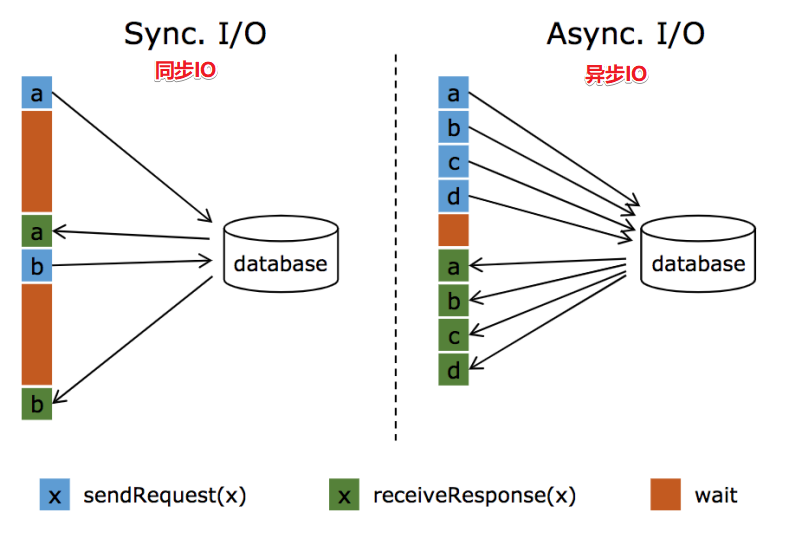

  

## 4-3 如何使用异步IO

1.对于数据源来说: 需要提供异步客户端,如果没有提供需要使用第三方的,如Vertx(Java提供的一个异步客户端工具,可以将MySQL的jdbc连接包装成异步的) 或者使用连接池自己实现

  

2.对于Flink代码来说,需要实现异步IO的接口

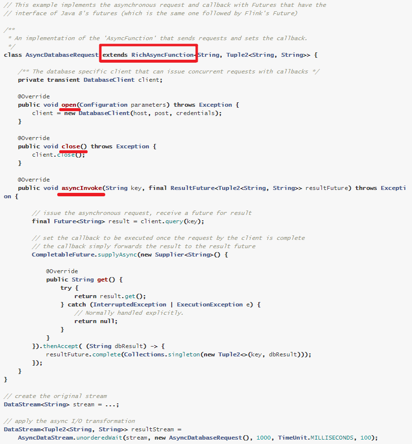

  

  

# 5- Streaming File Sink和File Sink


## 5-1 注意

- 在Flink1.7

  离线文件输出使用ds.writeAsText

  实时文件输出Streaming File Sink

- 在Flink1.12中

  离线和实时文件输出都使用File Sink

所以接下来直接演示File Sink


## 5-2 原理和API

https://ci.apache.org/projects/flink/flink-docs-release-1.12/dev/connectors/file_sink.html

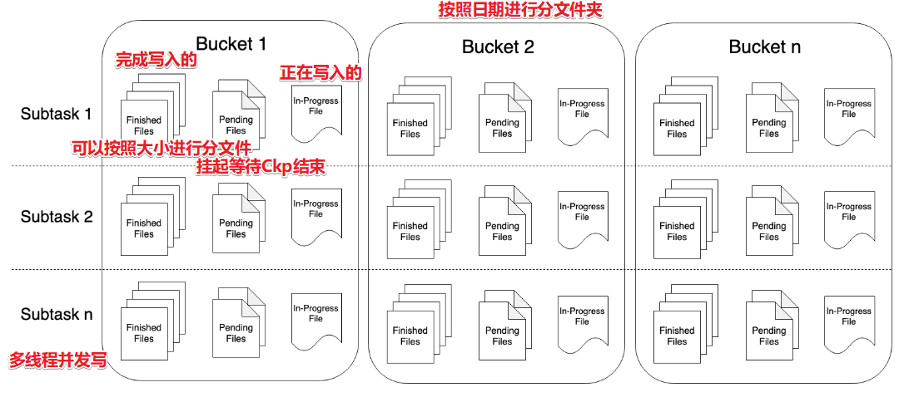

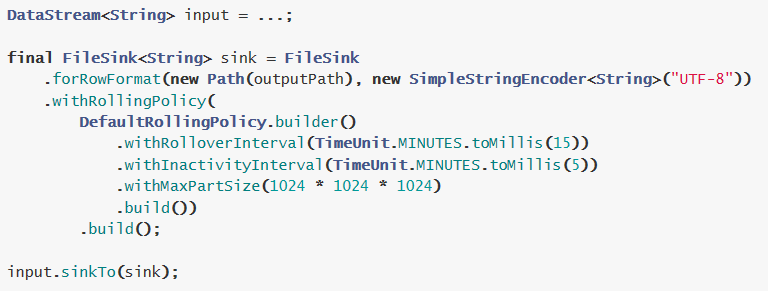


## 5-3 代码演示

```java
package cn.itcast.extend;

import org.apache.flink.api.common.RuntimeExecutionMode;
import org.apache.flink.api.common.functions.FlatMapFunction;
import org.apache.flink.api.common.functions.MapFunction;
import org.apache.flink.api.common.serialization.SimpleStringEncoder;
import org.apache.flink.api.java.tuple.Tuple2;
import org.apache.flink.connector.file.sink.FileSink;
import org.apache.flink.core.fs.Path;
import org.apache.flink.runtime.state.filesystem.FsStateBackend;
import org.apache.flink.streaming.api.datastream.DataStream;
import org.apache.flink.streaming.api.environment.CheckpointConfig;
import org.apache.flink.streaming.api.environment.StreamExecutionEnvironment;
import org.apache.flink.streaming.api.functions.sink.filesystem.bucketassigners.DateTimeBucketAssigner;
import org.apache.flink.streaming.api.functions.sink.filesystem.rollingpolicies.DefaultRollingPolicy;
import org.apache.flink.util.Collector;

import java.util.concurrent.TimeUnit;

/**
 * Author itcast
 * Desc 演示Flink1.12新特性-FlieSink将数据实时写入到HDFS
 */
public class FileSinkDemo {
    public static void main(String[] args) throws Exception {
        //TODO 1.env-准备环境
        StreamExecutionEnvironment env = StreamExecutionEnvironment.getExecutionEnvironment();
        env.setRuntimeMode(RuntimeExecutionMode.AUTOMATIC);
        //====配置Checkpoint:都是一些固定的通用的配置===
        env.enableCheckpointing(1000);
        env.setStateBackend(new FsStateBackend("file:///D:/ckp"));
        env.getCheckpointConfig().setMinPauseBetweenCheckpoints(500);//默认是0
        env.getCheckpointConfig().setTolerableCheckpointFailureNumber(10);//默认值为0，表示不容忍任何检查点失败
        env.getCheckpointConfig().enableExternalizedCheckpoints(CheckpointConfig.ExternalizedCheckpointCleanup.RETAIN_ON_CANCELLATION);

        //TODO 2.source-加载数据
        DataStream<String> socketDS = env.socketTextStream("192.168.88.161", 9999);

        //TODO 3.transformation-数据转换处理
        DataStream<String> resultDS = socketDS.flatMap(new FlatMapFunction<String, Tuple2<String, Integer>>() {
            @Override
            public void flatMap(String value, Collector<Tuple2<String, Integer>> out) throws Exception {
                String[] words = value.split(" ");
                for (String word : words) {
                    out.collect(Tuple2.of(word, 1));
                }
            }
        }).keyBy(0).sum(1).map(new MapFunction<Tuple2<String, Integer>, String>() {
            @Override
            public String map(Tuple2<String, Integer> value) throws Exception {
                return value.f0 + ":::" + value.f1;
            }
        });


        //TODO 4.sink-数据输出
        resultDS.print();
        //准备FlinkSink的配置
        //指定路径和编码
        FileSink<String> fileSink = FileSink.forRowFormat(new Path("hdfs://node1:8020/FlinkFileSink/48"), new SimpleStringEncoder<String>("UTF-8"))
                //指定分桶策略/分文件夹的策略
                .withBucketAssigner(new DateTimeBucketAssigner<>())
                //指定滚动策略
                .withRollingPolicy(DefaultRollingPolicy.builder()
                        .withMaxPartSize(1024 * 1024 * 1024)//单个文件最大大小
                        .withRolloverInterval(TimeUnit.MINUTES.toMillis(15))//文件最多写入的时长
                        .withInactivityInterval(TimeUnit.MINUTES.toMillis(5))//文件最大空闲时间
                        .build())
                .build();

        resultDS.sinkTo(fileSink);

        //TODO 5.execute-执行
        env.execute();
    }
}

```


  

# 6- 关于并行度-面试


## 6-1 注意: 

你设置的并行度并不代表真正的有那么多线程同时执行, 得有足够的CPU资源才可以!!!


## 6-2 设置方式

- 在operator上进行设置: ds.operator.setParallelism

- 在env上进行设置

- 在flink ru命令后加参数:    -p,--parallelism

- 在flink-conf.yaml中:    parallelism.default: 1

  从上到下依次会进行覆盖


## 6-3 设置多少?

没有固定答案,但有规律

```properties
SourceOperator的并行度:一般和Kafka的分区数保持一致(一般百级,互联网公司有万级)
TransformationOperator的并行度:一般不做随意更改,因为改了之后可能会导致shuffle重分区,什么时候改? 数据变多之后-调大并相度,数据变少如filter之后,可以调下并行度
Sink的并行度:一般也不用边,如果往HDFS输出,要避免小文件,如往HBase输出避免过多的连接,可以调小并行度
```


## 6-4 总结

### 6-4-1 各种名称

- HDFS:文件分块
  - 目的是为了**并行读写**,提高**读写效率**,便于**存储,容错**(针对块做副本,便于恢复)
- MR:数据切片 splits
  - 目的是为了**并行计算**
- Hive:分区(分文件夹)和分桶(文件夹下分文件)
  - 如按照日期分区,按照小时分桶;
  - 目的就是为了提高**查询效率**(读写效率)
- HBase:分Region,就是按照rowkey的范围进行分区
  - 目的也是为了提高**读写效率**
- Kafka:分区Partition
  - 目的为了提高**读写效率**
- Spark:分区
  - 目的是为了**并行计算**
- Flink:分区/并行度
  - 目的是为了**并行计算**

总结: **以后凡是遇到分区/分片/分桶/分Segment/分Region/分Shard...都是为了提高效率**


### 6-4-2 在Flink中可以如何设置分区数/并行度?

- 算子operator.setParallelism(2);


- env.setParallelism(2);


- 提交任务时的客户端./bin/flink run -p  2 WordCount-java.jar .......


- 配置文件中flink-conf.yaml: parallelism.default: 2

- **算子级别 > env级别 > Client级别 > 配置文件级别**  (越靠前具体的代码并行度的优先级越高)


### 6-4-3 什么时候调整并行度?

``` properties
source:一般和kafka的分区数保持一致

transformation:如果处理逻辑复杂,耗时长,那么调大并行度, 如果数据过滤后变少了,处理简单,可以调小并行度

sink:一般和kafka的分区数保持一致,如果sink到其他地方,灵活处理(如到HDFS为了避免大量小文件可以调小并行度)

注意: 设置的并行度和实际执行时的并行度并不会始终一致
```


