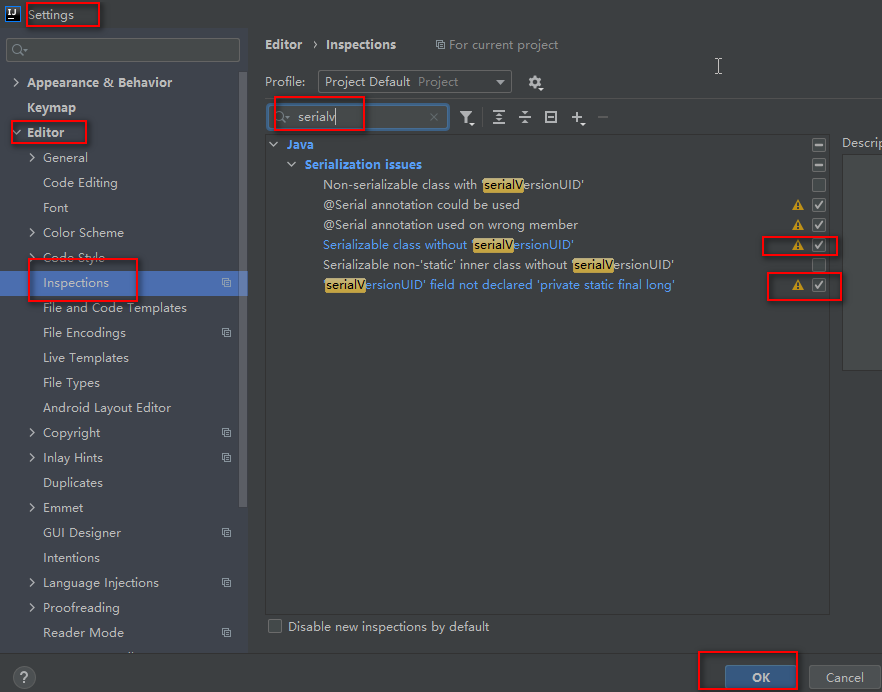

# CRT无法连接虚拟机

1- ip addr 

2- systemctl stop firewalld

3- systemctl restart network

4- 关闭本机的防火墙

# 做数仓项目大概思路

## 倒推法

**[明确主题要啥-> 出个指标需要哪些数据->数据再那些表->确定表->采集表->做维度宽表->做维度聚合->出指标]()**

# IDEA 序列化无法自动生成UID

