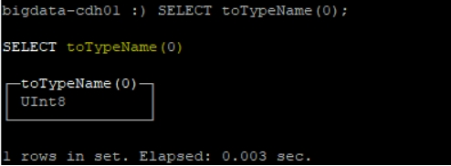
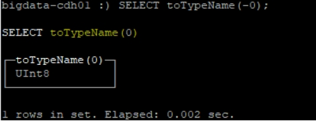
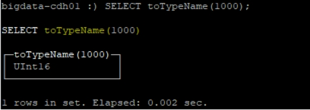
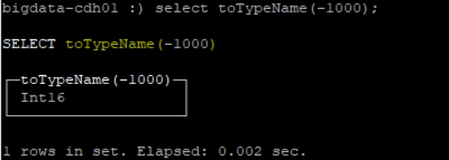
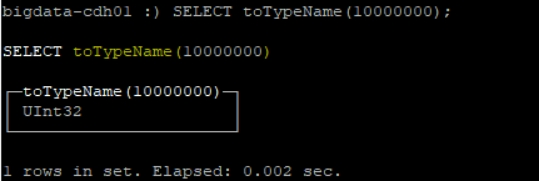
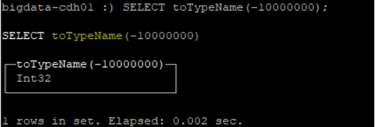
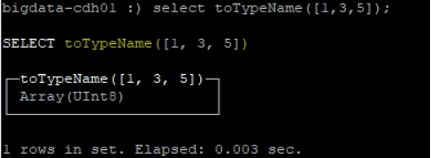

[TOC]


# 1- ClickHouse介绍

## 1-1 ClickHouse 对比其它框架

- **Spark Flink** 是**[通用计算]()**, 各方面都能算, [都未达到极致性能](), 但是也不慢，挺快的
- **Impala**\Presto\GreenPlum: **通用[SQL]()计算**, 各类型SQL都可以, 但也[未达到极致性能,]() 也不慢 高吞吐
- **ClickHouse**: **[非通用]()性SQL计算**, [专用场景]()SQL计算, 比如聚合场景, 在专用场景下是[极致的性能]().

- Hive
  - **缺点是慢**
  - 底层使用[**MR**]()做计算

- SparkSQ
  - 什么都能做，**通用型计算框架**，但是[性能为达到极致]()；

- Kylin
  - [空间换时间的设计思想]()；
  - **依赖** [hadoop hive zookeeper hbase]();
  - 创建[项目]()-创建[数据源]()-创建[模型-]()创建[Cube]()-执行[构建]()；
  - [**全量构建**]()（一个segment查询快）、**[增量构建]()**（多个segment查询慢）
  - 碎片（segment）管理:[手动合并、自动合并，手动删除，自动删除；]()
  - Cube优化：**剪枝优化**：[衍生维度，强制维度（减半），层级维度（N+1），联合维度(1)]()；

- Impala
  - 速度不够快
  - [分布式查询框架]()，[不能存储数据]()，使用**[hive的元数据]()**，自己[**提供计算引擎**]()，内存计算，速度快；
  - 一般跟kudu数据一起使用，兼容性非常好
  - 角色：
    - **statestore** : [管理]()每个节点[impalad](),心跳包 保证存活状态；
    - **catelog** ：[管理元数据]()（Hive中的元素 + impalad 的元素）
    - **impalad** ：执行者
    - Query **planner** : 接收sql语句，并[解析SQL生成执行计划]()；
    - Query **Coodinator** : [任务协调器]()，将任务分发给别的impalad中的queryexecutor 执行；
    - Query **executor** : 真正[执行任务]()的进程；

- Apache Druid
  - [**实时**数仓平台]()；
  - [不支持join,不支持DDL,不支持DML]()；
  - 实时项目一般从kafka中[摄取数据]()，[格式json;]()数据存储在HDFS,本地磁盘，kafka;
  - 数据是[**预聚合**]()；查询查询能达到亚秒级（[**位图索引**：某个值在哪些列中存在]()）；
    - **索引**组件：[overload]() [middlemanager]() ;  **摄取**数据，[创建删除表，管理segment]();
    - **存储**组件：[coordinator historical;]() 负责**数据的存储**，数据的删除，[按照时间范围chunk,每个chunck包含了多个segment,每个segment包含三部分，**时间列-指标列-维度列**]()；
    - **查询**组件：[router broker]():负责查询数据，将结果返回给客户端；

## 1-2- ClickHouse 概述

- 面向OLAP**[列式]()**数据库管理系统；
- **C++** 语言开发；(性能好)

- 每台服务器每秒能处理[数亿到十亿多行]()和[数十千兆字节]()的数据；
- 允许使用**类SQL实时查询生成分析数据**报告，具有[速度快、线性可扩展、硬件高效、容错、功能丰富、高度可靠、简单易用和支持跨数据中心部署]()等特性；
- 丰富的[**数据类型**]()、[**数据库引擎和表引擎**]()；
- ClickHouse独立于Hadoop生态系统，**不依赖Hadoop的HDFS**；
- ClickHouse还[支持查询Kafka和MySQL]()中的数据；


## 1-3- ClickHouse 特性

- 真正面向列的DBMS

- |          | ClickHouse | Hbase      |
  | -------- | ---------- | ---------- |
  | 计算量级 | 几亿行/s   | 数十万行/s |

- 支持SQL
  - **Hbase**原生[不支持SQL]()，需要借[助Kylin或者Pheonix]()，因为系统组件越多稳定性越低，维护成本越高；
  - ClickHouse支持SQL查询，[GROUP BY，JOIN ，IN，ORDER BY]()等；
  - ClickHouse[**不支持窗口函数**]()和[**相关的子查询**]()，所以一些逻辑需要开发者另想办法；

- 支持实时数据更新；

- 支持索引；
- 支持在线查询；
- 支持近似计算；
  - ClickHouse提供各种各样在**允许牺牲数据精度的情况下对查询进行加速的方法**

## 1-4- ClickHouse优势

- 高性能([查询贼拉快]())
- 线性可扩展([分布式都支持]())
- 硬件高效([新框架嘛, 支持新硬件]())
- 容错(必须有)：[副本机制 + WAL预写日志；]()
- 高度可靠([不可靠谁用]())
- 简单易用([**我不承认, 不太简单**]())

## 1-5- ClickHouse劣势

- 缺少高频率，**低延迟(类似[标记]()删除和更新)**的修改或删除已存在数据的能力。仅能用于批量删除或修改数据。

- 没有完整的事务支持(OLAP无所谓)

- 有限的SQL支持，[join实现与众不同]()

- [不支持二级索引]()
- [不支持窗口函数功能]()
- [元数据管理需要人工干预维护]()（运维）

## 1-6 ClickHouse的应用场景

- [绝大多数]()请求都是用于[**读访问**]()的
- 数据需要以[大批量（大于1000行）进行更新]()，而**不是单行更新**；或者根本没有更新操作
- 数据只是添加到数据库，**没有必要修改**
- 读取数据时，会从数据库中提取出大量的行，但[只用到一小部分列]()
- 表很“宽”，即表中包含大量的列
- [查询频率相对较低]()（通常每台服务器每秒查询数百次或更少）
- 对于简单查询，允许大约50毫秒的延迟
- **列的值是比较小的数值和短字符串**（例如，每个URL只有60个字节）
- 在处理单个查询时需要高吞吐量（每台服务器每秒高达数十亿行）
- [不需要事务]()
- 数据一致性要求较低
- [每次查询中只会查询一个大表]()。除了一个大表，其余都是小表
- [查询结果显著小于数据源。即数据有过滤或聚合]()。返回结果不超过单个服务器内存大小

# 2- ClickHouse安装


## 2-1 安装ClickHouse(单机)

### 2-1-1 安装yum-utils工具包

``` sehll
yum instalyum-utils
```


### 2-1-2 添加ClickHouse的yum源

``` shell
yum-config-manager --add-repo https://repo.yandex.ru/clickhouse/rpm/stable/x86_64
```


### 2-1-3 安装ClickHouse的服务端和客户端

``` shell
yum instal-y clickhouse-server clickhouse-client
```

注意：

​	[如果安装时出现warning: rpmts_HdrFromFdno: Header V4 RSA/SHA1 Signature, key ID e0c56bd4: NOKEY错误导致无法安装，需要在安装命令中添加—nogpgcheck来解决。]()

``` shell
yum instal-y clickhouse-server clickhouse-client --nogpgcheck
```


### 2-1-4 关于安装的说明

- 默认的[配置文件]()路径是：/etc/clickhouse-server/
- 默认的[日志文件]()路径是：/var/log/clickhouse-server/

### 2-1-5 查看ClickHouse的版本信息

``` shell
clickhouse-client -m --host node2.itcast.cn --user root --password 123456
select version();
```


## 2-2 在命令行中操作ClickHouse

​		ClickHouse安装包中提供了clickhouse-client工具，这个客户端在运行shell环境中，使用TCP方式连接clickhouse-server服务。要运行该客户端工具可以选择使用交互式与非交互式（批量）两种模式：使用非交互式查询时需要指定--query参数；在交互模式下则需要注意是否使用—mutiline参数来开启多行模式。

clickhouse-client提供了很多参数可供使用，常用的参数如下表：

| 参数                   | 介绍                                                         |
| ---------------------- | ------------------------------------------------------------ |
| --host,-h              | 服务端的 host 名称, 默认是 'localhost'。 您可以选择使用 host 名称或者 IPv4 或 IPv6 地址。 |
| --port                 | 连接服务端的端口，**默认值9000**                             |
| --user,-u              | 访问的用户名，默认default                                    |
| --password             | 访问用户的密码，默认空字符串                                 |
| --query,-q             | 非交互模式下的查询语句                                       |
| --database,-d          | 连接的数据库，默认是default                                  |
| --multiline,-m         | 使用多行模式，在多行模式下，回车键仅表示换行。默认不使用多行模式。 |
| --multiquery,-n        | 使用”,”分割的多个查询，仅在非交互模式下有效                  |
| --format, -f           | 使用指定格式化输出结果                                       |
| --vertical, -E         | 使用垂直格式输出，即每个值使用一行显示                       |
| --time, -t             | 打印查询时间到stderr中                                       |
| --stacktrace           | 如果出现异常，会打印堆栈跟踪信息                             |
| --config-file          | 使用指定配置文件                                             |
| --use_client_time_zone | 使用服务端时区                                               |
| quit,exit              | 表示退出客户端                                               |
| Ctrl+D,Ctrl+C          | 表示退出客户端                                               |

 

## 2-3 登录

``` shell
clickhouse-client -m --host node2.itcast.cn --user root --password 123456
```

## 2-4 退出

``` shell
ctr+ C/D
quit
exit
```


# 3- ClickHouse的数据类型支持

## 3-1 整型

| 数据类型 | 取值范围                                  |
| -------- | ----------------------------------------- |
| Int8     | -128 ~ 127                                |
| Int16    | -32768 ~ 32767                            |
| Int32    | -2147483648 ~ 2147483647                  |
| Int64    | -9223372036854775808 ~ 223372036854775807 |
| UInt8    | 0 ~ 255                                   |
| Uint16   | 0 ~ 65535                                 |
| Uint32   | 0 ~ 4294967295                            |
| Uint64   | 0 ~ 18446744073709551615                  |

## 3-2 浮点型

- ClickHouse支持[Float32和Float64]()两种浮点类型；

- 浮点型在运算时可能会导致一些问题；
- **官方建议尽量以整数形式存储数据**

## 3-3 Decimal

- ClickHouse支持Decimal类型的有符号定点数，可在加、减和乘法运算过程中保持精度。**对于除法，最低有效数字会被丢弃，但不会四舍五入**；

| 数据类型      | 十进制的范围                                          |
| ------------- | ----------------------------------------------------- |
| Decimal32(S)  | Decimal32(S)：  ( -1 * 10^(9 - S), 1 * 10^(9 - S) )   |
| Decimal64(S)  | Decimal64(S)：  ( -1 * 10^(18 - S), 1 * 10^(18 - S) ) |
| Decimal128(S) | Decimal128(S)： ( -1 * 10^(38 - S), 1 * 10^(38 - S) ) |

## 3-4 布尔型 UInt8

ClickHouse中[没有定义布尔类型]()，可以使用[UInt8类型，取值限制为0或1]()。

## 3-5 字符串类型

- ClickHouse中的String类型[没有编码的概念]()。字符串可以**是任意的字节集，按它们原本的方式进行存储和输出**。若需存储文本，**建议使用UTF-8编码**;

| 数据类型       | 十进制的范围                                                 |
| -------------- | ------------------------------------------------------------ |
| String         | 字符串可以任意长度的。它可以包含任意的字节集，包含空字节。ClickHouse中的String类型可以代替其他DBMS中的VARCHAR、BLOB、CLOB等类型。 |
| FixedString(N) | [固定长度 N 的字符串]()，N必须是严格的正自然数。<br>当服务端读取长度[小于]()N的字符串时候，通过在**字符串末尾添加[空字节]()**来达到N字节长度。当服务端读取长度[大于]()N的字符串时候，**将返回错误消息**。<br>与String相比，极少会使用FixedString，因为使用起来不是很方便。<br>[1）在插入数据时，如果字符串包含的字节数小于N,将对字符串末尾进行空字节填充。如果字符串包含的字节数大于N,将抛Too large value for FixedString(N)异常。<br>2）在查询数据时，ClickHouse不会删除字符串末尾的空字节。如果使用WHERE子句，则须要手动添加空字节以匹配FixedString的值（例如：where a=’abc\0’）]()。<br>**注意，FixedString(N)的长度是个常量。仅由空字符组成的字符串，函数[length](#array_functions-length)返回值为N,而函数[empty](#string_functions-empty)**的返回值为1。 |

## 3-6 UUID

- ClickHouse支持UUID类型（通用[唯一标识符]()），该类型是一个16字节的数字，用于标识记录。
- ClickHouse内置[**generateUUIDv4**]()函数来生成UUID值，UUID数据类型仅支持String数据类型也支持的函数（例如，**min,max和count**）。


## 3-7 Date类型

- ClickHouse支持Date类型，这个日期类型用**两个字节存储**，表示从 1970-01-01 (无符号) 到当前的日期值。允许存储从 Unix 纪元开始到编译阶段定义的上限阈值常量（目前上限是2106年，但最终完全支持的年份为2105），
- [最小值输出为0000-00-00]()。日期类型中[不存储时区信息]()；


## 3-8 DateTime类型

- ClickHouse支持DataTime类型，这个时间戳类型用**四个字节**（无符号的）存储Unix时间戳。允许存储与日期类型相同范围内的值，[最小值为0000-00-00 00:00:00]()。时间戳类型值**精确到秒（**不包括闰秒）。
- 使用客户端或服务器时的系统时区，时间戳是从文本转换为二进制并返回。在文本格式中，有关夏令时的信息会丢失。
- 默认情况下，客户端连接到服务的时候会使用服务端时区。
- 您可以通过启用客户端命令行选项**--use_client_time_zone** 来设置使用客户端时间。
- 因此，在处理文本日期时（例如，在保存文本转储时），请记住在夏令时更改期间可能存在歧义，如果时区发生更改，则可能存在匹配数据的问题。


## 3-9 枚举类型

| 数据类型 | String=Integer对应关系 | 取值范围       |
| -------- | ---------------------- | -------------- |
| Enum8    | 'String'= Int8         | -128 ~ 127     |
| Enum16   | 'String'= Int16        | -32768 ~ 32767 |


## 3-10 数组类型

ClickHouse支持Array(T)类型，T可以是任意类型，**包括数组类型，但[不推荐使用多维数组]()，因为对其的支持有限（[MergeTree引擎表不支持存储多维数组]()**）。T要求是兼容的数据类型


## 3-11 AggregateFunction类型

- [一般配合引擎 AggregatingMergeTree 一起使用]()；
- AggregateFunction(name,type_of_arguments)
- 创建表时使用AggregateFunction   AggregatingMergeTree
- **插入数据**时使用 [minState 、maxState 、countState]()；
- **查询数据**时使用 [minMerge 、maxMerge 、countMerge;]()
- 创建表

``` sql
create table aggMT (
    whatever Date default '2019-12-18',
    key String,
    value String,
    first AggregateFunction(min, DateTime),
    last AggregateFunction(max, DateTime),
    totaAggregateFunction(count,UInt64)
) ENGINE=AggregatingMergeTree(whatever,(key,value),8192);
```

- 插入数据

``` sql
insert into aggMT (key,value,first,last,total) select 'test','1.2.3.4',minState(toDateTime(1576654217)),maxState(toDateTime(1576654217)),countState(cast(1 as UInt64));

insert into aggMT (key,value,first,last,total) select 'test','1.2.3.5',minState(toDateTime(1576654261)),maxState(toDateTime(1576654261)),countState(cast(1 as UInt64));

insert into aggMT (key,value,first,last,total) select 'test','1.2.3.6',minState(toDateTime(1576654273)),maxState(toDateTime(1576654273)),countState(cast(1 as UInt64));
```

- 查询数据

``` sql
select 
	key, 
	value,
	minMerge(first),
	maxMerge(last),
	countMerge(total) 
from aggMT 
group by key, value;
```


## 3-12 元组类型

- select [tuple]()(1, 'a') as x, toTypeName(x);


- 使用元组传入null值时自动推断类型例子2；

``` sql
select tuple(1, null) as x, toTypeName(x);
```


## 3-13 Nullable类型

``` sql
# 创建测试表tbl_test_nullable
create table tbl_test_nullable(
    f1 String, 
    f2 Int8, 
    f3 Nullable(Int8)
) engine=TinyLog;
```


``` sql
# 插入非null值到tbl_test_nullable表(成功)
insert into tbl_test_nullable(f1,f2,f3) values('NoNull',1,1);
```


``` sql
# f1字段为null值时插入到tbl_test_nullable表(失败)
insert into tbl_test_nullable(f1,f2,f3) values(null,2,2);
```


``` sql
# f2字段为null值时插入到tbl_test_nullable表(失败) 
insert into tbl_test_nullable(f1,f2,f3) values('NoNull2',null,2);
```


```sql
# f3字段为null值时插入到tbl_test_nullable表(成功)
insert into tbl_test_nullable(f1,f2,f3) values('NoNull2',2,null);
```


```sql
# 查询tbl_test_nullable表(有2条记录)
select * from tbl_test_nullable;
```


## 3-14 嵌套数据结构

- 创建表时，可以包含任意[多个嵌套数据结构的列]()；
- 但嵌套数据结构的列仅支持[一级嵌套]()。
- 嵌套列在insert时，需要把嵌套列的每一个字段以[[要插入的值]]()格式进行数据插入。

``` sql
# 创建带嵌套结构字段的表
create table tbl_test_nested(
    uid Int64, 
    ctime date, 
    user Nested(
        name String, 
        age Int8, 
        phone Int64), 
    Sign Int8
) engine=CollapsingMergeTree(ctime,intHash32(uid),(ctime,intHash32(uid)),8192,Sign);
```


```sql
# 插入数据
insert into tbl_test_nested values(1,'2019-12-25',['zhangsan'],[23],[13800138000],1);
```


``` sql
# 查询uid=1并且user嵌套列的age>=20的数据
select * from tbl_test_nested where uid=1 and arrayFilter(u -> u >= 20, user.age) != [];
```


``` sql
#查询user嵌套列name=zhangsan的数据
select * from tbl_test_nested where hasAny(user.name,['zhangsan']);
```


``` sql
# 模糊查询user嵌套列name=zhang的数据
select * from tbl_test_nested where arrayFilter(u -> u like '%zhang%', user.name) != [];
```


## 3-15 Interval

| 时间类型参数 | 查询Interval类型                     | Interval类型    |
| ------------ | ------------------------------------ | --------------- |
| SECOND       | SELECT toTypeName(INTERVA4 SECOND);  | IntervalSecond  |
| MINUTE       | SELECT toTypeName(INTERVA4 MINUTE);  | IntervalMinute  |
| HOUR         | SELECT toTypeName(INTERVA4 HOUR);    | IntervalHour    |
| DAY          | SELECT toTypeName(INTERVA4 DAY);     | IntervalDay     |
| WEEK         | SELECT toTypeName(INTERVA4 WEEK);    | IntervalWeek    |
| MONTH        | SELECT toTypeName(INTERVA4 MONTH);   | IntervalMonth   |
| QUARTER      | SELECT toTypeName(INTERVA4 QUARTER); | IntervalQuarter |
| YEAR         | SELECT toTypeName(INTERVA4 YEAR);    | IntervalYear    |

``` sql
# 获取当前时间+4天的时间
select now() as cur_dt, cur_dt + interva4 DAY plus_dt;
```


``` sql
# 获取当前时间+4天+3小时的时间
select now() as cur_dt, cur_dt + interva4 DAY + interva3 HOUR as plus_dt;
```


## 3-16 IPv4类型与IPv6类型

``` SQL
# 创建tbl_test_domain表
create table tbl_test_domain(
    urString, 
    ip4 IPv4, 
    ip6 IPv6
) ENGINE = MergeTree() ORDER BY url;
```


``` sql
# 插入IPv4和IPv6类型字段数据到tbl_test_domain表
insert into tbl_test_domain(url,ip4,ip6) values('http://www.itcast.cn','127.0.0.1','2a02:aa08:e000:3100::2');
```


``` sql
# 查询tbl_test_domain表数据
select * from tbl_test_domain;
```


``` sql
# 查询类型和二进制格式
select url,toTypeName(ip4) as ip4Type, hex(ip4) as ip4Hex,toTypeName(ip6) as ip6Type, hex(ip6) as ip6Hex from tbl_test_domain;
```


``` sql
# 使用IPv4NumToString和IPv6NumToString将Domain类型转换为字符串
select url,IPv4NumToString(ip4) as ip4Str,IPv6NumToString(ip6) as ip6Str from tbl_test_domain;
```


## 3-17 默认值处理

| 数据类型  | 默认值                  |
| --------- | ----------------------- |
| Int和Uint | 0                       |
| String    | [空字符串]()            |
| Array     | [空数组]()              |
| Date      | [0000-00-00]()          |
| DateTime  | [0000-00-00 00:00:00]() |
| NULL      | 不支持                  |

# 4- ClickHouse的引擎

ClickHouse提供了多种不同的[**表引擎**]()，表引擎可以简单理解为[不同类型的表]()。

表引擎（即表的类型）决定了：

- 数据的存储方式和位置，写到哪里以及从哪里读取数据
- 支持哪些查询以及如何支持
- 并发数据访问
- 索引的使用（如果存在）
- 是否可以执行多线程请求
- 数据复制参数

下面介绍其中几种，对其他引擎有兴趣的可以去查阅官方文档：

https://clickhouse.tech/docs/zh/engines/table-engines/

## 4-1 日志引擎

这些引擎是为了需要写入许多**小数据量**（少于一百万行）的表的场景而开发的。

这系列的引擎有：

- [StripeLog]()
- [日志]()
- [TinyLog]()


共同属性 

引擎：

- 数据存储在**磁盘**上。
- 写入时将数据**追加在文件末尾**。
- [不支持Alter操作]()。
- [不支持索引]()。这意味着 `SELECT` 在范围**查询时效率不高**。
- **非原子地写入数据**。如果某些事情破坏了写操作，例如服务器的异常关闭，你将会得到一张包含了损坏数据的表。

### 4-1-1 TinlyLog

- 概念：
  - 用于将数据存储在磁盘上。
  - 每列都存储在单独的压缩文件中;
  - 写入时，数据将附加到文件末尾。

- 特性：
  - [**INSERT**]() 请求执行过程中**表会被锁定**，并且其他的读写数据的请求都会等待直到锁定被解除。如果[没有写数据]()的请求，[任意数量的读请求都可以并发执行]()。
  - 在读取数据时，ClickHouse 使用多线程。 [每个线程处理不同的数据块]()。
  - **[一次写入，N次读取]()**
    - 这种表引擎的典型用法是 **write-once**：首先只写入一次数据，然后根据需要多次读取。
    - 此引擎适用于相对[较小的表]()（建议最多1,000,000行）。如果有许多小表，则使用此表引擎是适合的，因为它比需要打开的文件更少。
    - 当拥有大量小表时，可能会导致性能低下。
    - 不支持索引。

``` sql
# 创建一个TinyLog引擎的表并插入一条数据
# 此时我们到保存数据的目录/var/lib/clickhouse/data/default/user中可以看到如下目录结构：
# id.bin 和 name.bin 是压缩过的对应的列的数据，sizes.json 中记录了每个 *.bin 文件的大小：
create table user (id UInt16, name String) ENGINE=TinyLog;
insert into user (id, name) values (1, 'zhangsan');
```


## 4-2 数据库引擎

- **Atomic、[MySQL]()和Lazy**这3种数据库引擎;

- 但在**[默认]()**情况下仅使用其[Atomic]()数据库引擎;
  - 该引擎提供[可配置的表引擎]()(MergeTree、Log和Intergation)和SQL方言(完整的SQL解析器，即递归下降解析器；数据格式解析器，即快速流解析器)。

### 4-2-1 MySQL引擎

- MySQL引擎用于将[远程的MySQL服务器中的库映射到ClickHouse中](), 作为一个库存在；
- [**允许对表进行 INSERT 和 SELECT 查询**]()，以方便您在ClickHouse与MySQL之间进行数据交换。
- MySQL数据库引擎会将对其的[查询转换为MySQL语法并发送到MySQL服务器中]();(**[实际执行者还是MySQL]()**)
  - 因此您可以执行诸如SHOW TABLES或SHOW CREATE TABLE之类的操作。
- 但您**无法对其执行**以下操作：
  - [不支持 rename]()
  - [不支持 CREATE TABLE]()
  - [不支持 ALTER]()

- 语法结构

``` sql
CREATE DATABASE [IF NOT EXISTS] db_name [ON CLUSTER cluster]
ENGINE = MySQL('host:port', ['database' | database], 'user', 'password')
```

- MySQL数据库引擎参数
  - host:port— 链接的MySQL地址。
  - database— 链接的MySQL数据库。
  - user— 链接的MySQL用户。
  - password— 链接的MySQL用户密码。

- 案例：

MySQL：

``` sql
# 在MySQL中创建表
CREATE TABLE `mysql_table` (
`int_id` INT NOT NULL AUTO_INCREMENT,
`float` FLOAT NOT NULL,
PRIMARY KEY (`int_id`));
# 插入数据
insert into mysql_table (`int_id`, `float`) VALUES (1,2);
```

ClickHouse

``` sql
# 在ClickHouse中创建MySQL类型的数据库，同时与MySQL服务器交换数据
CREATE DATABASE mysql_db ENGINE = MySQL('node1.itcast.cn:3306', 'test', 'root', '123456')

SHOW DATABASES;
SHOW TABLES FROM mysql_db;
SELECT * FROM mysql_db.mysql_table;
INSERT INTO mysql_db.mysql_table VALUES (3,4);
SELECT * FROM mysql_db.mysql_table
┌─int_id─┬─value─┐
│      1 │     2 │
│      3 │     4 │
└──────┴─────┘
```


## 4-3 表引擎 -- MergeTree系列引擎

- [**MergeTree（合并树）**]()系列引擎是ClickHouse中最强大的表引擎，是[官方主推的存储引擎]()，几乎支持ClickHouse所有的核心功能。
- 该系列引擎主要[用于海量数据分析的场景]()，支持对表数据进行[**分区、复制、采样、存储有序、主键索引、稀疏索引和数据TTL**]()等特性。
- MergeTree系列引擎的基本[**理念**是当有大量数据要插入到表中时，需要高效地**一批一批的写入数据片段**，并希望这些数据片段在后台**按照一定规则合并**，]()这种方法比插入期间连续重写存储中的数据效率更高。
- MergeTree系列引擎支持ClickHouse所有的SQL语法，但还是有一些SQL语法和MySQL并不太一样。
- MergeTree系列引擎包括：
  - **MergeTree** ： 父引擎 可以有重复的主键；
  - **ReplacingMergeTree**： 使用 [optimize]() 解决主键不能去重的问题；
  - **SummingMergeTree**： 实现[sum 预聚合]()；
  - **AggregatingMergeTree**：实现[所有**聚合函数**的预聚合]()；
  - **CollapsingMergeTree**： 添加[sign列]()== 1 或者 -1，实现[update delete]() 功能；
  - **VersionedCollapsingMergeTree**：添加了[version 列]()， 解决 [sign == -1 或者 1 乱序的问题]()；

- [MergeTree引擎非常重量级, 如果需要许多小表, 可以考虑日志系列如TinyLog]()


### 4-3-1 MergeTree

- 选择这个引擎总结:
  - [**主键 可以 重复**]()  ：主键没有去重功能
  - **[主键可以加速查询]()** ；
  - 创建MergeTree引擎表有两种方式，**一种是[集群表]()（ON cluster 'ch_cluster'），一种是本地表**。
  
- MergeTree引擎的表的[**允许插入主键重复的数据**]()
- 主键主要作用是[生成**主键索引**来提升查询效率]()，而不是用来保持记录主键唯一
  Main features:
  - **主键排序**
  - **数据可以分区**
  - **支持副本**
  - **支持采样方法**

#### 4-3-1-1 创建语法

``` sql
CREATE TABLE [IF NOT EXISTS] [db.]table_name [ON CLUSTER cluster]
(
    name1 [type1] [DEFAULT|MATERIALIZED|ALIAS expr1] [TTL expr1],
    name2 [type2] [DEFAULT|MATERIALIZED|ALIAS expr2] [TTL expr2],
    ...
    INDEX index_name1 expr1 TYPE type1(...) GRANULARITY value1,
    INDEX index_name2 expr2 TYPE type2(...) GRANULARITY value2
) ENGINE = MergeTree()
[PARTITION BY expr]
[ORDER BY expr]
[PRIMARY KEY expr]
[SAMPLE BY expr]
[TTL expr [DELETE|TO DISK 'xxx'|TO VOLUME 'xxx'], ...]
[SETTINGS name=value, ...]
```

- 子句说明
  - ENGINE：ENGINE = MergeTree() --说明：该引擎不需要参数。
  - PARTITION BY 字段名称：PARTITION by to YYYYMM(cdt)；
  - ORDER BY 字段名称(可以是元组)：ORDER BY cdt或ORDER BY (age,gender)；
  - PRIMARY KEY 字段名称：PRIMARY KEY age；
    - [注意: 如果没有primarykey ,默认就是sort 键作为主键；]()
  - SAMPLE BY 字段名称：SAMPLE BY intHash64(userId)；
  - TTL Date字段或DateTime字段：TTL cdt + INTERVAL 1 DAY；（[数据的有效期:过期就删除]()）
  - SETTINGS param=value...
    - [SETTINGS index_granularity=8192]()  说明：**索引粒度**。即索引中相邻”标记”间的数据行数。设为 8192 可以适用大部分场景。
    - SETTINGS index_granularity_bytes= 说明：设置数据粒度的最大大小(单位/字节)，默认10MB。从大行（数十和数百MB）的表中select数据时，此设置可提高ClickHouse的提高select性能。
    - enable_mixed_granularity_parts 说明：启用或禁用过渡。
    - use_minimalistic_part_header_in_zookeeper 说明：在ZK中存储数据部分标题，0是关闭，1是存储的少量数据。
    - min_merge_bytes_to_use_direct_io 说明：使用对存储磁盘的直接I / O访问所需的最小合并操作数据量。合并数据部分时，ClickHouse会计算要合并的所有数据的总存储量。如果卷超过min_merge_bytes_to_use_direct_io字节，ClickHouse将使用直接I/O接口（O_DIRECT选项）读取数据并将数据写入存储磁盘。如果为min_merge_bytes_to_use_direct_io = 0，则直接I / O被禁用。默认值：10 * 1024 * 1024 * 1024字节。
    - merge_with_ttl_timeout 说明：与TTL合并之前的最小延迟(单位/秒)，默认86400。
    - write_final_mark 说明：启用或禁用在数据部分末尾写入最终索引标记，默认1。建议不关闭此设置。
    - storage_policy 说明：存储策略。

#### 4-3-1-2 案例

- **创建MergeTree引擎的表**

  - 创建使用MergeTree引擎的[**集群表**test.tbl_testmergetree_users_all,]()集群表一般都携带[_all后缀]()，而且必须所有节点都存在test数据库，这样所有节点的test库中都有tbl_testmergetree_users_all表。
  - 这个表的物理存储是在我们设置的数据路径/export/data/clickhouse中，该路径下的/data/data下是ClickHouse节点中维护的数据库，对应下图中的default、system和test三个文件夹

  

  - 然后在test文件夹下，有一个tbl_test_mergetree_users文件夹（是我们自己创建的表），该文件夹中有很多日期类型的文件夹（我们创建表时指定的分区字段的值），在此文件夹下有很多具体的数据文件。
  - 这些数据文件中的  * .bin和* .mrk2指的是列字段的数据信息，*.idx指的是索引字段信息

``` sql
  
# 集群表  ON cluster 'ch_cluster'
CREATE TABLE test.tbl_test_mergetree_users_all ON cluster 'ch_cluster'(
    id UInt64, 
    email String, 
    username String, 
    gender UInt8, 
    birthday Date, 
    mobile FixedString(13), 
    pwd String, 
    regDT DateTime, 
    lastLoginDT DateTime, 
    lastLoginIP String
) ENGINE=MergeTree() 
partition by toYYYYMMDD(regDT) 
order by id  # 如果没有primarykey ,默认就是sort 键作为主键；
settings index_granularity=8192;
```


``` sql
# 本地表  
CREATE TABLE tbl_test_mergetree_users(
    id UInt64, 
    email String, 
    username String, 
    gender UInt8, 
    birthday DATE, 
    mobile FixedString(13), 
    pwd String, 
    regDT DateTime, 
    lastLoginDT DateTime, 
    lastLoginIP String
) ENGINE=MergeTree() 
partition by toYYYYMMDD(regDT) 
order by id # 如果没有primarykey ,默认就是sort 键作为主键；
settings index_granularity=8192;
```


- 插入数据到MergeTree引擎的表

``` sql
1、测试数据集
insert into tbl_test_mergetree_users(id, email, username, gender, birthday, mobile, pwd, regDT, lastLoginDT, lastLoginIP) values (1,'wcfr817e@yeah.net','督咏',2,'1992-05-31','13306834911','7f930f90eb6604e837db06908cc95149','2008-08-06 11:48:12','2015-05-08 10:51:41','106.83.54.165'),(2,'xuwcbev9y@ask.com','上磊',1,'1983-10-11','15302753472','7f930f90eb6604e837db06908cc95149','2008-08-10 05:37:32','2014-07-28 23:43:04','121.77.119.233'),(3,'mgaqfew@126.com','涂康',1,'1970-11-22','15200570030','96802a851b4a7295fb09122b9aa79c18','2008-08-10 11:37:55','2014-07-22 23:45:47','171.12.206.122'),(4,'b7zthcdg@163.net','金俊振',1,'2002-02-10','15207308903','96802a851b4a7295fb09122b9aa79c18','2008-08-10 14:47:09','2013-12-26 15:55:02','61.235.143.92'),(5,'ezrvy0p@163.net','阴福',1,'1987-09-01','13005861359','96802a851b4a7295fb09122b9aa79c18','2008-08-12 21:58:11','2013-12-26 15:52:33','182.81.200.32'),(6,'juestiua@263.net','岑山裕',1,'1996-02-12','13008315314','96802a851b4a7295fb09122b9aa79c18','2008-08-14 05:48:16','2013-12-26 15:49:12','36.59.3.248'),(7,'oyyrzd@yahoo.com.cn','姚茗咏',2,'1977-02-06','13303203846','96e79218965eb72c92a549dd5a330112','2008-08-15 10:07:31','2013-12-26 15:55:05','106.91.23.177'),(8,'lhrwkwwf@163.com','巫红影',2,'1996-02-21','15107523748','96802a851b4a7295fb09122b9aa79c18','2008-08-15 14:37:41','2013-12-26 15:55:05','123.234.85.27'),(9,'v2zqak8kh@0355.net','空进',1,'1974-01-16','13903178080','96802a851b4a7295fb09122b9aa79c18','2008-08-16 03:24:44','2013-12-26 15:52:42','121.77.192.123'),(10,'mqqqmf@yahoo.com','西香',2,'1980-10-13','13108330898','96802a851b4a7295fb09122b9aa79c18','2008-08-16 04:42:08','2013-12-26 15:55:08','36.57.21.234'),(11,'sf8oubu@yahoo.com.cn','壤晶媛',2,'1976-03-05','15202615557','96802a851b4a7295fb09122b9aa79c18','2008-08-16 06:08:51','2013-12-26 15:55:03','182.83.220.201'),(12,'k6k21ce@qq.com','东平',1,'2005-04-25','13603648382','96802a851b4a7295fb09122b9aa79c18','2008-08-16 06:18:20','2013-12-26 15:55:05','210.34.111.155'),(13,'zguxgg@qq.com','夹影悦',2,'2002-08-23','15300056290','96802a851b4a7295fb09122b9aa79c18','2008-08-16 06:57:45','2013-12-26 15:55:02','61.232.211.180'),(14,'g2jqhbzrf@aol.com','生晓怡',2,'1974-06-22','13507515420','96802a851b4a7295fb09122b9aa79c18','2008-08-16 08:23:43','2013-12-26 15:55:02','182.86.5.162'),(15,'1evn3spn@126.com','咎梦',2,'1998-04-14','15204567060','060ed80051e6384b77ddfaa26191778b','2008-08-16 08:29:57','2013-12-26 15:55:02','210.30.171.70'),(16,'tqndz6l@googlemail.com','司韵',2,'1992-08-28','15202706709','96802a851b4a7295fb09122b9aa79c18','2008-08-16 14:34:25','2013-12-26 15:55:03','171.10.115.59'),(17,'3472gs22x@live.com','李言',1,'1997-09-08','15701526600','96802a851b4a7295fb09122b9aa79c18','2008-08-16 15:04:07','2013-12-26 15:52:39','171.14.80.71'),(18,'p385ii@gmail.com','詹芸',2,'2004-11-05','15001974846','96802a851b4a7295fb09122b9aa79c18','2008-08-16 15:26:06','2013-12-26 15:55:02','182.89.147.245'),(19,'mfbncfu@yahoo.com','蒙芬霞',2,'1990-09-10','15505788156','96802a851b4a7295fb09122b9aa79c18','2008-08-16 15:30:58','2013-12-26 15:55:05','182.91.15.89'),(20,'l24ffbn@ask.com','后冠',1,'2000-09-02','15608241150','96802a851b4a7295fb09122b9aa79c18','2008-08-17 01:15:55','2014-08-29 00:51:12','36.58.7.85'),(21,'m26lggpe@qq.com','宋美月',2,'2003-01-13','15606561425','96802a851b4a7295fb09122b9aa79c18','2008-08-17 01:24:09','2013-12-26 15:52:36','123.235.233.160'),(22,'ndmfm13qf@0355.net','邬玲',2,'2002-08-11','13207844859','96802a851b4a7295fb09122b9aa79c18','2008-08-17 03:31:11','2013-12-26 15:55:03','36.60.8.4'),(23,'5shmvnd@sina.com','乐心有',1,'1998-05-01','13201212693','96802a851b4a7295fb09122b9aa79c18','2008-08-17 03:33:41','2013-12-26 15:55:02','123.234.184.210'),(24,'pwa0hu@3721.net','任学诚',1,'1978-03-19','15802040152','7f930f90eb6604e837db06908cc95149','2008-08-17 07:24:01','2013-12-26 15:52:34','210.43.167.14'),(25,'1ybjhul@googlemail.com','巫纨',2,'1995-01-20','15900530105','96802a851b4a7295fb09122b9aa79c18','2008-08-17 07:48:06','2013-12-26 15:55:02','222.55.139.104'),(26,'b31me2i8b@yeah.net','石娅',2,'2000-02-25','13908735198','96802a851b4a7295fb09122b9aa79c18','2008-08-17 08:17:24','2013-12-26 15:52:45','123.235.99.123'),(27,'qgb2w4n7@163.net','柏菁',2,'1975-02-09','15306552661','96802a851b4a7295fb09122b9aa79c18','2008-08-17 08:47:39','2013-12-26 15:55:02','121.77.245.202'),(28,'cfb3ck@sohu.com','鲜梦',2,'1974-01-26','13801751668','96802a851b4a7295fb09122b9aa79c18','2008-08-17 08:55:47','2013-12-26 15:55:02','210.26.163.24'),(29,'nfrf6mp@msn.com','鄂珍',2,'1974-04-14','13300247433','96802a851b4a7295fb09122b9aa79c18','2008-08-17 09:02:14','2013-12-26 15:55:08','210.31.214.157'),(30,'o1isumh@126.com',' 法姬',2,'1978-06-16','15607848127','96802a851b4a7295fb09122b9aa79c18','2008-08-17 09:09:59','2013-12-26 15:55:08','222.24.34.19'),(31,'y2wrclkq@msn.com','太以',1,'1998-09-07','13608585923','96802a851b4a7295fb09122b9aa79c18','2008-08-17 11:35:39','2013-12-26 15:52:35','182.89.218.177'),(32,'fv9avnuo@263.net','庚姣欣',2,'1982-09-14','13004625187','96802a851b4a7295fb09122b9aa79c18','2008-08-17 12:50:36','2013-12-26 15:55:02','106.82.225.130'),(33,'o1e96z@yahoo.com','微伟',1,'1981-07-30','13707663880','96802a851b4a7295fb09122b9aa79c18','2008-08-17 15:12:05','2013-12-26 15:49:12','171.13.152.247'),(34,'cm3oz64ja@msn.com','那竹娜',2,'1989-01-09','13607294767','96802a851b4a7295fb09122b9aa79c18','2008-08-17 15:51:08','2013-12-26 15:55:02','171.13.110.67'),(35,'g7impl@msn.com','闾和栋',1,'1994-10-12','13907368366','96802a851b4a7295fb09122b9aa79c18','2008-08-17 16:51:02','2013-12-26 15:55:01','210.28.163.83'),(36,'jz2fjtt@163.com','夏佳悦',2,'2001-03-17','15102554998','7af1b63f0d1f37c35c1274339c12b6a8','1970-01-01 08:00:00','1970-01-01 08:00:00','222.91.138.221'),(37,'klwrtomws@yahoo.com','南义梁',1,'1981-03-19','15105745902','96802a851b4a7295fb09122b9aa79c18','2008-08-18 01:49:17','2013-12-26 15:55:01','36.62.155.17'),(38,'yhzs1nnlk@3721.net','牧元',1,'2001-06-07','13501780163','96802a851b4a7295fb09122b9aa79c18','2008-08-18 04:24:52','2013-12-26 15:55:01','171.15.184.130'),(39,'hem76ot33@gmail.com','凌伟文',1,'1988-03-04','13201417535','96802a851b4a7295fb09122b9aa79c18','2008-08-18 05:34:52','2013-12-26 15:55:14','61.237.105.3'),(40,'ndp40j@sohu.com','弘枝',2,'2000-09-05','13001236425','96802a851b4a7295fb09122b9aa79c18','2008-08-18 06:23:48','2013-12-26 15:55:01','106.82.172.45'),(41,'zeyacpr@gmail.com','台凡',2,'1998-05-26','15102913418','96802a851b4a7295fb09122b9aa79c18','2008-08-18 06:41:24','2013-12-26 15:55:07','123.233.69.218'),(42,'0ts0wiz@aol.com','任晓红',2,'1984-05-02','13502366778','96802a851b4a7295fb09122b9aa79c18','2008-08-18 06:55:16','2013-12-26 15:55:01','210.26.44.18'),(43,'zi7dhzo@googlemail.com','蔡艺艳',2,'1990-08-07','15603954810','96802a851b4a7295fb09122b9aa79c18','2008-08-18 06:57:30','2013-12-26 15:55:01','171.12.171.179'),(44,'b0yfzilu@hotmail.com','郎诚',1,'1994-05-18','13602127171','96802a851b4a7295fb09122b9aa79c18','2008-08-18 07:02:04','2013-12-26 15:55:02','171.8.22.92'),(45,'er9az5e9s@163.com','台翰',1,'1994-06-22','15900953220','96802a851b4a7295fb09122b9aa79c18','2008-08-18 07:05:08','2013-12-26 15:55:14','222.31.141.156'),(46,'e34jy2@yeah.net','彭筠',2,'1983-08-12','15106915420','96802a851b4a7295fb09122b9aa79c18','2008-08-18 07:09:37','2013-12-26 15:52:34','36.60.51.67'),(47,'1u0zc56h@163.net','包华婉',2,'1998-10-03','13102518450','96802a851b4a7295fb09122b9aa79c18','2008-08-18 07:47:24','2013-12-26 15:55:02','121.76.76.105'),(48,'cs8kyk3@ask.com','淳盛',1,'2002-06-19','13203151569','96802a851b4a7295fb09122b9aa79c18','2008-08-18 08:01:58','2013-12-26 15:55:02','36.60.76.111'),(49,'ibcgi5ll@yahoo.com','车珍枫',2,'1975-07-27','15605361319','96802a851b4a7295fb09122b9aa79c18','2008-08-18 08:12:45','2013-12-26 15:55:01','106.83.110.76'),(50,'gzxcx6vz@live.com','应冰红',2,'2004-04-19','15104154370','96802a851b4a7295fb09122b9aa79c18','2008-08-18 09:00:09','2013-12-26 15:55:01','182.88.181.216');

```

- 删除MergeTree引擎的表

``` sql
# 删除tbl_test_mergetree_users本地表
drop table tbl_test_mergetree_users;
```


### 4-3-2 ReplacingMergeTree

- [为了解决MergeTree相同主键**无法去重的问题**]()
- [删除重复数据]()可以使用[**optimize**]()命令手动执行，这个合并操作是在[后台运行]()的，且[无法预测具体的执行时间]()(类似HBase的合并操作, [**标记删除**]())

- 缺点：
  - 在使用[optimize]()命令执行合并时，如果表数据量过大，会导致[**耗时很长**]()，此时[表将是不可用的]()，因为optimize会通过读取和写入大量数据来完成合并操作。
  - [**不能保证不存在重复数据**]()。在没有彻底optimize之前，可能无法达到主键去重的效果，比如部分数据已经被去重，而另外一部分数据仍旧存在主键重复的情况。在[分布式场景下]()，[相同主键的数据可能被分片到不同节点上]()，**不同分片间无法去重**。ReplacingMergeTree更多的被用于确保数据最终被去重([**最终一致性**]())，而无法保证查询过程中主键不重复。


#### 4-3-2-1 创建语法

``` sql
# 创建ReplacingMergeTree引擎表的语法
CREATE TABLE [IF NOT EXISTS] [db.]table_name [ON CLUSTER cluster]
(
    name1 [type1] [DEFAULT|MATERIALIZED|ALIAS expr1],
    name2 [type2] [DEFAULT|MATERIALIZED|ALIAS expr2],
    ...
) ENGINE = ReplacingMergeTree([ver])
[PARTITION BY expr]
[ORDER BY expr]
[PRIMARY KEY expr]
[SAMPLE BY expr]
[SETTINGS name=value, ...]

ReplacingMergeTree([ver])中的ver参数是可选的，指带有版本的列，这个列允许使用UInt*、Date或DateTime类型。ReplacingMergeTree在合并时会把具有相同主键的所有行仅保留一个。
- 如果不指定ver参数则保留最后一次插入的数据。
- 如果 ver 列已指定，保留 ver 值最大的版本。
```

#### 4-3-2-2 案例

- 创建ReplacingMergeTree引擎的本地表

``` sql
# 创建ReplacingMergeTree引擎的本地表tbl_test_replacing_mergetree_users
CREATE TABLE tbl_test_replacingmergetree_users (
    id UInt64, 
    email String, 
    username String, 
    gender UInt8, 
    birthday Date, 
    mobile FixedString(13), 
    pwd String, 
    regDT DateTime, 
    lastLoginDT DateTime, 
    lastLoginIP String
) ENGINE=ReplacingMergeTree(id) partition by toYYYYMMDD(regDT) order by id settings index_granularity=8192;
```


- 插入数据到ReplacingMergeTree引擎的表

``` sql
# 插入数据到表tbl_test_replacingmergetree_users
insert into tbl_test_replacingmergetree_users select * from tbl_test_mergetree_users where id<=5;
```


- 插入重复数据（使用lastLoginDT来区分数据插入的先后顺序）

``` sql
# 插入重复数据（使用lastLoginDT来区分数据插入的先后顺序）
insert into tbl_test_replacingmergetree_users(id,email,username,gender,birthday,mobile,pwd,regDT,lastLoginIP,lastLoginDT) select id,email,username,gender,birthday,mobile,pwd,regDT,lastLoginIP,now() as lastLoginDT from tbl_test_mergetree_users where id<=3;
```


- 再次查询表中全量数据:
  - [**明显看到id是1、2、3的数据各有两条，说明目前已经存在3条重复数据，且新增的3条数据的lastLoginDT都是2019-12-04 14:55:56。**]()

``` sql
select * from tbl_test_replacingmergetree_users order by id,lastLoginDT;
```

- 现在使用optimize命令执行**合并操作**，使表中主键id字段的重复数据由现在的6条变成3条：

``` sql
optimize table tbl_test_replacingmergetree_users final;
```


- 再次查询
  - 发现主键id字段为1、2、3的重复数据已经合并了，且合并后保留了最后一次插入的3条数据，因为最后插入的3条记录的时间是2019-12-04 14:55:56。

``` sql
select * from tbl_test_replacingmergetree_users;
```


- 删除表

``` sql
drop table tbl_test_replacingmergetree_users;
```


### 4-3-3 SummingMergeTree

- SummingMergeTree来支持对[主键列进行预聚合]()。
- 在后台合并时，会将[主键相同的多行进行sum求和]()，然后使用一行数据取而代之，从而大幅度降低存储空间占用，提升聚合计算性能。
- ClickHouse只在后台[**Compaction**]()时才会进行数据的预先聚合，而**compaction**的执行[时机无法预测]()，所以可能会[存在一部分数据  **已经**  被预先聚合，但仍有一部分数据  **尚未**  被聚合的情况]()。
- 因此在执行聚合计算时，SQL中仍需要使用GROUP BY子句来保证sum的准确。
- 在预聚合时，ClickHouse [会对主键列以外的其他所有列进行预聚合]() 。但这些列 [**必须是数值类型**]() 才会计算sum（当sum结果为0时会删除此行数据）；如果是String等不可聚合的类型，则随机选择一个值。
- 通常建议将SummingMergeTree与MergeTree[配合使用]()，使用MergeTree来 **存储明细数据**，使用SummingMergeTree **存储预聚合的数据**来支撑加速查询。


#### 4-3-3-1 创建语法

``` sql
CREATE TABLE [IF NOT EXISTS] [db.]table_name [ON CLUSTER cluster]
(
        name1 [type1] [DEFAULT|MATERIALIZED|ALIAS expr1],
        name2 [type2] [DEFAULT|MATERIALIZED|ALIAS expr2],
        ...
) ENGINE = SummingMergeTree([columns])
[PARTITION BY expr]
[ORDER BY expr]
[SAMPLE BY expr]
[SETTINGS name=value, ...]
```

- 参数说明
  - SummingMergeTree([columns])中的[columns]参数是表中的列，是可选的，该列是要汇总值的列名称的元组。
  - 这些列必须是**数字类型**，并且不能在主键中。如果[不指定该列参数]()，ClickHouse会使用[数值数据类型]()汇总**[所有]()**非主键列的sum值;

#### 4-3-3-2 案例

- 创建SummingMergeTree引擎的tbl_test_summingmergetree表

``` sql
# 创建SummingMergeTree引擎的tbl_test_summingmergetree表
create table tbl_test_summingmergetree(
        key UInt64,
        value UInt64
) engine=SummingMergeTree() order by key;
```


- 第一次插入数据

``` sql
# 第一次插入数据
insert into tbl_test_summingmergetree(key,value) values(1,13);
insert into tbl_test_summingmergetree(key,value) values(2,11);
insert into tbl_test_summingmergetree(key,value) values(3, 9);
```


- 查询第一次插入的数据

``` sql
# 查询第一次插入的数据
select * from tbl_test_summingmergetree;
```


- 第二次插入重复数据

``` sql
# 第二次插入重复数据
insert into tbl_test_summingmergetree(key,value) values(1,13);
```


- 查询表数据（有2条key=1的重复数据）

``` sql
# 查询表数据（有2条key=1的重复数据）
select * from tbl_test_summingmergetree;
```


- 第三次插入重复数据

``` sql
# 第三次插入重复数据
insert into tbl_test_summingmergetree(key,value) values(1,16);
```


- 查询表数据（有3条key=1的重复数据）

``` sql
select * from tbl_test_summingmergetree;
```


- 使用sum和count查询数据
  - sum函数用于计算value的和，count函数用于查看插入次数，group by用于保证是否合并完成都是准确的计算sum

``` sql
select key,sum(value),count(value) from tbl_test_summingmergetree group by key;
```


- 手动触发重复数据的合并

``` sql
# 手动触发重复数据的合并
optimize table tbl_test_summingmergetree final;
```


- 再次使用sum和count查询数据
  - 结果集中key=1的count值变成1了，sum(value)的值是38。说明手动触发合并生效了

``` sql
select key,sum(value),count(value) from tbl_test_summingmergetree group by key;
```


- 非聚合查询
  - 此时，key=1的这条数据的确是合并完成了，由原来的3条变成1条了，而且value值的求和是正确的38。

``` sql
# 非聚合查询
select * from tbl_test_summingmergetree;
```


### 4-3-4 AggregatingMergeTree

- AggregatingMergeTree也是预聚合引擎的一种，是在MergeTree的基础上针对聚合函数计算结果进行增量计算用于提升[**聚合计算的性能**]()。
- **AggregatingMergeTree** 与[SummingMergeTree]()的区别在于：
  - SummingMergeTree对非主键列进行[sum]()聚合;
  - AggregatingMergeTree则可以指定[各种聚合函数]()。
- AggregatingMergeTree表适用于增量数据聚合，包括聚合的物化视图。
- AggregatingMergeTree的语法比较复杂，需要结合物化视图或ClickHouse的特殊数据类型[**AggregateFunction一起使用**]()。
- 在insert和select时，**也有独特的写法和要求**：
  - [插入数据必须使用insert into table select 的形式；](): **select 语句必须带上group by** 
  - 写入时需要使用[-State语法]();
  - 查询时使用[-Merge语法]()。


#### 4-3-4-1 创建语法

``` sql
CREATE TABLE [IF NOT EXISTS] [db.]table_name [ON CLUSTER cluster]
(
        name1 [type1] [DEFAULT|MATERIALIZED|ALIAS expr1],
        name2 [type2] [DEFAULT|MATERIALIZED|ALIAS expr2],
        ...
) ENGINE = AggregatingMergeTree()
[PARTITION BY expr]
[ORDER BY expr]
[SAMPLE BY expr]
[TTL expr]
[SETTINGS name=value, ...]
```

#### 4-3-4-2 案例

- **创建用户行为表**
  - MergeTree引擎的用户行为表用来存储所有的用户行为数据，是后边[AggregatingMergeTree引擎的UV和PV增量计算表的数据源]()。
  - [**因为AggregatingMergeTree的UV和PV增量计算表无法使用insert into tableName values语句插入，只能使用insert into tableName select语句才可以插入数据**]()。

``` sql
# 用户行为表
create table tbl_test_mergetree_logs(
guid String,
url String,
refUrl String,
cnt UInt16,
cdt DateTime
) engine = MergeTree() partition by toYYYYMMDD(cdt) order by toYYYYMMDD(cdt);
```

- **插入数据到用户行为表**

```sql
# 插入数据到用户行为表
insert into tbl_test_mergetree_logs(guid,url,refUrl,cnt,cdt) values('a','www.itheima.com','www.itcast.cn',1,'2019-12-17 12:12:12'),('a','www.itheima.com','www.itcast.cn',1,'2019-12-17 12:14:45'),('b','www.itheima.com','www.itcast.cn',1,'2019-12-17 13:13:13');


# 查询用户行为表数据
select * from tbl_test_mergetree_logs;
```


- **创建UV和PV增量计算表**

``` sql
# 创建UV和PV增量计算表
create table tbl_test_aggregationmergetree_visitor(
guid String,
cnt AggregateFunction(count, UInt16),
cdt Date
) engine = AggregatingMergeTree() partition by cdt order by cnt;
```


- **插入数据到UV和PV增量计算表**

``` sql
# 插入数据到UV和PV增量计算表
insert into tbl_test_aggregationmergetree_visitor select guid,countState(cnt),toDate(cdt) from tbl_test_mergetree_logs group by guid,cnt,cdt;
```


- **统计UV和PV增量计算表**

``` sql
# 统计UV和PV增量计算表
select guid,count(cnt) from tbl_test_aggregationmergetree_visitor group by guid,cnt;
```


#### 4-3-4-3 总结

- 1.插入数据必须使用<span style="color:red;font-size:20px;font-family:黑体;"> INSERT INTO table SELECT</span>  语句插入数据， 并必须带上 group by 
- 2.[插入数据的时候](), 字段必须带上<span style="color:red;font-size:20px;font-family:黑体;">聚合State函数</span>, 比如 如果字段是针对count做预聚合, 那么插入的时候就需要对字段加上 countState(字段名) 如果是min 就是minState...等等
- 3.[查询的时候](), 必须带上<span style="color:red;font-size:20px;font-family:黑体;">分组和聚合Merge函数</span> 如:minMerge(字段名), 如果没有, 只是简单地select *, 那么聚合字段是没有输出的.
- <span style="color:red;font-size:20px;font-family:黑体;">**优势**: 按照你设定的聚合规则, 在后台默默做预聚合.</span>
- <span style="color:red;font-size:20px;font-family:黑体;">**缺点**: 写起来实在是烦人.</span>


### 4-3-5 CollapsingMergeTree  sign 支持删除

- 在ClickHouse中[不支持对数据update和delete操作]()（不能使用标准的更新和删除语法操作CK）;
- ClickHouse提供了一个[**CollapsingMergeTree表引擎**]()，它继承于MergeTree引擎，是通过一种变通的方式来实现状态的更新。
- CollapsingMergeTree表引擎需要的建表语句与MergeTree引擎基本一致，惟一的区别是需要指定[**Sign列（必须是Int8类型）**]()。
- 这个**Sign列有1和-1两个值**
  - 1表示为**状态行**，当需要新增一个状态时，需要将insert语句中的Sign列值设为1；
  - -1表示为**取消行**，当需要删除一个状态时，需要将insert语句中的Sign列值设为-1。
- 这其实是插入了[两行除Sign列值不同]()，但[其他列值均相同的数据]()。因为有了Sign列的存在，当触发后台合并时，会找到存在状态行与取消行对应的数据，然后进行[**折叠操作**]()，也就是同时删除了这两行数据。
- **状态行与取消行不折叠有两种情况**。
  - [**第一种是合并机制**]()，由于合并在[后台发生]()，且具体的[执行时机不可预测]()，所以可能会存在状态行与取消行还没有被折叠的情况，这时会出现[数据冗余]()；
  - [**第二种是当乱序插入时**]()(CollapsingMergeTree仅允许严格连续插入)，ClickHouse不能保证相同主键的行数据落在同一个节点上，但[**不同节点上的数据是无法折叠的**]()。为了得到正确的查询结果，需要将[count(col)、sum(col)改写成sum (Sign)、sum(col * Sign)]()。
- 如果在业务系统中使用ClickHouse的CollapsingMergeTree引擎表，当状态行已经存在，要插入取消行来删除数据的时候，必须存储一份状态行数据来执行insert语句删除。这种情况下，就有些麻烦，因为同一个业务数据的状态需要我们记录上一次原始态数据，和当前最新态的数据，才能完成原始态数据删除，最新态数据存储到ClickHouse中。

#### 4-3-5-1 创建语法

- [Sign是列名称，必须是Int8类型，用来标志Sign列。Sign列值为1是状态行，为-1是取消行。]()

``` sql
CREATE TABLE [IF NOT EXISTS] [db.]table_name [ON CLUSTER cluster]
(
        name1 [type1] [DEFAULT|MATERIALIZED|ALIAS expr1],
        name2 [type2] [DEFAULT|MATERIALIZED|ALIAS expr2],
        ...
) ENGINE = CollapsingMergeTree(sign)
[PARTITION BY expr]
[ORDER BY expr]
[SAMPLE BY expr]
[SETTINGS name=value, ...]
```


#### 4-3-5-2 案例

- 创建CollapsingMergeTree引擎的tbl_test_collapsingmergetree_day_mall_sale_all表

``` sql
create table tbl_test_collapsingmergetree_day_mall_sale (
        mallId UInt64,
        mallName String,
        totalAmount Decimal(32,2),
        cdt Date,
        sign Int8
) engine=CollapsingMergeTree(sign) partition by toYYYYMMDD(cdt) order by mallId;

```


- 第一次插入2条sign=1的数据
  - [**注意：当一行数据的sign列=1时，是标记该行数据属于状态行。也就是说，我们插入了两条状态行数据。**]()

```sql
insert into tbl_test_collapsingmergetree_day_mall_sale(mallId,mallName,totalAmount,cdt,sign) values(1,'西单大悦城',17649135.64,'2019-12-24',1);
insert into tbl_test_collapsingmergetree_day_mall_sale(mallId,mallName,totalAmount,cdt,sign) values(2,'朝阳大悦城',16341742.99,'2019-12-24',1);
```


- 查询第一次插入的数据

``` sql
select * from tbl_test_collapsingmergetree_day_mall_sale;
```


- 第二次插入2条sign=-1的数据
  - 注意：当一行数据的sign列=-1时，是标记该行数据属于取消行（取消行有一个要求：[除了sign字段值不同，其他字段值必须是相同的]()。这样一来，就有点麻烦，因为我们在状态发生变化时，还需要保存着未发生状态变化的数据。这个场景类似于修改数据，但由于ClickHouse本身的特性不支持update，所以其提供了一种变通的方式，即通过CollapsingMergeTree引擎来支持这个场景）。
  - 取消行指的是当这一行数据有了新的状态变化，需要先取消原来存储的数据，使ClickHouse合并时来删除这些sign由1变成-1的数据，虽然合并发生时机不确定，但如果触发了合并操作就一定会被删除。这样一来，我们将有新状态变化的数据再次插入到表，就仍然是2条数据。

``` sql
insert into tbl_test_collapsingmergetree_day_mall_sale(mallId,mallName,totalAmount,cdt,sign) values(1,'西单大悦城',17649135.64,'2019-12-24',-1);
insert into tbl_test_collapsingmergetree_day_mall_sale(mallId,mallName,totalAmount,cdt,sign) values(2,'朝阳大悦城',16341742.99,'2019-12-24',-1);
```

- 对表执行强制合并

``` sql
optimize table tbl_test_collapsingmergetree_day_mall_sale final;
```

- 查询数据
  - 然后发现查询数据时，表中已经没有了数据。这表示当触发合并操作时，会合并状态行与取消行同时存在的数据。


### 4-3-6 VersionedCollapsingMergeTree

- 对**CollapsingMergeTree的增强**:
  - 1.[解决了乱序问题, 可以先插入-1, 后插入1]()
  - 2.[对数据支持加版本数, 用以直观的看到版本的变化]()

#### 4-3-6-1 创建语法

``` sql
CREATE TABLE [IF NOT EXISTS] [db.]table_name [ON CLUSTER cluster]
(
    name1 [type1] [DEFAULT|MATERIALIZED|ALIAS expr1],
    name2 [type2] [DEFAULT|MATERIALIZED|ALIAS expr2],
    ...
) ENGINE = VersionedCollapsingMergeTree(sign, version)
    [PARTITION BY expr]
    [ORDER BY expr]
    [SAMPLE BY expr]
    [SETTINGS name=value, ...]
```

#### 4-3-6-2 案例

- 创建表

``` sql
CREATE TABLE UAct
(
    UserID UInt64,
    PageViews UInt8,
    Duration UInt8,
    Sign Int8,
    Version UInt8
)
ENGINE = VersionedCollapsingMergeTree(Sign, Version)
ORDER BY UserID;
```

- 插入数据 一条 sing = -1  ; version = 1  [数据乱序]()

``` sql

INSERT INTO UAct VALUES (4324182021466249494, 5, 146, -1, 1);
```

- 查询数据

``` sql
SELECT *  FROM UAct
┌──────────────UserID─┬─PageViews─┬─Duration─┬─Sign─┬─Version─┐
│ 4324182021466249494 │         5 │      146 │   -1 │       1 │

└─────────────────┴────────┴───────┴─────┴───────┘

```

- 再插入一条数据 sign = 1 ; version = 1  [数据乱序]()

``` sql
INSERT INTO UAct VALUES (4324182021466249494, 5, 146, 1, 1);
```

- 查询数据

``` sql
SELECT *  FROM UAct

┌──────────────UserID─┬─PageViews─┬─Duration─┬─Sign─┬─Version─┐
│ 4324182021466249494 │         5 │      146 │   -1 │       1 │
└─────────────────────┴───────────┴──────────┴──────┴─────────┘
┌──────────────UserID─┬─PageViews─┬─Duration─┬─Sign─┬─Version─┐
│ 4324182021466249494 │         5 │      146 │    1 │       1 │
└─────────────────────┴───────────┴──────────┴──────┴─────────┘
```

- 收到合并

``` sql
optimize table UAct final;

# 再次查询就没有数据了; 已经处理了乱序的问题;
```


### 4-3-7 总结 - 收到触发合并

- 手动触发重复数据的合并;

``` sql
optimize table tableName final;
```


# 5- ClickHouse 的SQL语法

## 5-1 常用的SQL命令

| 作用                 | SQL                                                          |
| -------------------- | ------------------------------------------------------------ |
| 列出所有数据库       | show databases;                                              |
| 进入某一个数据库     | use dbName;                                                  |
| 列出数据库中所有的表 | show tables;                                                 |
| 创建数据库           | create database [if not exists] dbName;                      |
| 删除数据库           | drop database dbName;                                        |
| 创建表               | create [temporary] table [if not exists] tableName [ON CLUSTER cluster] (     fieldName dataType ) engine = EngineName(parameters); |
| 清空表               | truncate table tableName;                                    |
| 删除表               | drop table tableName;                                        |
| [创建视图]()         | create view view_name as select ...                          |
| [创建物化视图]()     | create [MATERIALIZED] view [if not exists] [db.]tableName [to [db.]name] [engine=engine] [populate] as select ... |

## 5-2 select查询语法

- ClickHouse中完整select的查询语法

``` sql
SELECT [DISTINCT] expr_list
    [FROM [db.]table | (subquery) | table_function] [FINAL]
    [SAMPLE sample_coeff]
    [ARRAY JOIN ...]
    [GLOBAL] ANY|ALL INNER|LEFT JOIN (subquery)|table USING columns_list
    [PREWHERE expr]
    [WHERE expr]
    [GROUP BY expr_list] [WITH TOTALS]
    [HAVING expr]
    [ORDER BY expr_list]
    [LIMIT [n, ]m]
    [UNION ALL ...]
    [INTO OUTFILE filename]
    [FORMAT format]
    [LIMIT n BY columns]
```

- **Sample子句**
  - SAMPLE是ClickHouse中的[近似查询处理]()，它只能工作在[**MergeTree*系列的表**]()中，并且在创建表时需要显示指定采样表达式。
  - SAMPLE子句可以使用SAMPLE k来表示，[其中k可以是0到1的小数值]()，或者是一个足够大的正整数值。当k为0到1的小数时，查询将使用[k作为百分比选取数据]()。
  - 例如，SAMPLE [0.1查询只会检索数据总量的10%]()。当k为一个足够大的正整数时，查询将使用'k'作为最大样本数。例如，SAMPLE [1000查询只会检索最多1000行数据]()，使用相同的采样率得到的结果总是一致的。

- **PreWhere子句**
  - PREWHERE子句与WHERE子句的意思[大致相同]()，在一个查询中如果[同时指定PREWHERE和WHERE]()，在这种情况下，[PREWHERE优先于WHERE]()。
  - 当使用PREWHERE时，首先[**只读取PREWHERE表达式中需要的列**]()。[然后在根据PREWHERE执行的结果读取其他需要的列]()。
  - 如果在[过滤条件中有少量不适合索引过滤的列]()，但是它们又可以提供很强的过滤能力。这时使用PREWHERE能减少数据的读取。
  - 但PREWHERE字句[仅支持*MergeTree系列引擎]()，不适合用于已经存在于索引中的列，因为当列已经存在于索引中的情况下，只有满足索引的数据块才会被读取。
  - 如果将'[**optimize_move_to_prewhere**]()'设置为1时，但在查询中不包含PREWHERE，则系统将自动的把适合PREWHERE表达式的部分从WHERE中抽离到PREWHERE中。

- **FORMAT子句**
  - 'FORMAT format'子句[用于指定返回数据的格式]()，使用它可以方便的转换或创建数据的转储。
  - 如果不存在FORMAT子句，则使用默认的格式，这将取决与DB的配置以及所使用的客户端。
  - 对于**批量模式**的HTTP客户端和命令行客户端而言，默认的格式是[TabSeparated]()。
  - 对于**交互模式**下的命令行客户端，默认的格式是[PrettyCompact]()（它有更加美观的格式）。
  - 当使用**命令行客户端时**，[数据以内部高效的格式在服务器和客户端之间进行传递]()。客户端将单独的解析FORMAT子句，以帮助数据格式的转换，会减轻网络和服务器的负载。

## 5-3 insert into语法

- 语法1：
  - 使用语法1时，如果表存在但要插入的数据不存在，如果有DEFAULT表达式的列就根据DEFAULT表达式填充值。
  - 如果没有DEFAULT表达式的列则填充零或空字符串。如果**strict_insert_defaults=1**（开启了严格模式）则必须在insert中写出所有没定义DEFAULT表达式的列。

``` sql
INSERT INTO [db.]table [(c1, c2, c3)] VALUES (v11, v12, v13), (v21, v22, v23)...
```


- 语法2：
  - 使用语法2时，数据可以是ClickHouse[支持的任何输入输出格式传递给INSERT，但format_name必须显示的指定。]()

``` sql
INSERT INTO [db.]table [(c1, c2, c3)] FORMAT format_name data_set
```


- 语法3：
  - 语法3所用的输入格式就与语法1中INSERT ... VALUES的中使用的输入格式相同。

``` sql
INSERT INTO [db.]table [(c1, c2, c3)] FORMAT Values (v11, v12, v13)...
```


- 语法4：
  - 语法4是使用SELECT的结果写入到表中，[select中的列类型必须与table中的列类型位置严格一致，列名可以不同，但类型必须相同]()。

``` sql
INSERT INTO [db.]table [(c1, c2, c3)] SELECT ...
```


- 注意
  - 除了VALUES外，其他格式中的数据都不允许出现如now()、1 + 2等表达式。
  - VALUES格式允许有限度的使用但不建议我们这么做，因为执行这些表达式的效率低下。
  - **系统不支持的其他用于修改数据的查询**：[UPDATE、DELETE、REPLACE、MERGE、UPSERT和 INSERT UPDATE]()。
  - 但是可以使用ALTER TABLE ... DROP PARTITION查询来删除一些不需要的数据。
  - 如果在写入的数据中包含多个月份的混合数据时，将会显著的降低INSERT的性能。为了避免这种情况，可以让数据总是以尽量大的batch进行写入，如每次写入100000行；
  - 数据在写入ClickHouse前预先的对数据进行分组。
  - 在进行INSERT时将会对写入的数据进行一些处理，[**按照主键排序，按照月份对数据进行分区、数据总是被实时的写入、写入的数据已经按照时间排序**]()，这几种情况下，性能不会出现下降。


## 5-4 alter语法

- ClickHouse中的ALTER[只支持MergeTree系列]()，Merge和Distributed引擎的表

- 基本语法

``` sql
ALTER TABLE [db].name [ON CLUSTER cluster] ADD|DROP|MODIFY COLUMN ...
```

- 参数解析：
  - ADD COLUMN – 向表中[添加新列]()
  - DROP COLUMN – 在表中[删除列]()
  - MODIFY COLUMN – [更改列的类型]()
- 创建一个MergerTree引擎的表

``` sql
CREATE TABLE mt_table (
                          date  Date,
                          id UInt8,
                          name String
) ENGINE=MergeTree() partition by toYYYYMMDD(date) order by id settings index_granularity=8192;
```

- 向表中插入一些值

``` sql
insert into mt_table values ('2020-09-15', 1, 'zhangsan');
insert into mt_table values ('2020-09-15', 2, 'lisi');
insert into mt_table values ('2020-09-15', 3, 'wangwu');
```

- 在末尾添加一个新列age

``` sql
:)alter table mt_table add column age UInt8
:)desc mt_table
┌─name─┬─type───┬─default_type─┬─default_expression─┐
│ date │ Date   │              │                    │
│ id   │ UInt8  │              │                    │
│ name │ String │              │                    │
│ age  │ UInt8  │              │                    │
└──────┴────────┴──────────────┴────────────────────┘
:) select * from mt_table
    ┌───────date─┬─id─┬─name─┬─age─┐
│ 2019-06-01 │  2 │ lisi │   0 │
└────────────┴────┴──────┴─────┘
┌───────date─┬─id─┬─name─────┬─age─┐
│ 2019-05-01 │  1 │ zhangsan │   0 │
│ 2019-05-03 │  3 │ wangwu   │   0 │
└────────────┴────┴──────────┴─────┘
```

- 更改age列的类型

``` sql
:)alter table mt_table modify column age UInt16
:)desc mt_table

┌─name─┬─type───┬─default_type─┬─default_expression─┐
│ date │ Date   │              │                    │
│ id   │ UInt8  │              │                    │
│ name │ String │              │                    │
│ age  │ UInt16 │              │                    │
└──────┴────────┴──────────────┴────────────────────┘
```

- 删除刚才创建的age列

``` sql
:)alter table mt_table drop column age
:)desc mt_table
┌─name─┬─type───┬─default_type─┬─default_expression─┐
│ date │ Date   │              │                    │
│ id    │ UInt8  │              │                    │
│ name │ String │              │                    │
└─────┴──────┴─────────┴───────────────┘
```


# 6- ClickHouse 的SQL函数

## 6-1 类型检测函数  toTypeName

| select toTypeName(0);                                        |                 |
| ------------------------------------------------------------ | ---------------------------------------------------- |
| select toTypeName(-0);                                       |                 |
| select toTypeName(1000);                                     |                 |
| select toTypeName(-1000);                                    |                 |
| select toTypeName(10000000);                                 |                 |
| select toTypeName(-10000000);                                |                 |
| select toTypeName(1.99);                                     |                 |
| select toTypeName(toFloat32(1.99));                          |                 |
| select toTypeName(toDate('2019-12-12')) as dateType, toTypeName(toDateTime('2019-12-12 12:12:12')) as dateTimeType; |                 |
| select toTypeName([1,3,5]);                                  |  |

## 6-2 数学函数

| 函数名称     | 作用       | 用法                                                       | 结果       |
| ------------ | ---------- | ---------------------------------------------------------- | ---------- |
| plus         | 求和       | select plus(1, 1)                                          | =2         |
| minus        | 差         | select minus(10, 5)                                        | =5         |
| multiply     | 求积       | select multiply(2, 2)                                      | =4         |
| divide       | 除法       | select divide(6, 2)select divide(10, 0)select divide(0, 0) | =3=inf=nan |
| intDiv       | 整数除法   | select intDiv(10, 3)                                       | =3         |
| intDivOrZero | 计算商     | select intDivOrZero(5,2)                                   | =2         |
| modulo       | 余数       | select modulo(10, 3)                                       | =1         |
| negate       | 取反       | select negate(10)                                          | =-10       |
| abs          | 绝对值     | select abs(-10)                                            | =10        |
| gcd          | 最大公约数 | select gcd(12, 24)                                         | =12        |
| lcm          | 最小公倍数 | select lcm(12, 24)                                         | =24        |


## 6-3 时间函数

| select now() as curDT,toYYYYMM(curDT),toYYYYMMDD(curDT),toYYYYMMDDhhmmss(curDT); |
| ------------------------------------------------------------ |
|                        |
| select toDateTime('2019-12-16 14:27:30') as curDT;           |
|                        |
| select toDate('2019-12-12') as curDT;                        |
|                                      |


# 7- ClickHouse 中update/delete新特性

- Clickhouse通过alter方式实现更新、删除，它把update、delete操作叫做**mutation**(突变);
- **mutation**与标准的update、delete有什么区别呢？
  - 标准SQL的更新、删除操作是同步的，即客户端要等服务端返回执行结果（通常是int值）；
  - 而Clickhouse的update、delete是通过异步方式实现的，当执行update语句时，服务端立即返回，但是实际上此时数据还没变，而是排队等着。

## 7-1 语法

``` sql
ALTER TABLE [db.]table DELETE WHERE filter_expr
ALTER TABLE [db.]table UPDATE column1 = expr1 [, ...] WHERE filter_expr
```

## 7-2 案例

- 创建表 MergeTree

``` sql
CREATE TABLE tbl_test_users(
    id UInt64, 
    email String, 
    username String, 
    gender UInt8, 
    birthday Date, 
    mobile FixedString(13), 
    pwd String, 
    regDT DateTime, 
    lastLoginDT DateTime, 
    lastLoginIP String
) ENGINE=MergeTree() partition by toYYYYMMDD(regDT) order by id settings index_granularity=8192;
```

- 插入数据到MergeTree引擎的表

``` sql
insert into tbl_test_users(id, email, username, gender, birthday, mobile, pwd, regDT, lastLoginDT, lastLoginIP) values (1,'wcfr817e@yeah.net','督咏',2,'1992-05-31','13306834911','7f930f90eb6604e837db06908cc95149','2008-08-06 11:48:12','2015-05-08 10:51:41','106.83.54.165'),(2,'xuwcbev9y@ask.com','上磊',1,'1983-10-11','15302753472','7f930f90eb6604e837db06908cc95149','2008-08-10 05:37:32','2014-07-28 23:43:04','121.77.119.233'),(3,'mgaqfew@126.com','涂康',1,'1970-11-22','15200570030','96802a851b4a7295fb09122b9aa79c18','2008-08-10 11:37:55','2014-07-22 23:45:47','171.12.206.122'),(4,'b7zthcdg@163.net','金俊振',1,'2002-02-10','15207308903','96802a851b4a7295fb09122b9aa79c18','2008-08-10 14:47:09','2013-12-26 15:55:02','61.235.143.92'),(5,'ezrvy0p@163.net','阴福',1,'1987-09-01','13005861359','96802a851b4a7295fb09122b9aa79c18','2008-08-12 21:58:11','2013-12-26 15:52:33','182.81.200.32');

```

- 更新数据

``` sql
ALTER TABLE tbl_test_users UPDATE username='张三' WHERE id=1;
```


- 查询数据

``` sql
select * from tbl_test_users;
```


- 删除数据

``` sql
ALTER TABLE tbl_test_users DELETE WHERE id=1;
```


- 查询数据

``` sql
select * from tbl_test_users;
```


- 查看mutation队列

``` sql
SELECT
    database,
    table,
    command,
    create_time,
    is_done
FROM system.mutations
ORDER BY create_time DESC
    LIMIT 10;
```


``` sql
database: 库名
table: 表名
command: 更新/删除语句
create_time: mutation任务创建时间，系统按这个时间顺序处理数据变更
is_done: 是否完成，1为完成，0为未完成
通过以上信息，可以查看当前有哪些mutation已经完成，is_done为1即表示已经完成。
```

